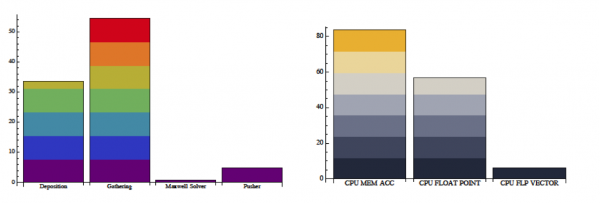
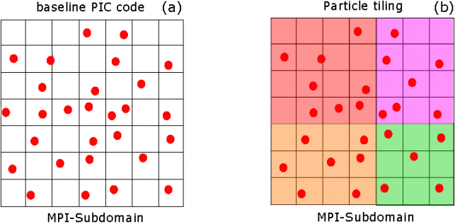
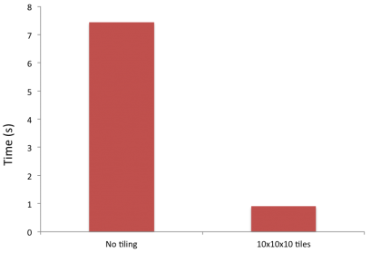
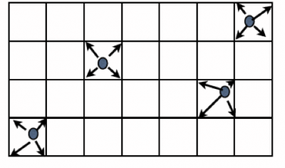
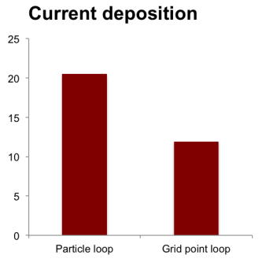
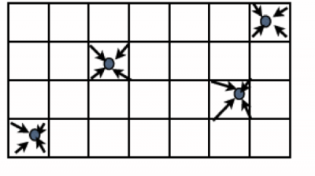
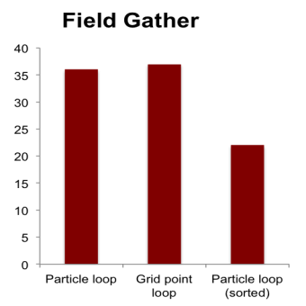
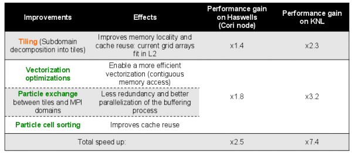
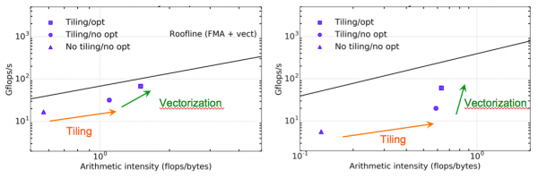

#Update

A more complete summary is now available at https://picsar.net/

#Background

WARP is an accelerator code that is used to conduct detailed simulations of particle accelerators, among other high energy physics applications. It is a so-called Particle-In-Cell (PIC) code that solves for the motion of charged particles acted upon by electric and magnetic forces. The particle motion is computed in a Lagrangian sense, following individual particles. The electric and magnetic fields acting on the particle are considered to be Eulerian and are solved on a Cartesian grid surrounding the particles. The Eulerian fields reside on the computational grid, which is stationary and occupy fixed locations in memory after they are initialized. The particles on the other hand, move freely through the computational grid at each iteration. This eventually results in a random access pattern with respect to the grid nodes, which in turn impacts performance.   

To focus the optimization efforts on these issues, the computationally intensive kernels from WARP were extracted out into a smaller code called PICSAR, which stands for Particle-In-Cell Scalable Application Resource. The paragraphs below refer to PICSAR, unless noted otherwise. The main computational steps involved are as follows:

1. Maxwell solver with arbitrarily high order centered/staggered finite differences for computing field quantities on the Cartesian grid.

2. Field gathering routines that interpolate Eulerian electric and magnetic fields from the Cartesian grid on to arbitrarily located particles.

3. Boris particle pusher for stepping the particles in time based on their local velocities.

4. Morse-Nielsen/Esirkepov current deposition from particles to the Cartesian grid, which in turn is used to construct the right hand side of the Maxwell equations that are used to move the electric and magnetic fields in time. 



Left image shows fraction of time spent in the four main routines. Image on right shows the wall clock time associated with the different type of operations within those routines

The work described here was performed by WARP/PICSAR developers, Henri Vincenti, Remi Lehe and Jean-Luc Vay with help from Ruchira Sasanka and Karthik Raman at Intel. The Intel VTUNE profiling tool was used extensively in debugging performance issues during the implementation of the strategies below.  

#Application starting point for dungeon session

As seen in the image above, two routines account for almost 80% of the runtime of the PICSAR application, the field gather and current deposition subroutines. The first optimization undertaken was to improve cache reuse for both these routines. Tiling was used as described below.



Left image shows the original untiled domain within a single MPI rank. Image on the right shows same domain distributed across four tiles each of which fit into L2 cache 

##Tiling particles for memory locality

The two plots above show the computational subdomain within one MPI task. The plot (a) on the left is the version before tiling. When the entire subdomain is too large to fit into the L2 cache and once particles start to be randomly distributed in this subdomain, it introduces cache misses and hence both field gather and current deposition routines perform yield sub-optimal performance. In plot (b) on the right, the particles in the MPI subdomain have been assigned to tiles which are able to fit into the L2 cache. With this change, cache reuse went up from 85% to 99% and a 3x overall speedup was obtained on Xeon processors. On Xeon Phi, the performance improved by a factor of five. For a 100x100x100 point subdomain, tile sizes between between 8x8x8 and 10x10x10 were found to be optimal. 



Wall time per time step before and after applying the tiling optimization
 
#Optimizations explored during dungeon session

From the top image on the page, it can also be seen that most of the time in the current deposition and field gathering routines is spent in moving data to and from memory and scalar floating point operations, with poor utilization of the vector unit. Hence one of the main goals for the dungeon session was to improve the vectorization performance of both routines. 

##Current deposition routine

	

The first issue to be tackled was the lack of vectorization in the current deposition routine. Achieving good vectorization is critical to code performance on current and future generations of Xeon and Xeon Phi processors due to a majority of the compute capability coming from the large vector units. For the Haswell line of processors, the vector width is 256 bits, which can accommodate four double precision floating point numbers. In general, the compiler considers the inner most loop of a nest for vectorization. The schematic on the left shows the operation involved. Each particle contributes a current to its neighboring grid points depending on the particle shape factor.The original code had a single loop that computed the contribution of each particle to its neighboring grid cells. This could not be vectorized since the grid array being deposited to was three dimensional and therefore the memory locations being accessed were not contiguous. To address this, new grid array of size [8,NCELLS] was constructed where NCELLS is the number of grid cells in the tile and the 8 corresponds to the number of neighbors of a particle in a 3D Cartesian grid for a first order deposition. The advantage of this approach is that the eight neighbors that a particle deposits to are now contiguous in memory. The loop can now be vectorized on these points instead of particles.  

```fortran
DO ip=1,np,LVEC
        . . .
        DO n=1,MIN(LVEC,np-ip+1)
               ic=ICELL(n)
               !DIR$ ASSUME_ALIGNED rhocells:64
               . . . 
               !DIR$ SIMD
               DO nv=1,8
                       ww=(-mx(nv)+sx(n))*(-my(nv)+sy(n))* &
                              (-mz(nv)+sz(n))*wq(n)*sgn(nv)
                              rhocells(nv,ic)=rhocells(nv,ic)+ww
              END DO
        END DO 
END DO
```

The code section above shows the implementation of this approach. The outermost loop runs over the particles in a computational tile. The loop is blocked by a factor of LVEC (8 in this case) to ensure good cache reuse. All arrays are assumed to be aligned to 64 byte boundaries for efficient loads/stores. The innermost loop was vectorized by the compiler along the eight neighboring grid points for each particle leading to almost a factor of 2 speedup for this routine as seen in the bar graph below. The key to getting the compiler to vectorize the loop was the explicit Intel SIMD directive. The IVDEP directive was insufficient to achieve vectorization. Another side note here is that the arrays mx, my and mz above were defined as real valued arrays instead of being converted from type integer. This also played a small role in the observed speedup.   

		

##Field gather routine

		

 The second routine to be optimized was the field gather routine that interpolates electric and magnetic field values onto the individual particles within each grid cell. The schematic on the left illustrates this operation in 2D. As with the current deposition routine, it is not possible to vectorize over the grid points in the original 3D array due to non-unit stride accesses in two directions. Converting the three dimensional array into a two dimensional one of size [8,NCELLS] as done before will also not give much of a performance boost, since it involves a reduction operation across the 8 neighboring grid points. This can be seen by looking at the middle line in the bar chart below, which corresponds to this strategy. The only approach that appears to allow vectorization in this case is to sort the particles within each grid cell so that they are located at contiguous locations in memory. The innermost loop can then be run over the particles in a SIMD manner. The outer loop is then run over the eight surrounding vertices. In this manner, inefficiencies due to both the reduction-induced serialization and non-unit strided access can be mitigated. The right-most line in the bar chart below corresponds to the above approach, yielding an approximately 1.5x speedup compared to the original routine. This strategy does have the downside of a computational overhead introduced by the sorting, which must be done at each time step. However, since this is essentially a bin-sort operation, it is O(n) in the number of particles and therefore still overall faster than the original.  


		

#Performance on KNL

The effects of the above optimizations on KNL can be seen in the following table:



You can see immediately the tiling and vectorization optimizations improve performance on both KNL and Haswell (Cori Phase 1 node). However, the speedups are significantly greater on KNL than Haswell. To explore why, consider the various optimization stages on the a roofline performance curve for Cori Phase 1 node and Cori Phase 2 node. The cure shows measured performance of various application revisions and measured arithmetic-intensity (FLOPs per byte transferred from DRAM to the cores on the node). 



A couple important observations can be made. First, the measured arithmetic intensity of the original code is significantly higher on Haswell. This can be attributed to the L3 cache on the Haswell cores which is large enough to hold the grid data for the MPI rank. Adding a level of tiling, where the tiles are choses to fit in L2 improves the arithmetic intensity on both Haswell and KNL. However, the effect is largest on the KNL, because, as just mentioned, the L3 cache on Haswell provides some level of data reuse even without tiling. The final point, labeled "Vectorization" increases the performance closer to the theoretical max (the black line). The improved ai associated with this point is largely due to particle sorting implemented to aid in vectorization. 
