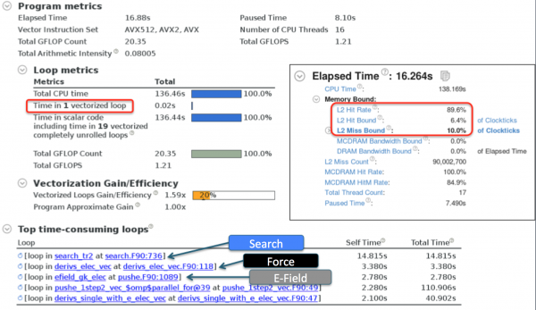
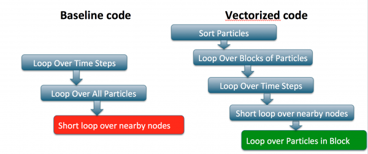
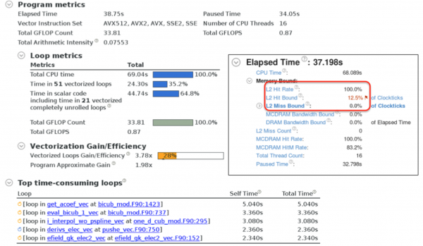
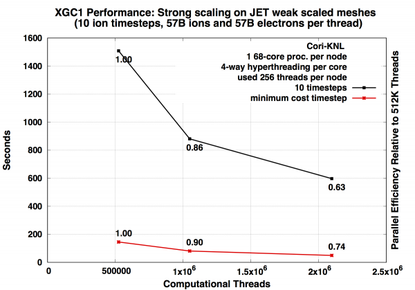
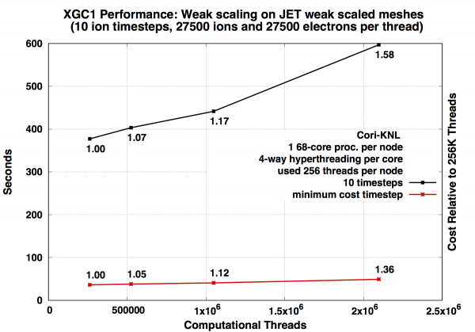

# XGC1

## Background

XGC1 is a gyrokinetic Particle-In-Cell code for simulating plasma
turbulence in magnetic confinement fusion devices. It
self-consistently solves the kinetic evolution of the charged particle
distribution and the electromagnetic fields. Lagrangian equation of
motion is used for time advancing the particles, while conserving the
mass, canonical angular momentum, and energy. The usual gyrokinetic
Poisson equation is solved with the four-point averaging technique. In
order to simulate the whole reactor geometry without mathematical
difficulties at magnetic null points, XGC1 uses a cylindrical
coordinate system for the particle motion and an unstructured mesh for
the field solver. An electron sub-cycling scheme is used to accelerate
ion-scale simulations.

XGC1 is written mostly in Fortran 90 with roughly 100 000 lines of
code in the main branch. The PI of the XGC1 development team is
Prof. [CS Chang](mailto:cschang@pppl.gov) at PPPL and the team members
in multiple universities and national labs. XGC1 has been selected as
one of the main tools in the ECP project High-Fidelity Whole Device
Modeling of Magnetically Confined Fusion Plasma. The code is version
controlled under git and hosted in bitbucket. For access to the
repository,
please
[contact the main developers](https://epsi.pppl.gov/xgc-users/how-to-become-an-xgc-user).

The XGC1 code has five main kernels:

* Particle Push
* Charge Deposition
* Particle Shift
* Collision Operator
* Field Solver

## Performance on KNL

In production runs, up to 80% of the computing time in XGC1 is spent
in the electron push routine. This is typical of gyrokinetic PIC
codes, and is caused by the electron sub-cycling scheme. For each ion
time step, a large number (typically around 50) electron time steps
are made **without charge deposition or field solve in between**.

Figure 1. Time Spent in XGC1 Main Kernels in a 1024 Node Run on Cori
KNL

## Optimizations To Electron Push

The electron push algorithm consists of four main steps:

1. Search for nearest 3 mesh nodes to the particle position & map to neighbor plane
2. Interpolate fields from 6 mesh points to particle position
3. Calculate force on particle from fields
4. Push particle for time step dt

An electron push kernel `pushe` that can be ran separately from the main XGC1
code had been prepared by the XGC1 team. We profiled the `pushe` kernel heavily
with VTune and Advisor and found that steps 1-3 were all roughly equally
expensive. The summary reports are shown in the figure below.

The main issues identified were

1. no compiler auto-vectorization;
2. poor hit rate in L2 cache.

Both issues called for a re-structuring of the code. In the original state the
main routine loops over the sub-cycles and in each sub cycle loops over the
electrons. Within the electron loop, long chains of subroutine calls are made
with too small tripcounts to merit vectorization. Each particle typically
touches the same data on the grid multiple times during the sub-cycling, but
because all particles are processed per sub-cycle, the cache locality is lost.

We introduced cache blocking over the particles, and reversed the order of the
time and particle loops to take improve the cache reuse. Then we moved the
inner particle loop to the lowest subroutines, typically dealing with
interpolation of data from the mesh. The re-structuring is illustrated in the
figure below:

This structure allows both better cache re-use and compiler vectorization in
some of the hot loops. The performance is limited by indirect memory access in
the interpolation loops that does not vectorize well. The compiler has to
generate gather/scatter instructions that incur large latency. This is a
feature of particle codes that is hard to avoid completely. Although we sort
particles and try to block over particle in the same part of the grid that
touch the same data, unless we sort after every sub-cycle, which is too
expensive, we can't guarantee that each particle in the block will touch the
same grid data and therefore we have to access the grid on every sub-cycle.

To improve the memory access patterns, a re-ordering of the particle data
structures was made. Originally the particle data was stored in two data
structures that contain a total of 40 double precision numbers (and a few
integers). These numbers include coordinate values, vector field values, field
derivatives, and such. The original data structure was an Array of Structures
(AoS). Such data structure can be beneficial for memory access when the
structures are small and the whole structure is accessed in sequence. In XGC1,
typically 3 values from the structure of 40 are accessed in sequence (for
example, x,y,z components of the magnetic field). For this type of access, the
AoS incurs large strides when looping over particles, which is what we want to
do. We found improved performance with a Structure of Arrays (SoA) data
structure, where looping over particles is unit strided, and the array size is
tuned to fit in cache. To take advantage of the typical access to 3 consequtive
values from the structure, we also introduced a compound data structure that
can be described as SoSoA, where the x,y,z components form sub-structures in
the main data structure.

The profiling summaries for the optimized code from Intel VTune and Advisor are
shown in the figures below. We conclude that the vectorization has been
improved to cover roughly 1/3 of the code base. The L2 cache hit rate is now
close to 100%, and VTune actually flags L2 hit latency as the main bottleneck.
If one looks closer at the memory access pattern analysis in Advisor, the main
interpolation loops indeed contain gather/scatter instructions.

## Charge Deposition Threading Optimization

Charge deposition in XGC1 is performed after every ion time step for
both ions and electrons. Each MPI ranks deposits charge on the **whole
grid**, dividing the work among its OpenMP threads. The ion charge is
deposited in a 3-D array with the dimensions [number of grid nodes per
toroidal plane, number of velocity space grid points, number of
adjacent toroidal planes]. The number of adjacent toroidal planes is
always 2. The velocity grid is required for the gyro-averaging routine
and usually has 4 or 8 points. The total size of this array is
therefore 8 - 16 x the size of the unstructured mesh, usually ~100k -
1M, totaling 1M - 10M elements. The electron charge is deposited
without using a velocity space grid, which reduces the size of the
array. In the initial implementation, a separate copy of the charge
density array was allocated for each thread. Each thread would
initialize it to 0 and deposit charge from a subset of particles to
its own copy of the array. In the end a sum over all copies of the
array would be stored on the master thread, but the reduction sum was
done manually with a loop written in the code.

We found two problems in large-scale runs on Cori KNL.

1. The initialization of 10M elements per thread `avx512_memset` function
   became extremely slow;
2. the manual reduction was not well optimized. Both the problems had the same
   cause: trying to do by hand something that is built into OpenMP.

To solve 1) and 2) we eliminated the allocation and initialization of
separate copies for each thread. However, when all threads write to
the same array, we have to make sure we don't create race
conditions. We developed two solutions

1. Declare the charge density array with `!$omp reduction(+:)`. When `omp
   reduction` is used, the variable becomes private to each thread within the
parallel region and a sum over all threads is calculated at the end of the
parallel region. This imitates what the code was doing before but the OpenMP
runtime provides a much better optimized implementation.
2. Declare the charge density array `!$omp shared` and declare all updates to
   the array `!$omp atomic`.

The performance of optimizations 1 and 2 depend on the setup of the
problem, especially the size of the unstructured mesh and the number
of particles per thread. The OpenMP reduction operation incurs an
overhead from creating private copies of the array at the beginning of
the parallel region and calculating the sum over all threads at the
end of the parallel region. This overhead depends on the size of the
unstructured mesh. The OpenMP atomic update operation on the other
hand incurs an overhead whenever two threads try to update the same
memory location and the other thread has to wait, and potentially
retrieve the value from the cache of another core before updating
it. This overhead is fairly constant per particle (ie, a certain
fraction of particles will cause a wait, regardless of the total
number of particles), therefore increasing the number of particles
increases the total overhead.

The charge deposition optimizations were tested with a 60 000 node
unstructured mesh, on 16 compute nodes running 16 MPI ranks per node
and 16 OpenMP threads per MPI rank. The number of particles per thread
was varied between 10 000 and 400 000.

Figure 1. The time spent in Ion Charge Deposition Scatter routine, as
a function of the number of particles per thread. Both the total time
and the time inside the parallel region (loop1) are plotted for both
atomic and reduction operations.

Figure 2. The time per particle in Ion Charge Deposition Scatter
routine, as a function of number of particles per thread. Only total
time is plotted for both atomic and reduction operations.

Figure 3. The overhead from the OpenMP parallel region (copying
private variables and the reduction) for both atomic and reduction
operations. The time plotted here is roughly equal to the difference
between the total time and the loop1 time in Figure 1.

## Strong Scaling

A strong scaling study on Cori KNL nodes up to full Cori scale (8196 nodes)
shows good strong scaling for a large problem size.

## Weak Scaling

A weak scaling study was performed by scaling up to a large-size run on full
Cori size. The parameters of the study are summarized in the table below:

|Compute Nodes|Threads    |Grid Nodes Per Rank|Total Grid Nodes|Particles Per Thread|Total Particles (billions)|
|-------------|-----------|-------------------|----------------|--------------------|--------------------------|
| 128         | 32 768    | 117               | 3 750          | 55 000             | 1.8                      |
| 256         | 65 536    | 117               | 7 500          | 55 000             | 3.6                      |
| 512         | 131 072   | 117               | 15 000         | 55 000             | 7.2                      |
| 1024        | 262 144   | 117               | 30 000         | 55 000             | 14.4                     |
| 2048        | 524 288   | 117               | 60 000         | 55 000             | 28.8                     |
| 4096        | 1 048 576 | 117               | 120 000        | 55 000             | 57.6                     |
| 8192        | 2 098 176 | 117               | 240 000        | 55 000             | 115                      |

The jobs were configured to run with 64 OpenMP threads per MPI rank and 4 MPI
ranks per node, fully subscribing the available hyper-threads on the KNL nodes.
The KNL nodes were used in quad,cache mode.

## References

Koskela T., Deslippe J. (2017) Optimizing Fusion PIC Code Performance at Scale
on Cori Phase Two. In: Kunkel J., Yokota R., Taufer M., Shalf J. (eds) High
Performance Computing. ISC High Performance 2017. Lecture Notes in Computer
Science, vol 10524. Springer, Cham https://doi.org/10.1007/978-3-319-67630-2_32

Koskela T., Raman K., Friesen B., Deslippe J. (2017) Fusion PIC Code
Performance Analysis on The Cori KNL System. Cray User's Group Meeting 2017.
https://cug.org/proceedings/cug2017_proceedings/includes/files/pap152s2-file1.pdf

Kurth T. et al. (2017) Analyzing Performance of Selected NESAP Applications on
the Cori HPC System. In: Kunkel J., Yokota R., Taufer M., Shalf J. (eds) High
Performance Computing. ISC High Performance 2017. Lecture Notes in Computer
Science, vol 10524. Springer, Cham https://doi.org/10.1007/978-3-319-67630-2_25

[Talk given at NERSC application readiness meeting on 02/14/2018 by T. Koskela
(PDF)](https://www.nersc.gov/assets/Uploads/tkoskela-appReadiness-0214-public.pdf)
