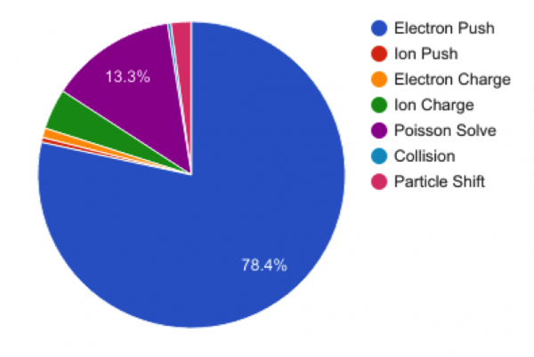
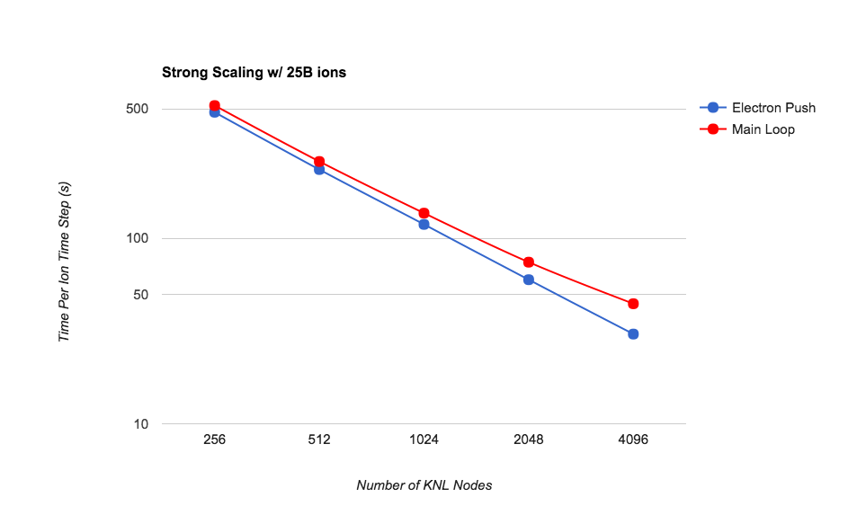
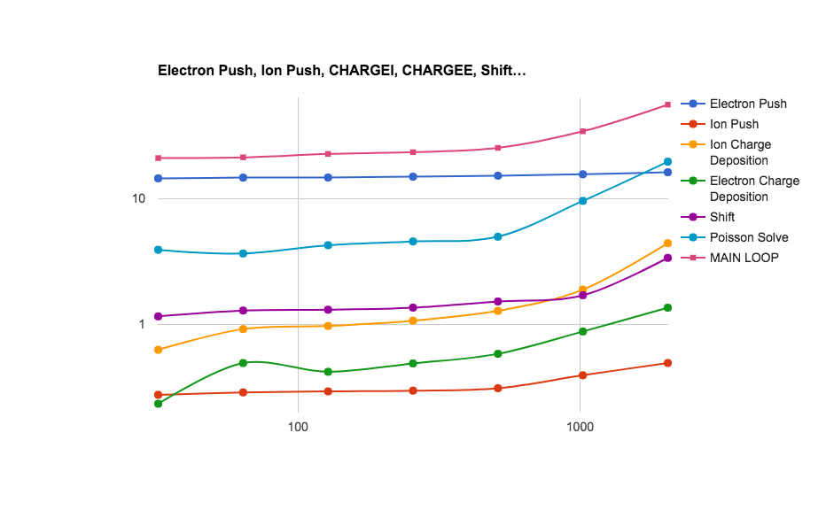
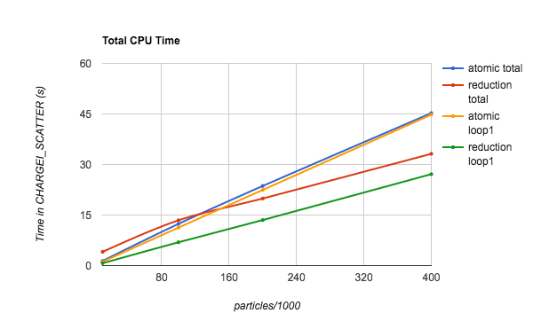
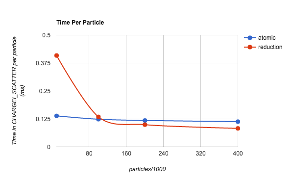
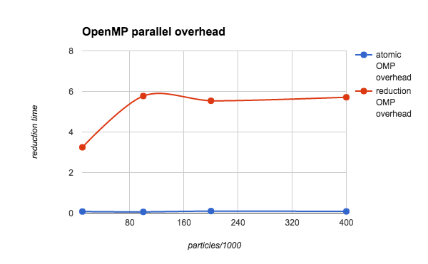

# Background

XGC1 is a gyrokinetic Particle-In-Cell code for simulating plasma
turbulence in magnetic confinement fusion devices. It
self-consistently solves the kinetic evolution of the charged particle
distribution and the electromagnetic fields. Lagrangian equation of
motion is used for time advancing the particles, while conserving the
mass, canonical angular momentum, and energy. The usual gyrokinetic
Poisson equation is solved with the four-point averaging technique. In
order to simulate the whole reactor geometry without mathematical
difficulties at magnetic null points, XGC1 uses a cylindrical
coordinate system for the particle motion and an unstructured mesh for
the field solver. An electron sub-cycling scheme is used to accelerate
ion-scale simulations.

XGC1 is written mostly in Fortran 90 with roughly 100 000 lines of
code in the main branch. The PI of the XGC1 development team is
Prof. [CS Chang](mailto:cschang@pppl.gov) at PPPL and the team members
in multiple universities and national labs. XGC1 has been selected as
one of the main tools in the ECP project High-Fidelity Whole Device
Modeling of Magnetically Confined Fusion Plasma. The code is version
controlled under git and hosted in bitbucket. For access to the
repository,
please
[contact the main developers](http://epsi.pppl.gov/xgc-users/how-to-become-an-xgc-user).

The XGC1 code has five main kernels:

* Particle Push
* Charge Deposition
* Particle Shift
* Collision Operator
* Field Solver

# Performance on KNL

In production runs, up to 80% of the computing time in XGC1 is spent
in the electron push routine. This is typical of gyrokinetic PIC
codes, and is caused by the electron sub-cycling scheme. For each ion
time step, a large number (typically around 50) electron time steps
are made **without charge deposition or field solve in between**.

Figure 1. Time Spent in XGC1 Main Kernels in a 1024 Node Run on Cori
KNL

# Optimizations To Electron Push

The electron push algorithm consists of four main steps:

Search for nearest 3 mesh nodes to the particle position & map to
neighbor plane Interpolate fields from 6 mesh points to particle
position Calculate force on particle from fields Push particle for
time step dt An electron push kernel, **pushe**, that can be ran
separately from the main XGC1 code had been prepared by the XGC1
team. We profiled the pushe kernel heavily with Vtune and Advisor and
found that steps 1 - 3 were all roughly equally expensive.

## Interpolation

## Force Calculation

## Search

# Strong Scaling

A strong scaling study on Cori KNL nodes up to half machine size shows
good strong scaling for a moderate problem size. This is a DIII-D
simulation with 25 · 10^9 ions and electrons and 56980 grid nodes.

# Weak Scaling

A weak scaling study shows there are issues when scaling up to a very
large problem size. After the optimizations made to charge deposition
that are discussed below, the main source of poor weak scaling is the
Poisson solver. It consists of a solver call to `PETSc_KSPSolve`
surrounded by MPI communication involving vscatters and vgathers.

In this weak scaling study we use 16 MPI ranks per node and 16 OpenMP
threads per MPI rank. The number of particles per MPI rank is 200 000
and the number of grid nodes per MPI rank is approximately 480.

# Charge Deposition

Charge deposition in XGC1 is performed after every ion time step for
both ions and electrons. Each MPI ranks deposits charge on the **whole
grid**, dividing the work among its OpenMP threads. The ion charge is
deposited in a 3-D array with the dimensions [number of grid nodes per
toroidal plane, number of velocity space grid points, number of
adjacent toroidal planes]. The number of adjacent toroidal planes is
always 2. The velocity grid is required for the gyro-averaging routine
and usually has 4 or 8 points. The total size of this array is
therefore 8 - 16 x the size of the unstructured mesh, usually ~100k -
1M, totaling 1M - 10M elements. The electron charge is deposited
without using a velocity space grid, which reduces the size of the
array. In the initial implementation, a separate copy of the charge
density array was allocated for each thread. Each thread would
initialize it to 0 and deposit charge from a subset of particles to
its own copy of the array. In the end a sum over all copies of the
array would be stored on the master thread, but the reduction sum was
done manually with a loop written in the code.

We found two problems in large-scale runs on Cori KNL: 1) The
initialization of 10M elements per thread avx512_memset function
became extremely slow and 2) the manual reduction was not well
optimized. Both the problems had the same cause: trying to do by hand
something that is built into OpenMP.

To solve 1) and 2) we eliminated the allocation and initialization of
separate copies for each thread. However, when all threads write to
the same array, we have to make sure we don't create race
conditions. We developed two solutions: I: Declare the charge density
array with `!$omp reduction(+:)`. When `omp reduction` is used, the
variable becomes private to each thread within the parallel region and
a sum over all threads is calculated at the end of the parallel
region. This imitates what the code was doing before but the OpenMP
runtime provides a much better optimized implementation. II: Declare
the charge density array `!$omp shared` and declare all updates to the
array `!$omp atomic`.

The performance of optimizations I and II depend on the setup of the
problem, especially the size of the unstructured mesh and the number
of particles per thread. The OpenMP reduction operation incurs an
overhead from creating private copies of the array at the beginning of
the parallel region and calculating the sum over all threads at the
end of the parallel region. This overhead depends on the size of the
unstructured mesh. The OpenMP atomic update operation on the other
hand incurs an overhead whenever two threads try to update the same
memory location and the other thread has to wait, and potentially
retrieve the value from the cache of another core before updating
it. This overhead is fairly constant per particle (ie, a certain
fraction of particles will cause a wait, regardless of the total
number of particles), therefore increasing the number of particles
increases the total overhead.

The charge deposition optimizations were tested with a 60 000 node
unstructured mesh, on 16 compute nodes running 16 MPI ranks per node
and 16 OpenMP threads per MPI rank. The number of particles per thread
was varied between 10 000 and 400 000.

Figure 1. The time spent in Ion Charge Deposition Scatter routine, as
a function of the number of particles per thread. Both the total time
and the time inside the parallel region (loop1) are plotted for both
atomic and reduction operations.

Figure 2. The time per particle in Ion Charge Deposition Scatter
routine, as a function of number of particles per thread. Only total
time is plotted for both atomic and reduction operations.

Figure 3. The overhead from the OpenMP parallel region (copying
private variables and the reduction) for both atomic and reduction
operations. The time plotted here is roughly equal to the difference
between the total time and the loop1 time in Figure 1.
