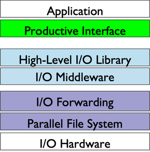

# Optimizing I/O performance

## General Guidelines
While there is clearly a wide range of I/O workloads associated with the many scientific applications
deployed at NERSC, there are a number of general guidelines for achieving good performance
when accessing our filesystems from parallel codes. Some of the most important guidelines include:

* Use filesystems for their intended use-case; for example, avoiding your home directory for production
 I/O (more details on intended use case may be found on our page providing general background on NERSC filesystems).
* Know what fraction of your wall-clock time is spent in I/O; for example, with estimates provided by Darshan,
profiling of critical I/O routines (such as with Craypat's trace groups), or explicit timing / instrumentation.
* When algorithmically possible:
    * Avoid workflows that produce large numbers of small files (e.g. a "file-per-process" access model at high levels of concurrency).
    * Avoid random-access I/O workloads in favor of contiguous access.
    * Prefer I/O workloads that perform large transfers that are similar in size or larger than,
and are also aligned with, the underlying filesystem storage granularity (e.g.
blocksize on GPFS-based filesystems, stripe width on Lustre-based filesystems).
    * Use high-level libraries for data management and parallel I/O operations (as these will often
apply optimizations in line with the above suggestions, such as MPI-IO collective
buffering to improve aggregate transfer size, alignment, and contiguous access).

With these suggestions in mind, there are also filesystem-specific tuning parameters which may be used
to enable high-performance I/O. These can affect both the layout of your files on the underlying
filesystem (as is the case in Lustre), as well as the manner is which your I/O operations
will be routed to the storage system (as in the case of GPFS over DVS on the Crays).

## HPC I/O Stack
Applications typically need to rely on multiple layers' I/O libraries
to talk to storage. The multiple layers' I/O software form a hierarchical
and complex I/O stack. Achieving the optimal I/O performance requires tunning
each layer well.

NERSC has done years of evaluation and benchmarking. Feel free to ask NERSC consultant for
recommendations if you use any of the following I/O softwares.

|I/O Layer|I/O Libraries|
|:--------|:-------------|
|Productive Interface|H5py, Python, Spark, Tensorflow, PyTorch|
|High-Level I/O Library|HDF5, NetCDF, PnetCDF, Root|
|I/O Middleware|MPIIO, POSIX|
|Parallel File System|Lustre, Datawarp, GPFS, HPSS|
