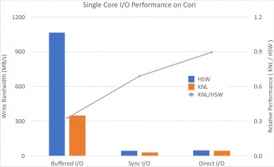
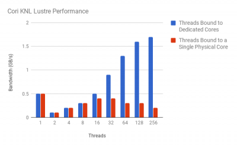

Cori KNL (Phase II) has different architecture from Cori Haswell (Phase I). In order to
achieve the best IO performance, applications need to leverage the new features in KNL
and avoid using the chip improperly. Based on our study and interaction with different applications,
we have collected the best practices for KNL IO, and we are continuously working on this list.
If you spot anything unusual issue or exciting practice regarding Cori IO, please email us consult@nersc.gov

# Core Specialization

Core Specialization can isolate system overhead to designated cores on a compute node
```shell
#SBATCH -S 4
```

With core specialization, we increased the 32 nodes HDF5 collective IO bandwidth from 6.3GB/sec to 7.6 GB/sec.


# Process Affinity

In case node is not fully packed, process affinity is important in balancing workload and leveraging memory locality.

```shell
nersc$ srun -n 4 -c 64 --cpu-bind=cores
```
"That does the trick. The time for reading the WRF restart file is now 36 seconds, (was 300 seconds)" --John Michalakes, UCAR

# Direct I/O vs. Buffered I/O

Direct IO can bypass page buffer in the client side, allow data to be read from disk directly
into user buffer, which in some cases is beneficial to the application's IO.
In our preliminary study, we found that KNL's page buffer management might be slower than Haswell,
possibly due to slower CPU frequencies. The performance gap between KNL and Haswell becomes
small when less IO buffer layers are removed, as shown in the following plot.




Avoiding page buffer becomes reasonable for a few specific IO patterns, e.g.,
highly randomly read, or large sequential read/write in volumes similar to or
larger than that of the cache. Specifically, we have the following guidelines:
*    Use default setting in most cases, e.g., small read, multiple read,
and write, or more complex I/O pattern
*    Consider using direct IO if you want to manage the page buffer by yourself,
or in case IO is too large that page buffer and Lustre readahead benefits diminish,
e.g., IO per node is much larger than 40% (dirty ratio) of node memory.

Turning on direct IO requires good knowledge of IO interface and underneath file systems,
as direct IO has strict in memory alignment (512 bytes), IO transaction size (multiple of 512 bytes), etc.
Direct IO can be turned on at different layer, e.g., MPIIO, Posix, or HDF5.
Though it often falls back to default buffer IO due to wrong configuration, we have tested the following options

*    POSIX: O_DIRECT in open(), together with a prior posix_memalign()
*    IOR: -B
*    MPIIO: setenv MPIO_DIRECT_READ TRUE
*    HDF5: H5Pset_fapl_direct()

The above options are programming interface, command line parameter, environmental variable,
and programming interface separately. In the case of HDF5, we saw as much as 11% speedup.

# Collective Buffer

Collective IO is one of the most important IO optimizations in ROMIO (an MPIIO implementation),
tuning collective IO buffer size is beneficial in aggregating small IO transactions into large
contiguous and reducing number of IO transactions. Tuning collective IO becomes also essential
due to the fact that KNL has larger inter/intra-node communication latency than Haswell.

|(us)|Haswell|KNL|
|:---:|----|----|
|intra|1.97|4.92|
|inter|0.23|0.63|


Better IO bandwidth can be achieved with hand optimized buffer size depends on your own applications.

# I/O Parallelism

*    Multi-process/cores (e.g., MPI)
Given that single stream IO on KNL is slower than Haswell, parallelizing the IO with multiple
cores can increase the bandwidth easily.
*    Multi-threading (e.g., OpenMP)
Exploring multi-threading is also beneficial to the I/O bandwidth.

The following results are from a multi-threading read test on KNL conducted by
Dr. Elliott Slaughter (Stanford). The benchmark code simulates the Stanford Legion program,
and simple contiguous pread. The first plot shows on Cori KNL (writing to CSCRATCH),
16 to 32 threads on a single core can saturate the bandwidth (see the red bar),
and interestingly, if binding multi-threads to multi-cores,
the I/O on KNL is pretty scalable to full rack (note that there are 4 specialization cores preallocated).
In the second plot, the IO on burst buffer on a single KNL core is able to saturate the I/O bandwidth.




# General Recommendations

General [Lustre striping](../lustre/index.md) and [MPIIO optimization](../library/index.md) still apply to Cori KNL.

Reference: Understanding the IO Performance Gap Between Cori KNL and Haswell, CUG 2017
