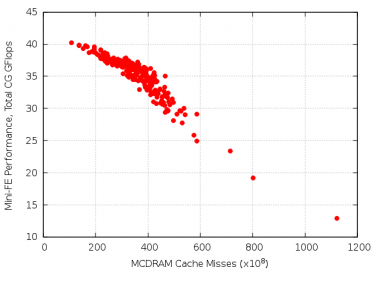
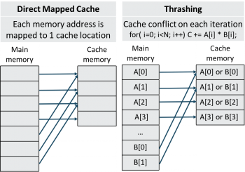
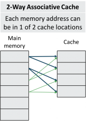

# MCDRAM cache mode

KNL's MCDRAM cache is prone to cache thrashing, which can be
detrimental to application performance and performance
reproducibility.

## Background

The two-level memory system on Cori's KNL nodes provides a promising
combination of capacity and bandwidth: DDR memory provides relatively
high capacity and modest bandwidth (96 GB and 90 GB/s), while
multi-channel DRAM (MCDRAM) offers more limited capacity with high
bandwidth (16 GB and >400 GB/s). The MCDRAM may, as a boot-time
option, be used in a ‘flat’ mode that requires software management of
which arrays are allocated in each memory level or a ‘cache’ mode that
is software-transparent, but incurs some latency and bandwidth
penalties.

The cache mode is the default Cori because it is most convenient for
application programmers and typically provides good
performance. Shortly following Cori’s installation in August 2016, we
observed high levels of performance variation in KNL’s cache mode,
manifesting as both run-to-run timing differences and unexpected
scaling challenges for applications that scale well on similar
systems. Cache thrashing was quickly suspected as a likely cause
because these effects were not observed in flat mode.

*Figure 1. Correlation between Mini-FE performance and MCDRAM miss
counters.*

Analysis of the Mini-FE application also pointed to cache-miss
imbalances as the source of its inconsistent performance. Mini-FE
reproduces the essential kernels of a finite element application: it
assembles, then solves a sparse linear system from the steady-state
conduction equation[^1]. The performance of the sparse matrix-vector
product used by the conjugate-gradient solver is especially sensitive
to memory bandwidth. This Mini-FE problem requires 17.6 GB memory,
which was only slightly (10%) larger than the cache and performed less
consistently than the other sizes tested. Figure 1 shows the joint
distribution of the number of MCDRAM cache misses and performance for
256 single-node Mini-FE jobs. The strong correlation between these two
measurements suggests that uneven cache miss rates are responsible for
the performance imbalance across nodes. This begs the question: why
would some nodes incur up to ten times more cache misses than others
for the same workload? The answer to this question is tied to the
interplay between cache structures and OS memory management.

## Caches and cache thrashing

*Figure 2. Direct mapped cache mapping (left) and a recipe for
thrashing (right).*

KNL has a direct mapped cache, which means that each address in main
memory is mapped to only one location in the cache. Because Cori’s DDR
capacity is six times larger than its MCDRAM cache, six different
memory addresses contend for the same location in the cache and will
evict each other from the cache when accessed. Cache thrashing occurs
when an application frequently alternates between two (or more) memory
addresses that map to the same cache line, causing a high rate of
conflict misses and main memory accesses. The frequency of cache
conflicts depends on an application's memory access pattern and the
specific memory addresses that have allocated by the OS. Figure 2
illustrates a) the N:1 mapping between memory addresses and cache
lines in a direct mapped cache, and b) a scenario in which a simple
and common memory access pattern induces cache thrashing.

*Figure 3. Address mapping in a 2-way associative cache.*

To understand why thrashing is more common on KNL nodes than more
conventional CPUs (like those in Cori's Haswell partition) It is
worthwhile to note the differences between their cache
implementations. The pitfalls of direct mapped caches are well known
[^2], which is why most modern caches are associative. Figure 3
illustrates a two-way associative cache wherein each address in main
memory may be mapped to either of two cache addresses. This
essentially doubles the probability that a heavily used variable will
be found in cache, but significantly increases the complexity of the
cache management hardware; two different cache addresses must be
searched before defaulting to main memory. The L3 caches on Cori's
Haswell nodes are 8-way associative, which greatly reduces the number
of conflict misses. The choice to use a direct mapped cache on KNL is
due in large part to the long latency for MCDRAM accesses that would
be compounded by associativity. In the trade-off between cache
capacity and latency, KNL's MCDRAM cache favors capacity (16 GB,
O(100ns)) where Haswell's SRAM cache emphasizes latency (30 MB,
O(1-10ns)).

## Zonesort

The frequency of cache conflicts and thrashing obviously depends on
whether multiple memory addresses allocated to a program map to the
same cache line. The list of free memory pages (and the corresponding
sets of potential cache conflicts) that the OS can allocate depends
intricately on its history of allocations and
deallocations. Consequently, nodes with different allocation histories
can have dramatically different cache miss rates. This is the root of
the variation observed in Figure 1.

We have worked closely with Intel and Cray to minimize cache thrashing
on Cori. To that end, Intel as developed the ‘zonesort’ kernel module
[^3]. The basic idea of zonesort is to re-order Linux’s free page list
to preferentially allocate blocks of memory that do not conflict with
each other in the cache. Cray’s Node Health Check tool frees I/O
buffers and compacts memory in order to maximize zonesort’s
effectiveness. However, even this approach can only ameliorate, not
eliminate, cache thrashing. For example, conflicts cannot be avoided
for problems larger than the cache.

We continued using the Mini-FE to assess the impact of KNL’s cache
thrashing and the benefit of the zonesort mitigation. Figure 4 shows
the distribution of MiniFE performance with and without zonesort. The
average performance without performance is 21 GB/s, but the wide
breadth of the distribution without zonesort reflects a troubling
aspect of the cache thrashing problem: its impact is not uniform. Some
nodes perform far worse than than others, depending on the order of
their page tables at the time the job started. This has dire
implications for jobs that require synchronization across nodes
because the slowest node will limit the progress of all other
nodes. Fortunately, as shown by the blue bars in Figure 4, zonesort
doubles the average performance and greatly reduces variation.

Zonesort is now incorporated into Cori’s workload manager (Slurm) and
runs before every job unless disabled. Zonesort takes only a few
microseconds to run, so this has no discernable impact of job launch
time. Zonesort can be disabled for each job by adding the
--zonesort=off option to the srun command. (Use of this is
discouraged.) If your job frequently allocates and deallocates memory
while it is running, then the `srun --zonesort=<n>` option, which
triggers zonesort every n seconds during the run, may be
useful. However, our tests of the Lulesh and Chombo-Crunch codes did
not benefit from periodic sorting.

## Node reboot policy

While zonesort has been shown to dramatically improve Mini-FE
performance and variation, there is evidence that its effectiveness
slowly diminishes until the node is rebooted. We have monitored the
performance of the Stream triad memory bandwidth benchmark [^5]
following each cache-mode job on Cori. Figure 5 shows the distribution
of these measurements. Immediately following reboot, all nodes achieve
350- 360 GB/s, but after several hours, a small fraction of nodes
(~18%) begins to sample performance levels tailing down to 100 GB/s,
despite running zonesort before every job. To eliminate this gradual
degradation, we have added a Stream measurement to the Node Health
Check that follows each job; nodes are rebooted whenever their
measured memory bandwidth falls below 300 GB/s.

## Recommendations for users

Cache thrashing cannot be directly addressed from user-space because
the Cray Linux Environment (and most other OSs) uses virtual addresses
that prevent users from seeing whether their allocated memory
conflicts in the cache. Users can, however, take indirect steps to
avoid cache thrashing.

For those who cannot or prefer not to modify their programs, the best
way to avoid this issue is to use less than 16 GiB of memory per node
so that all their data structures fit into MCDRAM. (This is most
easily done by strong scaling via MPI or OpenMP.) Reducing the memory
footprint does not prevent cache conflicts, but by using less memory,
the likelihood of allocating conflicting addresses is reduced,
particulary when zonesort is used. This will also improve performance
by eliminating the DDR traffic due to capacity misses.

Software developers may be able to reduce MCDRAM cache conflicts by
improving memory locality through cache re-use. Although re-use of the
MCDRAM cache has no impact on the likelihood of cache conflicts,
re-use of the L2 cache will reduce MCDRAM requests and the frequency
of potential MCDRAM conflicts. (KNL's L2 cache is 16-way associative
and has limited vulnerability to thrashing.) Increasing memory
locality is also an effective optimization technique when cache
thrashing is not a threat.

## Summary

Direct mapped caches, such as the MCDRAM cache on Cori's KNL nodes are
susceptible to cache thrashing. NERSC established a center of
excellence to address the thrashing problems on Cori. The COE verified
that cache thrashing was a significant source of performance variation
and degradation, and identified two system-level changes to avoid
cache thrashing. First, the zonesort kernel reduces cache conflicts by
re-ordering Linux’s free page list to preferentially allocate blocks
of memory that do not conflict with each other in the cache. It is
extremely effective for reducing cache thrashing, improving average
performance of Mini-FE by 2x, and is now run before every job on
Cori. Second, because the effectiveness of zonesort diminishes slowly
over time, nodes must be rebooted occasionally. By adding a bandwidth
measurement to the node health check that follows each job, we can
identify and reboot only underperforming nodes. Users can reduce cache
thrashing in their jobs minimizing their per-node memory use to 16 GiB
or less. Software optimizations that improve memory locality may also
have helpful impact on cache thrashing.

## References

[^1]: M. Heroux and S. D. Hammond. “MiniFE: finite element solver.”
[^2]: "Computer Architecture, A Quantitative Approach", J. L. Hennessy
	and D. A. Patterson, Morgan Kaufmann, 2003.
[^3]: "Intel Xeon Phi Processor Software User’s Guide", Intel
	Corporation, 2017
[^4]: The Slurm plugin that enables and controls zonesort on Cori was
	developed at NERSC and is not part of the generic Slurm distribution.
[^5]: J. D. McCalpin, “Memory Bandwidth and Machine Balance in Current
	High Performance Computers,”, IEEE Computer Society Technical
	Committee on Computer Architecture (TCCA) Newsletter, 1995.
