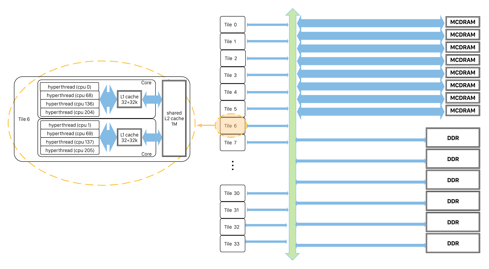
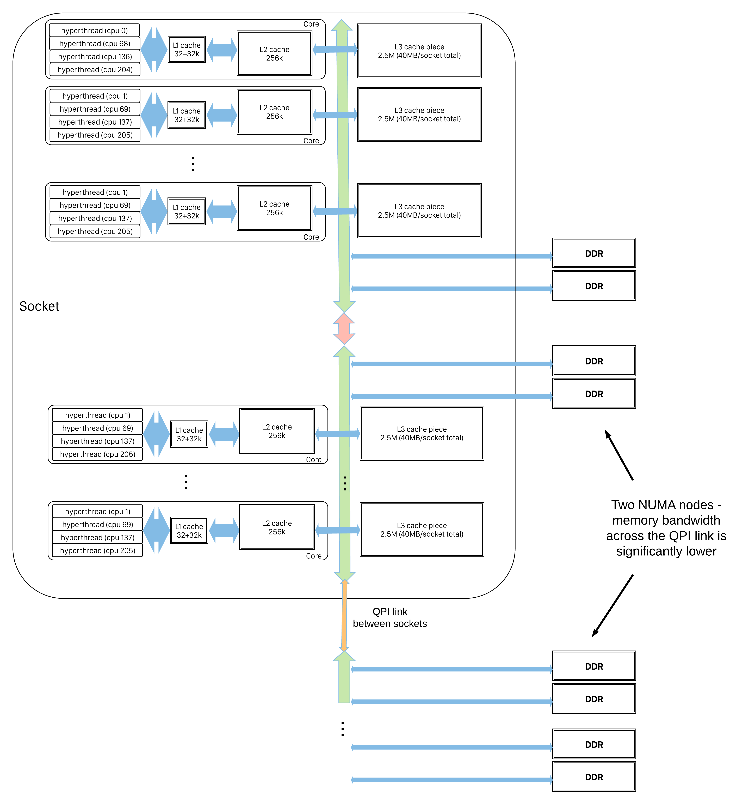

# Memory Bandwidth

Consider the following loop:

!!! example
	```fortran
	do i = 1, n
	  do j = 1, m
		c = c + a(i) * b(j)
	  end do
	end do
	```

CPUs perform arithmetic by reading an item from each of two registers, 
combining them in some way (eg by adding) and putting the result into a 
third register. There are only a few registers in the CPU so  the above 
loop is implemented something like:

    fetch c -> r1
    (loop)
    fetch a(i) -> r2
    (loop)
    fetch b(j) -> r3
    mul r2, r3 -> r4
    add r1, r4 -> r1
    (repeat)
    store r1 -> c

If `a`, `b` and `c` are `double precision` numbers - ie 8 bytes each - then
we must fetch 8 bytes for each multiply, add pair: we have an 
*operational  intensity* 2/8 = 1/4. 

If we [vectorize](vectorization.md) the loop, then with KNL AVX-512 we
can do 8 loop iterations simultaneously. But we need to load 8 values for 
`b`, so our operational intensity is still 16/64 = 1/4. Overall we will read
all of `b`, `n` times: for `2*m*n` operations we will local `8*m*n` bytes.

A KNL core can load 16 double precision values from it's L1 cache per cycle,
but if `b` has more that 4096 elements then `8*m*n` values will
need to be fetched from the L2 cache or beyond. As the diagram below 
illustrates, fetching from each step further in the memory hierarchy requires
traversing narrower, longer and more-shared links, so the performance is 
being limited not by the CPU but by the rate at which the memory system can 
deliver work to the CPU.

<a name="knl-mem-pipes"></a>


The [roofline model](../programming/performance-debugging-tools/roofline.md)
is a useful tool for identifying whether performance is being limited by the
CPU, memory bandwidth or something else.

If you identify that memory bandwidth is a limiting factor then you can modify
the code to reuse data in L1, for example with the following transform:

!!! example
    ``` fortran
    do jblock = 1, m, block_size
        do i = 1, n
            do j = jblock, jblock+block_size
                c = c + a(i) * b(j)
            end do
        end do
    end do
    ```

Now, if we choose `block_size` to fit in L1 cache, each subsequent iteration 
of the `i` loop will again traverse the part of `b` that is held in L1. We 
will still move `8*m*n` bytes over the core/L1 boundary but only `8*(m/block_size)*n`
bytes across the slower L1/L2 boundary.

On KNL, jobs that can fit within, or make good use of, the 16GB/node high-bandwidth
MCDRAM will benefit from it's much higher bandwidth compared to DDR. (On Cori, KNL nodes
are configured to use MCDRAM as a very large last-level cache). 
[Process and thread affinity](../jobs/affinity/index.md) is important on KNL primarily 
because pairs of cores share a large L2 cache. The narrowest point in the 
memory hierarchy on Haswell nodes, illustrated below, is the QPI link between sockets, 
affinity is therefore important on Haswell nodes so processes use the most-local memory.

<a name="haswell-mem-pipes"></a>


