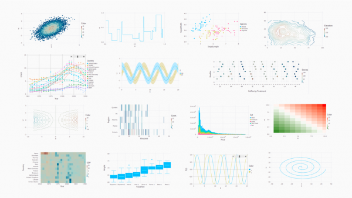

# Julia

Julia is a high-level, high-performance dynamic programming language for technical computing.
It has syntax that is familiar to users of many other technical computing environments.
Designed at MIT to tackle large-scale partial-differential equation simulation and distributed linear algebra, 
Julia features a robust ecosystem of tools for
[optimization,](https://www.juliaopt.org/)
[statistics,](https://juliastats.github.io/)
[parallel programming,](https://julia.mit.edu/#parallel) and 
[data visualization.](https://juliaplots.github.io/)
Julia is actively developed by teams
[at MIT](https://julia.mit.edu/) and 
[in industry,](https://juliacomputing.com/) along with 
[hundreds of domain-expert scientists and programmers from around the world](https://github.com/JuliaLang/julia/graphs/contributors).

To get started with Julia on your own machine or at NERSC, follow instructions [here.](https://julialang.org/downloads/)
You can also try out Julia in a web browser with [JuliaBox.](https://juliabox.com/)

