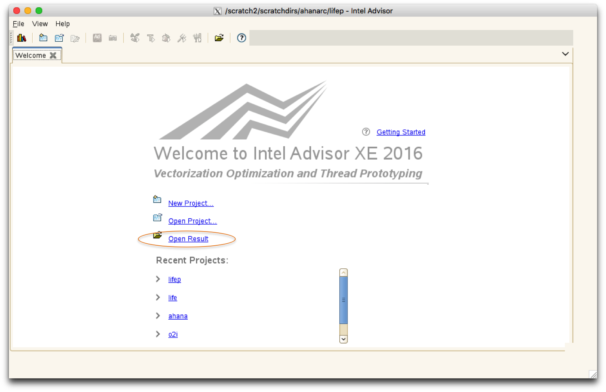
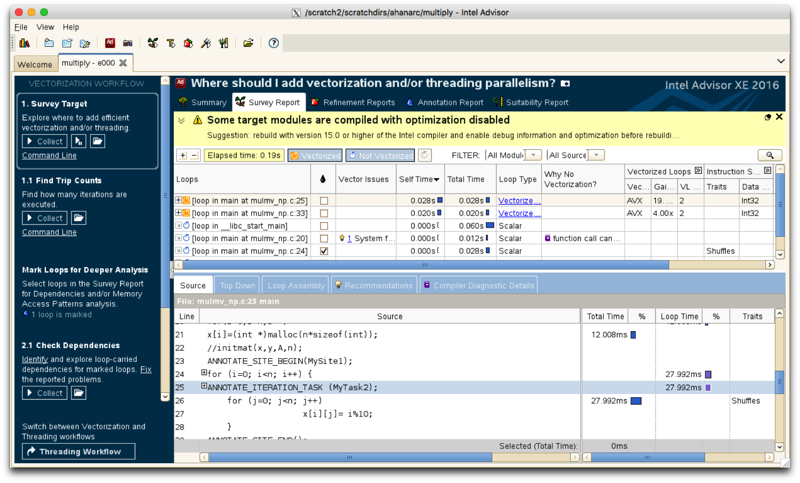

# Intel Advisor

## Introduction

Intel Advisor provides two workflows to help ensure that Fortran, C, and C++
applications can make the most of modern Intel processors. Advisor contains
three key capabilities:

* [Vectorization
  Advisor](https://software.intel.com/en-us/advisor/features/vectorization)
  identifies loops that will benefit most from vectorization, specifies what is
  blocking effective vectorization, finds the benefit of alternative data
  reorganizations, and increases the confidence that vectorization is safe.
* [Threading
  Advisor](https://software.intel.com/en-us/advisor/features/threading) is used
  for threading design and prototyping and to analyze, design, tune, and check
  threading design options without disrupting normal code development.
* [Advisor
  Roofline](https://software.intel.com/en-us/articles/getting-started-with-intel-advisor-roofline-feature)
  enables visualization of actual performance against hardware-imposed
  performance ceilings (rooflines) such as memory bandwidth and compute
  capacity - which provide an ideal roadmap of potential optimization steps.

The links to each capability above provide detailed information regarding how
to use each feature in Advisor. For more information on Intel Advisor, visit
[this page](https://software.intel.com/en-us/advisor).

## Using Intel Advisor on Cori

Either the command line tool, `advixe-cl` or the GUI can be used. We recommend
that you use the command line tool `advixe-cl`  to collect data via batch jobs
and then display results using the GUI `advixe-gui` on a login node.
The GUI is very responsive if one uses the [NX](../../connect/nx.md) screen
forwarding service.

### Compiling Codes to Run with Advisor

In order to compile code to work with Advisor, some additional flags need to be
used. In general, regardless of which compiler is used, one must enable debug
symbols (typically by adding the `-g` flag to the compiler) and also link
applications dynamically, not statically, in order for Advisor to produce
useful output.

When using the Cray compiler wrappers to compile codes to work with Advisor,
one can enable dynamic linking of an application either by adding the
`-dynamic` flag to the link line, or by setting the environment variable
`CRAYPE_LINK_TYPE=dynamic`. (The default link type for the Cray wrappers is
static.) If using the [Intel MPI compiler wrappers](../compilers/wrappers.md),
the default link type is dynamic so no additional flags need to be set.

To compile a code to be profiled by Advisor, one should use the same
optimization flags used in production runs of the code (typically `-O2` or
higher). For example, when using the Intel compilers with the Cray compiler
wrappers, to compile a C code for MPI as well as OpenMP, one could use one of
the following commands:

```
nersc$ cc -g -dynamic -qopenmp -O2 -o mycode.exe mycode.c
```

Enabling debug symbols via the `-g` flag allows Advisor to associate
application regions with source code lines.


### Launching Advisor with a Single MPI Rank

Advisor works best when profiling a single MPI rank. To launch Advisor for an
MPI + OpenMP code compiled with the Cray compiler wrappers, and using the basic
`survey` profiling mode in Advisor, one may use the following commands:

```
nersc$ salloc -N 1 -t 30:00 -q debug
nersc$ module load advisor
nersc$ export OMP_NUM_THREADS=8
nersc$ cc -g -dynamic -openmp -o mycode.exe mycode.c
nersc$ srun -n 1 -c 8 --cpu-bind=cores advixe-cl --collect survey --project-dir $SCRATCH/myproj  -- ./mycode.exe
```

This will store the results of the analysis performed by Advisor in the
`myproj` directory on the `$SCRATCH` Lustre file system.

### Launching Advisor with Multiple MPI Ranks

One can use Advisor to profile an application with multiple MPI ranks, albeit
with a few limitations. The default behavior in Advisor is to generate a
separate profiling database per MPI rank; this is rarely ideal, since the
common use case is to see aggregate performance of an application across all
MPI ranks. One can add the `-trace-mpi` flag to `advixe-cl`, which will
aggregate profiling data into a single database across MPI ranks, but the
aggregation is limited to ranks within a single compute node - Advisor will
always generate a separate database per compute node, regardless of the number
of ranks used per node.

Another way to use Advisor across multiple ranks is with Slurm's MPMD mode, in
which Advisor profiles only a subset of MPI processes. To do so, one may create
a plain text file (below called 'mpmd.conf'), containing the following exapmle code:
```
0 advixe-cl --collect survey --project-dir ./myproj -- ./mycode.exe
1-3 ./mycode.exe
```
To run this example in MPMD mode:
```
nersc$ srun --multi-prog ./mpmd.conf
```
This example instructs Slurm to profile process 0 with Advisor, but run
processes 1-3 without Advisor. This will generate a single profiling result
from Advisor (for process 0). The user should beware that this approach is
useful only if the workload for the application is similar across all
processes.

An alternative approach to MPMD mode is with a batch script which evalulates a
Slurm environment variable to decide which processes are profiled with Advisor.
For example, consider the following script, called `ascript.sh` below:
```
#!/bin/bash
if [ $SLURM_PROCID -eq 0 ]
then
 advixe-cl --collect survey --project-dir ./myproj -- ./mycode.exe
else
 ./mycode.exe
fi
```
One can then run this script as follows:
```
nersc$ srun -n 4  -c 8 ./ascript.sh
```
This script will profile process 0 with Advisor but run processes 1-3 without
profiling.

### Using the GUI to View Results

Note that the performance of the XWindows-based Graphical User Interface can be
greatly improved if used in conjunction with the free
[NX software](../../connect/nx.md).

#### Launching Advisor in GUI Mode

Log into Cori using the following command:

```
$ ssh -XY cori.nersc.gov
```

On the login node, load the Advisor module and then open the GUI:

```
cori$ module load advisor
cori$ advixe-gui
```

#### Viewing Results using the GUI



Use the "Open Result" button to browse for and open the ".advixeexp" file in
the directory that contains the result. Then, you should see a screen similar
to the following one which shows a list of top time-consuming loops:



To exit the GUI, simply click the cross on the top left hand corner of the
Advisor dialog box.

## Roofline Model Integration in Advisor

Recent versions of Advisor (2018 and newer) have integrated [Roofline
model](http://www.nersc.gov/assets/Uploads/2-SWillams-Roofline-Intro.pdf)
automation into their performance analysis. The new collection type `roofline`
runs the application twice - once with the `survey` analysis and again with the
`tripcounts` analysis, and combines the profiling information from each of the
two separate collections into a single presentation of the cache-aware roofline
model. One can then view the roofline data for the application in the Advisor
GUI.

Intel has posted a [video on
Youtube](https://www.youtube.com/watch?v=h2QEM1HpFgg) about how to use the
roofline functionality in Advisor.

## Examples

Below are a collection of example run scripts demonstrating the different
features of Advisor. All example assume the profiling data is being collected
on a Cori KNL node.

### Vectorization Advisor

This collection mode identifies general vectorization and threading
opportunities in a serial application. The example code provided in
`/opt/intel/advisor/samples/en/C++/vec_samples.tgz` is
suitable for this example.
```
srun -n 1 -c 4 --cpu-bind=cores advixe-cl -collect survey -project-dir $SCRATCH/Advisor_samples -- ./vec_samples
```
To view the result of the survey, the following statement can be run from a
login or compute node:
```
advixe-cl -report survey -project-dir $SCRATCH/Advisor_samples
```
which results in output like the following:

```
ID         Function Call Sites and Loops           Self Time   Total Time    Type                          Why No Vectorization                          Vector ISA   Compiler Estimated Gain   Average Trip Count   Min Trip Count   Max Trip Count   Call Count   Transformations   Source Location     Module
______________________________________________________________________________________________________________________________________________________________________________________________________________________________________________________________________________________________________________________
14   [loop in matvec at Multiply.c:69]                9.348s       9.348s   Scalar                            vector dependence prevents vectorization                                                                                                                                  Multiply.c:69   vec_samples
11   [loop in matvec at Multiply.c:60]                9.328s       9.328s   Scalar                            vector dependence prevents vectorization                                                                                                                                  Multiply.c:60   vec_samples
13   [loop in matvec at Multiply.c:82]                9.232s       9.232s   Scalar                            vector dependence prevents vectorization                                                                                                                                  Multiply.c:82   vec_samples
12   [loop in matvec at Multiply.c:49]                1.160s      29.068s   Scalar   outer loop was not auto-vectorized: consider using SIMD directive                                                                                                                                  Multiply.c:49   vec_samples
10   [loop in main at Driver.c:155]                   0.012s      29.080s   Scalar   loop with function call not considered an optimization candidate.                                                                                                                                   Driver.c:155   vec_samples
 9   [loop in __libc_csu_init at elf-init.c:87]           0s      29.068s   Scalar                                                                                                                                                                                                      elf-init.c:87   vec_samples
```

### Threading Advisor

This collection mode identifies threading bottlenecks in an OpenMP code. The
example code provided in
`/opt/intel/advisor/samples/en/C++/nqueens_Advisor.tgz` is suitable for this
example.
```
export OMP_NUM_THREADS=136
export OMP_PROC_BIND=spread
export OMP_PLACES=threads
srun -n 1 -c 272 --cpu-bind=sockets advixe-cl -collect survey -project-dir $SCRATCH/Advisor_OpenMP -- ./5_nqueens_omp
```
To view the result of the survey, the following statement can be run from a
login or compute node:
```
advixe-cl -report survey -project-dir $SCRATCH/Advisor_OpenMP
```
which results in output like the following:

```
ID                 Function Call Sites and Loops                   Self Time   Total Time    Type                                             Why No Vectorization                                            Vector ISA   Compiler Estimated Gain   Average Trip Count   Min Trip Count   Max Trip Count   Call Count   Transformations    Source Location         Module
_________________________________________________________________________________________________________________________________________________________________________________________________________________________________________________________________________________________________________________________________________________________________________________
 4   [loop in setQueen at nqueens_omp.cpp:104]                       20.235s      20.235s   Scalar                 loop with multiple exits cannot be vectorized unless it meets search loop idiom criteria                                                                                                                                nqueens_omp.cpp:104   5_nqueens_omp
 3   [loop in setQueen at nqueens_omp.cpp:133]                        3.321s      28.714s   Scalar   loop control variable was found, but loop iteration count cannot be computed before executing the loop                                                                                                                                nqueens_omp.cpp:133   5_nqueens_omp
 1   [loop in main$omp$parallel_for@157 at nqueens_omp.cpp:157]           0s      28.714s   Scalar   loop control variable was found, but loop iteration count cannot be computed before executing the loop                                                                                                                                nqueens_omp.cpp:157   5_nqueens_omp
 2   [loop in main$omp$parallel_for@157 at nqueens_omp.cpp:158]           0s      28.714s   Scalar                                        loop with function call not considered an optimization candidate.                                                                                                                                nqueens_omp.cpp:158   5_nqueens_omp
```

### Roofline Advisor

The example code provided
[here](https://software.intel.com/en-us/articles/training-sample-intel-advisor-roofline)
is suitable for this example. To perform the roofline analysis on the code, the
following example statement can be used:
```
export OMP_NUM_THREADS=136
export OMP_PROC_BIND=spread
export OMP_PLACES=threads
srun -n 1 -c 272 --cpu-bind=sockets advixe-cl -collect roofline -project-dir $SCRATCH/Advisor_roofline -- ./3_mmult_omp
```
After Advisor runs the two analysis required for the roofline model (`survey`
and `tripcounts`), one can view the resulting roofline plot in the Advisor GUI.

## Example Downloads

* [mulmv.c.txt](./example_codes/mulmv.c.txt): sample code used for the Advisor analysis.
  It is a matrix and vector multiplication code.
* [mulmv-annotated.c.txt](./example_codes/mulmv-annotated.c.txt): same file as above but
  with loop annontations for more targeted profiling.

## Common Pitfalls

Users profiling their applications with Advisor should be aware of pitfalls
described below.

### Profiling a statically linked executable

If one attempts to profile a statically linked application with Advisor, onen
will encounter an error similar to the following:

```
advixe: Error: Binary file of the analysis target does not contain symbols required for profiling. See the 'Analyzing Statically Linked Binaries' help topic for more details.
advixe: Error: Valid pthread_spin_trylock symbol is not found in the binary of the analysis target.
```

Instead, one should link applications dynamically. With the Cray compiler
wrappers this is achieved with the `-dynamic` link flag, or by setting the
environment variable `CRAYPE_LINK_TYPE=dynamic`. For other compilers, the
default link type is dynamic, and so no action is necessary.

One can verify that an application is dynamically linked by running the command
`ldd` on the executable. For example, a dynamically linked executable may show
output like the following:

```
user@cori04:src> ldd toypush
	linux-vdso.so.1 (0x00007ffd92dc9000)
	libAtpSigHandler.so.0 => /opt/cray/pe/lib64/libAtpSigHandler.so.0 (0x00002ba99e197000)
	librca.so.0 => /opt/cray/rca/default/lib64/librca.so.0 (0x00002ba99e3a1000)
	libmpich_intel.so.3 => /opt/cray/pe/lib64/libmpich_intel.so.3 (0x00002ba99e5a5000)
	libm.so.6 => /lib64/libm.so.6 (0x00002ba99eb5d000)
	libiomp5.so => /opt/intel/compilers_and_libraries_2018.3.222/linux/compiler/lib/intel64/libiomp5.so (0x00002ba99ee5a000)
	libpthread.so.0 => /lib64/libpthread.so.0 (0x00002ba99f235000)
	libdl.so.2 => /lib64/libdl.so.2 (0x00002ba99f452000)
	libc.so.6 => /lib64/libc.so.6 (0x00002ba99f656000)
	libgcc_s.so.1 => /opt/intel/advisor/lib64/libgcc_s.so.1 (0x00002ba99f9fb000)
	libxpmem.so.0 => /opt/cray/xpmem/default/lib64/libxpmem.so.0 (0x00002ba99fc12000)
	librt.so.1 => /lib64/librt.so.1 (0x00002ba99fe15000)
	libugni.so.0 => /opt/cray/ugni/default/lib64/libugni.so.0 (0x00002ba9a001d000)
	libudreg.so.0 => /opt/cray/udreg/default/lib64/libudreg.so.0 (0x00002ba9a029a000)
	libpmi.so.0 => /opt/cray/pe/lib64/libpmi.so.0 (0x00002ba9a04a4000)
	libifport.so.5 => /opt/intel/compilers_and_libraries_2018.3.222/linux/compiler/lib/intel64/libifport.so.5 (0x00002ba9a06eb000)
	libifcore.so.5 => /opt/intel/compilers_and_libraries_2018.3.222/linux/compiler/lib/intel64/libifcore.so.5 (0x00002ba9a0917000)
	libimf.so => /opt/intel/compilers_and_libraries_2018.3.222/linux/compiler/lib/intel64/libimf.so (0x00002ba9a0c74000)
	libsvml.so => /opt/intel/compilers_and_libraries_2018.3.222/linux/compiler/lib/intel64/libsvml.so (0x00002ba9a1207000)
	libintlc.so.5 => /opt/intel/compilers_and_libraries_2018.3.222/linux/compiler/lib/intel64/libintlc.so.5 (0x00002ba9a2b15000)
	/lib64/ld-linux-x86-64.so.2 (0x00002ba99df73000)
```

Howver, if one attempts to run `ldd` on a statically linked executable, the
output is an error:

```
user@cori04:src> ldd toypush
	not a dynamic executable
```

### Saving profiling database on a GPFS file system

The argument to the `-project-dir` flag for the `advixe-cl` command instructs
Advisor where to save the resulting profiling database from the application. On
the Cori the database must be saved to a Lustre
filesystem, e.g., `$SCRATCH`. If one attempts to save this database to a GPFS
file system (`$HOME` or `/project`), the profiling process will appear to run
correctly, but the final step of Advisor will fail with the following error:
```
advixe: Error: Data loading failed.
advixe: Error: Unexpected internal error / invalid state
```

### Finalization step on KNL nodes

The final step of Advisor's profiling process, called "finalization",
is a serial process, and runs as a single thread on a single
node. Because finalization depends on single-threaded performance of
the processor, this step can be very time consuming on Cori KNL
nodes. Consequently, it is recommended to add the flag
`-no-auto-finalize` to the `advixe-cl` command when profiling a code
running on KNL nodes. This defers the finalization step so that it can
be executed, e.g., on a login node which has Haswell processors with
much higher single-threaded performance.

One consequence of the `-no-auto-finalize` flag is that, when opening the GUI
to display the profiling output, Advisor may warn that it cannot find the
corresponding source code and object files for the profiled application, since
this step is performed during the finalization procedure. The user must then
manually add the locations of the directories containing source code and object
files, and then 're-finalize' the database from the GUI.
