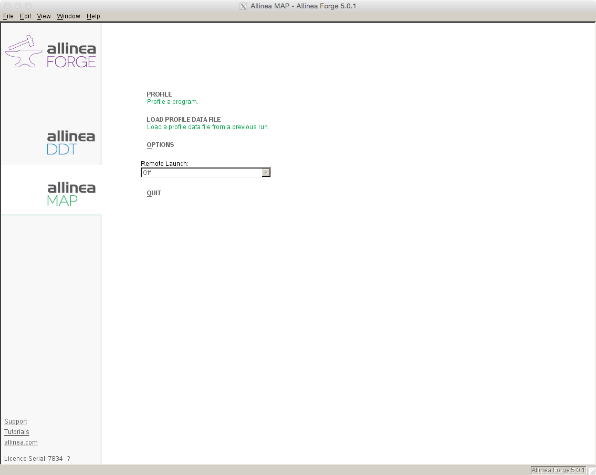
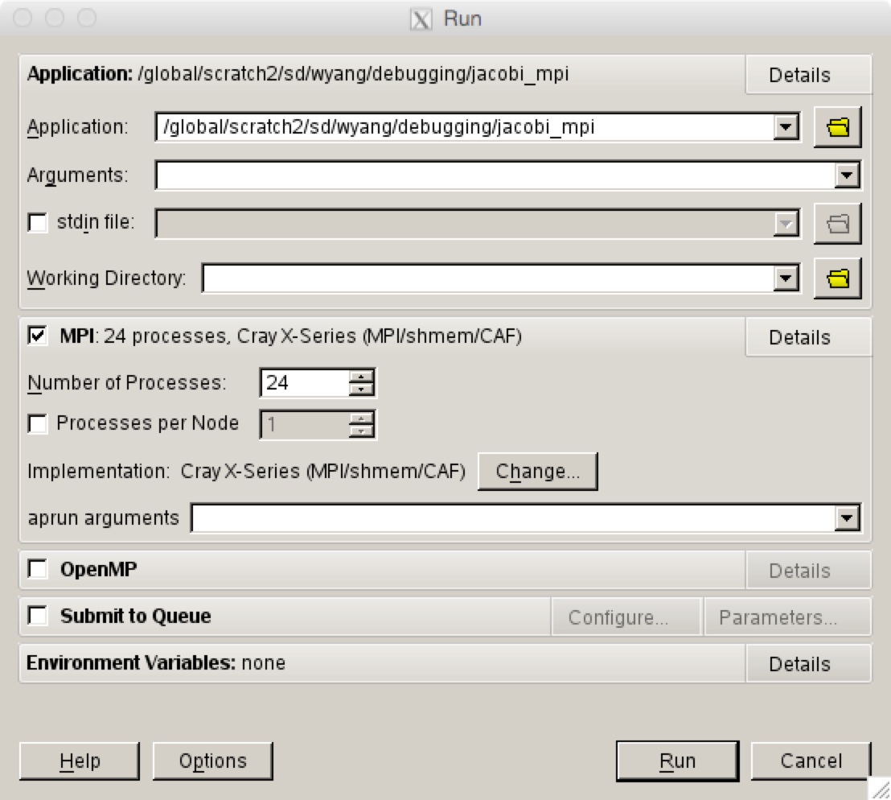
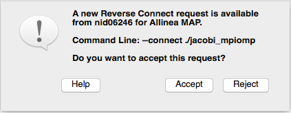
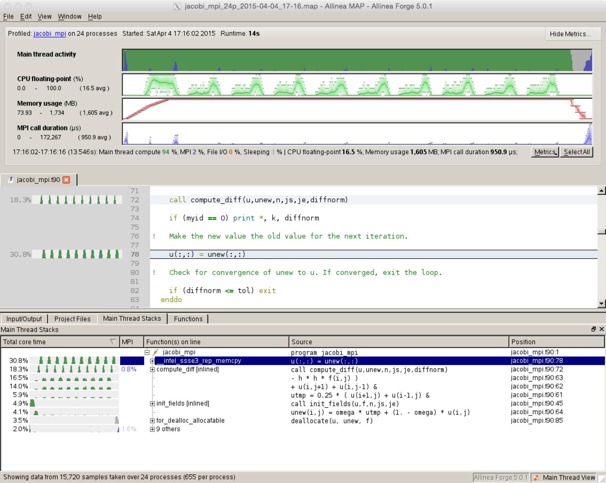

# MAP

MAP, a major component of the tool 'Arm Forge' (formerly called
Allinea Forge), is a parallel profiler with a simple graphical user
interface. It is installed on Cori.

Note that the performance of the X Windows-based MAP Graphical User
Interface can be greatly improved if used in conjunction with the
free [NX software](../../connect/nx.md).

## Introduction

Arm MAP is a parallel profiler with simple Graphical User Interface.
MAP can be run with up to 8192 processes, to profile serial, OpenMP
and MPI codes.

The Arm Forge User Guide available from the [Arm Forge web
page](https://developer.arm.com/docs/101136/latest/arm-forge) or
`$ALLINEA_TOOLS_DOCDIR/userguide-forge.pdf` on Cori after loading
an `allinea-forge` module is a good resource for learning more about
some of the advanced MAP features.

## Change of Module Name

As we are now using the package manager called Spack to install Arm
Forge, we have changed the module name from `allineatools` to
`allinea-forge`, following the standard Spack package name.  Although
the old name will still work for some time, we encourage users to
switch to the new name as the old modules will be phased out.

Note also that software or tools installed with Spack go to the new
installation location under `/global/common/sw`, instead of the
previous location in `/usr/common/software`.

Note that we will use the names, Arm Forge and Allinea Forge,
interchangeably in this webpage.

## Loading the Arm Forge Module

To use MAP, first load the `allinea-forge` module to set the
correct environment settings:

```Shell
nersc$ module load allinea-forge
```

The old module name `allineatools` still works:

```Shell
nersc$ module load allineatools
```

!!! tip
    We encourage users to use the new module name.

## Compiling Code to Run with MAP

To collect performance data, MAP uses two small libraries: MAP
sampler (`map-sampler`) and MPI wrapper (`map-sampler-pmpi`)
libraries. These must be used with your program. There are somewhat
strict rules regarding linking order among object codes and these
libraries (please read the User Guide for detailed information).
But if you follow the instructions printed by MAP utility scripts,
then it is very likely your code will run with MAP.

Your program must be compiled with the `-g` option to keep debugging
symbols, together with optimization flags that you would normally
use. If you use the Cray compiler on the Cray machines, we recommend
the `-G2` option.

Below we show build instructions using a Fortran case, but the C
or C++ usage is the same.

### On Cray Machines

Building an executable for MAP is more complicated on Cray machines.
First, you need to explicitly build the MAP sampler and MPI wrapper
libraries using `make-profiler-libraries`, and link your executable
against them.

To build a statically-linked executable, follow this procedure. It
creates a plain text file `allinea-profiler.ld` which contains
suggested options for linking the map libraries. You only need to
use `-Wl,@/your/directory/allinea-profiler.ld` flag with this file
in your link command in order to use the options contained in the
file.

```Shell
nersc$ make-profiler-libraries --lib-type=static
Created the libraries in /your/directory:
   libmap-sampler.a
   libmap-sampler-pmpi.a

To instrument a program, add these compiler options:
   compilation for use with MAP - not required for Performance Reports:
      -g (or '-G2' for native Cray Fortran) (and -O3 etc.)
   linking (both MAP and Performance Reports):
      -Wl,@/your/directory/allinea-profiler.ld ... EXISTING_MPI_LIBRARIES
   If your link line specifies EXISTING_MPI_LIBRARIES (e.g. -lmpi), then
   these must appear *after* the Allinea sampler and MPI wrapper libraries in
   the link line.  There's a comprehensive description of the link ordering
   requirements in the 'Preparing a Program for Profiling' section of either
   userguide-forge.pdf or userguide-reports.pdf, located in
   /usr/common/usg/allineatools/5.0.1/doc/.

nersc$ ftn -g -c testMAP.f        # Use -G2 instead of -g for the Cray compiler
nersc$ ftn -o testMAP_ex testMAP.o -Wl,@/your/directory/allinea-profiler.ld
```

You can provide an optional argument to `make-profiler-libraries`
to build the libraries in a directory other than the current working
directory.

To build a dynamically-linked executable, you don't have to build
the MAP libraries. You build your executable as you would normally
do, but with the `-g` compile flag:

```Shell
nersc$ ftn -c -g testMAP.f
nersc$ ftn -dynamic -o testMAP_ex testMAP.o -Wl,--eh-frame-hdr
```

## Starting a Job with MAP

Running an X window GUI application can be painfully slow when it
is launched from a remote system over internet. NERSC recommends
to use the free [NX software](https://docs.nersc.gov/connect/nx/)
because the performance of the X Window-based DDT GUI can be greatly
improved. Another way to cope with the problem is to use Arm Forge
remote client, which will be discussed in the next section.

You can also start Be sure to log in with an X window forwarding
enabled. This could mean using the `-X` or `-Y` option to ssh. The
`-Y` option often works better for macOS.

```Shell
$ ssh -Y username@cori.nersc.gov
```

After loading the `allinea-forge` module and compiling with the
`-g` option, request an interactive session:

```Shell
cori$ salloc -q interactive -N numNodes -C knl
```

Load the `allinea-forge` module if you haven't loaded it yet:

```shell
nerscc$ module load allinea-forge
```

Then launch the profiler with either

```Shell
nersc$ map ./testDDT_ex
```

or

```Shell
nersc$ forge ./testDDT_ex
```

where `./testDDT_ex` is the name of your program to profile.

The Arm Forge GUI will pop up, showing a start up menu for you to
select what to do. For profiling choose the option 'PROFILE' with
the 'arm MAP' tool.  You can also choose to 'LOAD PROFILE DATA FILE'
to view profiling results saved in a file created in a previous MAP
run.



Then a submission window will appear with a prefilled path to the
executable to debug. Select the number of processors on which to run
and press run. To pass command line arguments to a program enter them
in the 'srun arguments' box.



MAP will start your program and collect performance data from all
processes.


By default, MAP lets your program run to completion and will display
data for the entire run.  You can also use the 'Stop and Analyze'
button and the menu beneath it to control how long to profile your
program.

## Reverse Connect Using Remote Client

Arm provides remote clients for Windows, macOS and Linux that can
run on your local desktop to connect via SSH to NERSC systems to
debug, profile, edit and compile files directly on the remote NERSC
machine. You can download the clients from [Arm Forge download
page](https://developer.arm.com/products/software-development-tools/hpc/downloads/download-arm-forge)
and install on your laptop/desktop. Please note that the client
version must be the same as the Arm Forge version that you're going
to use on the NERSC machines.

For configuring the client for NERSC systems, follow the similar
steps shown in the [DDT web
page](./ddt.md).
If you have done configuration for using DDT on a NERSC machine,
the same configuration will be used for running MAP.

You can start MAP similarly. Select the configuration from the
Remote Launch menu corresponding to the machine that you want to
use, and login using your NIM password.


Arm recommends to use the __Reverse Connection__ method with the
remote client. To do this, put aside the remote client window that
you have been working with, and login to the corresponding machine
from a window on your local machine, as you would normally do. Then,
start an interactive batch session there, and run ddt with with the
option `--connect` as follows:

```Shell
$ ssh -Y cori.nersc.gov
[snip]

nersc$ salloc -N 1 -t 30:00 -p debug -C haswell
[snip]
nersc$ module load alline-forge
nersc$ map --connect srun -n 24 ./jacobi_mpi
```

The remote client will ask you whether to accept a Reverse Connect
request. Click 'Accept'.



The usual Run window will appear where you can change or set run
configurations and debugging options. Click 'Run'.


Now, your program will start under MAP and profiling results are
displayed in the remote client.

!!! note
	The above `map ... srun ...` command with version 19.1.x
	dumps a core file, and the vendor will release a fixed
	version. Note that the tool still generates performance
	summary results.

## Profiling Results

After completing the run, MAP displays the collected performance
data using GUI.



For info on how to interpret the results, please see the Arm Forge
User Guide.

MAP saves profiling results in a file,
`executablename_#p_yyyy-mm-dd_HH-MM.map` where `#` is for the process
count and `yyyy-mm-dd_HH-MM` is the time stamp.

```shell
nersc$ ls -l
-rw-------  1 wyang wyang   273822 Apr  4 17:16 jacobi_mpi_24p_2015-04-04_17-16.map
```

## Running in Command Line Mode

MAP can be run from the command line without GUI, by using the
`-profile` option. You can submit a batch job as follows:

```shell
nersc$ cat runit
#!/bin/bash
#SBATCH -N 1
#SBATCH -q debug
#SBATCH -t 10:00

module load allinea-forge
map --profile --np=24 ./jacobi_mpi

nersc$ sbatch runit
Submitted batch job 1054621

nersc$ cat slurm-1054621.out
Allinea Forge 6.0.1-46365 - Allinea MAP
Profiling             : /global/cscratch1/sd/wyang/debugging/jacobi_mpi
Allinea sampler       : statically linked

MPI implementation    : Auto-Detect (Cray X-Series (MPI/shmem/CAF))
* number of processes : 24
* Allinea MPI wrapper : statically linked
MPI enabled           : Yes
* MPI implementation  : SLURM (MPMD)
* number of processes : 24
* number of nodes     : 1
* Allinea MPI wrapper : statically linked

MAP analysing program...
MAP gathering samples...
MAP generated /global/cscratch1/sd/wyang/debugging/jacobi_mpi_24p_2016-02-01_12-21.map
           1   38.97168
...
          20   4.573649
...

nersc$ ls -l
...
-rw-------   1 wyang wyang   146101 Feb  1 12:21 jacobi_mpi_24p_2016-02-01_12-21.map
nersc$ sbatch runit
```

## Troubleshooting

If you are having trouble launching MAP, try these steps.

Make sure you have the most recent version of the `system.config`
configuration file. The first time you run DDT, you pick up a master
template which then gets stored locally in your home directory in
`~/.allinea/${NERSC_HOST}/system.config` where `${NERSC_HOST}` is the
machine name. If you are having problems launching DDT
you could be using an older verion of the `system.config` file and you
may want to remove the entire directory:

```Shell
nersc$ rm -rf ~/.allinea/${NERSC_HOST}
```

Remove any stale processes that may have been left by DDT.

```Shell
nersc$ rm -rf $TMPDIR/allinea-$USER
```

In case of a font problem where every character is displayed as a
square, please delete the `.fontconfig` directory in your home
directory and restart ddt.

```Shell
nersc$ rm -rf ~/.fontconfig
```

Make sure you are requesting an interactive batch session.  NERSC has
configured DDT to run from the interactive batch jobs.

```Shell
cori$ salloc -q interactive -N numNodes -C knl
```

Finally make sure you have compiled your code with `-g`. If none
of these tips help, please contact the consultants via
[ttps://help.nersc.gov](https://help.nersc.gov).

## Tutorial Materials

Previous tutorial presentation slides are available on how to use
MAP:

- [Allinea-MAP-perfreport-201702.pdf](http://www.nersc.gov/assets/Uploads/Allinea-MAP-perfreport-201702.pdf)
