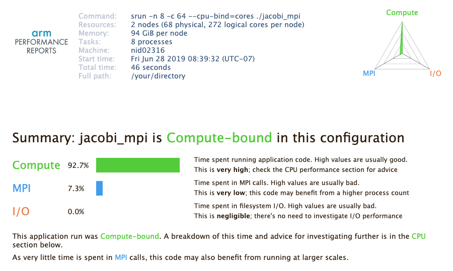
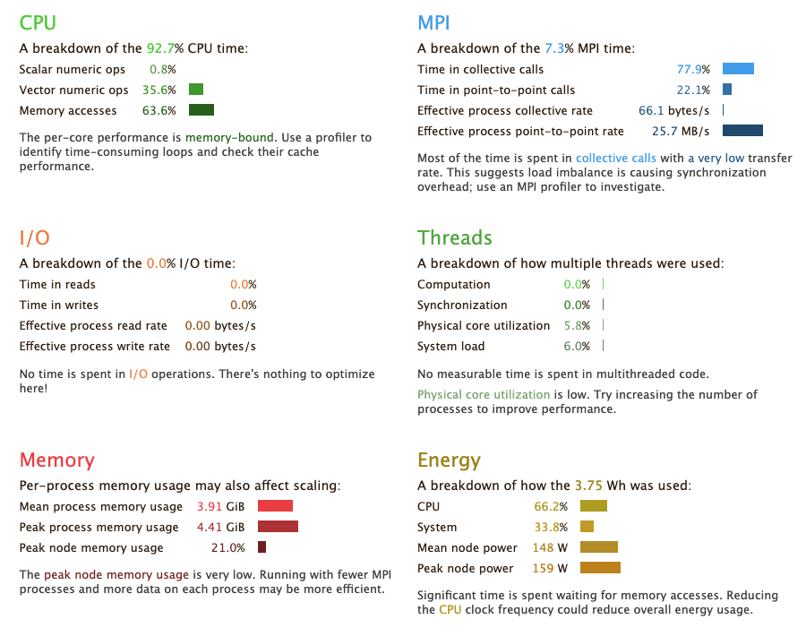

# Arm Performance Reports

## Introduction

Arm Performance Reports is a low-overhead tool that produces one-page
text and HTML reports summarizing and characterizing both
scalar and MPI application performance.  The report intends to
answer a range of vital questions:

-   Is this application optimized for the system it is running on?

-   Does it benefit from running at this scale?

-   Are there I/O or networking bottlenecks affecting performance?

-   Which hardware, software or configuration changes can be made
    to improve performance further?

The tool is based on [MAP](map.md)'s low-overhead adaptive sampling
technology that keeps data volumes collected and application overhead
low.

The Arm Performance Reports User Guide available from the [Arm
Performance Reports web
page](https://developer.arm.com/docs/101137/latest/introduction)
or `$ALLINEA_TOOLS_DOCDIR/userguide-reports.pdf` on Cori after
loading an `allinea-reports` module is a good resource for learning
more about its features.

## Loading the Arm Performance Reports Module

To use Arm Performance Reports, first load the `allinea-reports`
module to set the correct environment settings:

```Shell
nersc$ module load allinea-reports
```

## Compiling Code to Run with Arm Performance Reports

To collect performance data, Arm Performance Reports uses the same
sampling libraries that MAP uses: MAP sampler (`map-sampler`) and
MPI wrapper (`map-sampler-pmpi`) libraries. The same build and link
rules as with MAP apply here. For info, please read the User Guide
or the [MAP web page](map.md).

Just as with MAP, your program must be compiled with the `-g` option
to keep debugging symbols, together with optimization flags that
you would normally use. If you use the Cray compiler on the Cray
machines, we recommend the `-G2` option.

Below we show build instructions using a Fortran case, but the C
or C++ usage is the same.

### On Cray Machines

Building an executable for MAP is more complicated on Cray machines.
First, you need to explicitly build the MAP sampler and MPI wrapper
libraries using `make-profiler-libraries`, and link your executable
against them.

To build a statically-linked executable, follow this procedure. It
creates a plain text file `allinea-profiler.ld` which contains
suggested options for linking the map libraries. You only need to
use `-Wl,@/your/directory/allinea-profiler.ld` flag with this file
in your link command in order to use the options contained in the
file.

```Shell
nersc$ make-profiler-libraries --lib-type=static
Creating Cray static libraries in /your/directory
Created the libraries:
   libmap-sampler.a
   libmap-sampler-pmpi.a

To instrument a program, add these compiler options:
   compilation for use with MAP - not required for Performance Reports:
      -g (or '-G2' for native Cray Fortran) (and -O3 etc.)
   linking (both MAP and Performance Reports):
      -Wl,@/your/directory/allinea-profiler.ld ... EXISTING_MPI_LIBRARIES
   If your link line specifies EXISTING_MPI_LIBRARIES (e.g. -lmpi), then
   these must appear *after* the Allinea sampler and MPI wrapper libraries in
   the link line.  There's a comprehensive description of the link ordering
   requirements in the 'Preparing a Program for Profiling' section of either
   userguide-forge.pdf or userguide-reports.pdf, located in
   /global/common/sw/cray/cnl6/haswell/allinea-reports/19.1/doc/.

nersc$ ftn -g -c jacobi_mpi.f90      # Use -G2 instead of -g for the Cray compiler
nersc$ ftn -o jacobi_mpi jacobi_mpi.o -Wl,@/your/directory/allinea-profiler.ld
```

You can provide an optional argument to `make-profiler-libraries`
to build the libraries in a directory other than the current working
directory.

To build a dynamically-linked executable, you don't have to build
the MAP libraries. You build your executable as you would normally
do, but with the `-g` compile flag:

```Shell
nersc$ ftn -c -g jacobi_mpi.f90
nersc$ ftn -dynamic -o jacobi_mpi jacobi_mpi.o -Wl,--eh-frame-hdr
```

## Starting a Job with Arm Performance Reports

In order to use this tool, you do _not_ have to run your application
in an interactive batch job session. Just make sure that the module
is still loaded in the batch session (that is, in your batch job
script if you use the tool in a non-interactie batch job):

```shell
module load allinea-reports
```

Add a command that launches the tool:

```Shell
perf-report srun <usual srun flags> ./jacobi_mpi
```

where `./jacobi_mpi` is the name of a program to profile.

!!! note
	The above `perf-report srun ...` command with version 19.1
	dumps a core file, and the vendor will release a fixed
	version. Note that the tool still generates performance
	summary results.

## Profiling Results

After completing the run, Arm Performance Reports prepares performance
summary results in two files, one plain-text file and a HTML file:
`executablename_#p_#n_yyyy-mm-dd_HH-MM.txt` and
`executablename_#p_#n_yyyy-mm-dd_HH-MM.html` where `#` before the
letter `p` is for the process count, `#` before the letter `n` is
for the node count, and `yyyy-mm-dd_HH-MM` is the time stamp.
For example:

```shell
$ ls -lrt jacobi_mpi*
...
-rw-r--r--   1 xxxxx xxxxx   476702 Jun 28 08:40 jacobi_mpi_8p_2n_2019-06-28_08-39.html
-rw-r--r--   1 xxxxx xxxxx     3092 Jun 28 08:40 jacobi_mpi_8p_2n_2019-06-28_08-39.txt
```

The performance results in both files are basically the same. If
you want to use a web browser for a better display, download the
HTML file to your local workstation and view it with your favorite
browser.

The top portion of the report shows the command that was run and
info about the compute nodes, followed by a performance characterization
of the application run - whether it is a compute, MPI-communication
or I/O bound:



The triangular radar chart in the top-right corner of the report
reflects the values of the three key measurement.

Then, the report shows more detailed info in each category, by
breaking down relevant performance metrics into subcategories. For
example, The 'CPU' component shows how much time was spent on scalar
numeric operations, vector onumeric operations and memory access.
Simlar breakdowns are done for MPI, I/O, threading, etc.



### Summarizing an existing MAP file

If you have performance data collected with MAP before, you can get
a performance summary report from the MAP file, too. To get a report,
simply run the `perf-report` command on the MAP file:

```shell
nersc$ ls -l
...
-rw-r--r--   1 xxxxx xxxxx   475005 Jun 21 17:16 jacobi_mpi_8p_2n_2019-06-21_17-16.map
...

nersc$ perf-report jacobi_mpi_8p_2n_2019-06-28_08-49.map

nersc$ ls -l
...
-rw-r--r--   1 xxxxx xxxxx   476414 Jun 28 08:52 jacobi_mpi_8p_2n_2019-06-21_17-16.html
-rw-r--r--   1 xxxxx xxxxx     3078 Jun 28 08:52 jacobi_mpi_8p_2n_2019-06-21_17-16.txt
...
```
