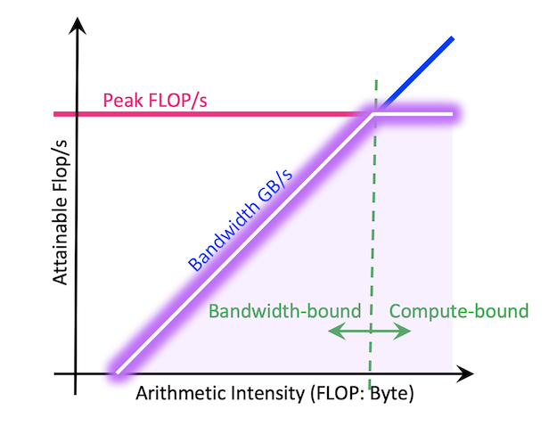
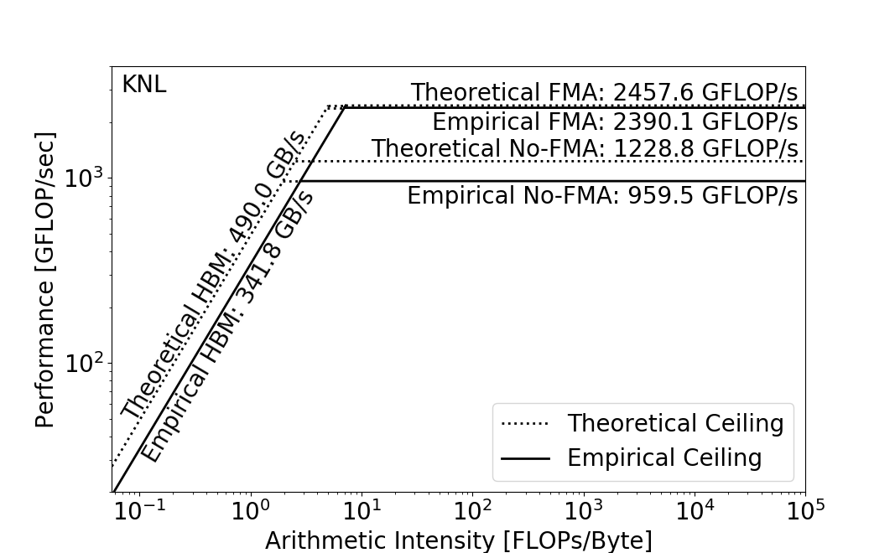
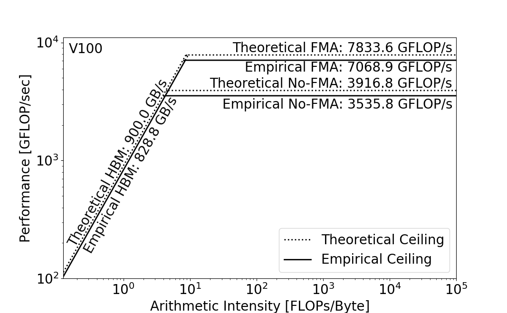
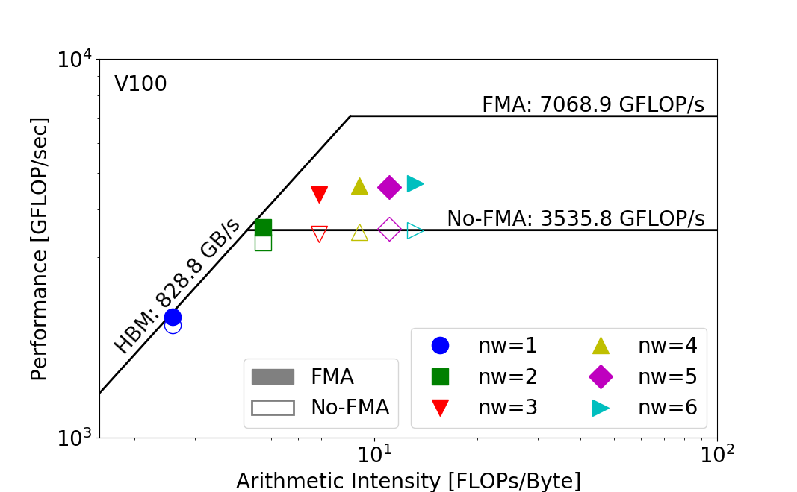

# Roofline Performance Model

Performance models and tools are an integral component in the
optimization process as they qualify performance relative to machine
capabilities, track the progress towards optimality, and identify
bottlenecks, inefficiencies, and limitations in current
implementations and architectures. The Roofline performance model
[\[1\]](#References) offers an insightful and intuitive method for
extracting the key computational characteristics of HPC applications
and comparing them against the performance bounds of modern
processors. Its capability to abstract the complexity of modern
non-uniform memory hierarchies and identify the most profitable
optimization techniques has made Roofline-based analysis increasingly
popular in the HPC community.

Roofline represents the performance of an application broken down into
its constituent loop nests or kernels (characterized by computation,
data movement, and run time) plotted against the peak capabilities
(GFLOP/s, bandwidth) of a given processor on an absolute scale. Given
the scale and complexity of modern science applications, it can be a
tedious task for a programmer to perform a detailed Roofline-based
characterization through manual instrumentation. On Intel
architectures, [Intel Advisor](advisor.md) has offered a feature that
automates the process of building a Roofline performance model for
each loop nest in an application. On NVIDIA GPU architectures, there
hasn't been any integration of such features in NVIDIA's tools such
as [NVPROF](https://docs.nvidia.com/cuda/profiler-users-guide/index.html) or
Nsight Systems/Compute.

In this documentation page, we provide a generic methodology for
Roofline data collection that requires a bit of labour but works on
both architectures. The tools involved in this methodolgy
are
[ERT](https://bitbucket.org/berkeleylab/cs-roofline-toolkit/),
[SDE](https://software.intel.com/en-us/articles/intel-software-development-emulator),
[VTune](vtune.md) and [LIKWID](likwid.md) for Intel architectures,
and [NVPROF](https://docs.nvidia.com/cuda/profiler-users-guide/index.html) for NVIDIA GPU architectures.

## Roofline Performance Model

The most basic
[Roofline model](http://crd.lbl.gov/departments/computer-science/PAR/research/roofline/introduction/) can
be used to bound floating-point performance as a function of machine
peak performance, machine peak bandwidth, and arithmetic
intensity. One can visualize the Roofline model by plotting the
performance bound (GFLOP/s) as a function
of [Arithmetic Intensity](##Arithmetic Intensity), as shown Below. The
resultant curve (hollow purple) can be viewed as a performance
envelope under which kernel or application performance exists.



Details on how to measure the peak compute performance, peak bandwidth
and arithmetic intensity are given below.

## Empirical Roofline Toolkit (ERT)

A common conception is to use vendor specifications to calculate the
peak compute performance (FLOP/s) and peak bandwidth. This gives some
insight into the scale of the machine's capability, but it may not
capture the realistic execution environment (e.g. power/energy
constraints) and hence be inaccurate. For example, the clock frequency
for a KNL chip may be reduced by 200MHz when running full-AVX codes
[\[2\]](#References) and an NVIDIA GPU card may be subject to thermal
throttling and down clocking due to external power constraints or
temperature
control. The
[Empirical Roofline Toolkit (ERT)](https://bitbucket.org/berkeleylab/cs-roofline-toolkit/),
runs a variety of micro-kernels and sweeps through a range of runtime
configurations. These micro-kernels may be small and designed to just
test an aspect of the system, but they provide a set of more realistic
machine capabilities, such as peak bandwidth and peak GFLOP/s.

The following two figures show the discrepancy between the theoretical
compute peak and bandwidth peak, and the empirical peaks measured by
ERT, on Intel KNL (Xeon Phi 7250) on Cori (Top) and NVIDIA V100 on
Voltar cluster at University of Oregon (Bottom). The bandwidth here is
between the High Bandwidth Memory (HBM) and the cache one level
above. (Here Intel KNL is configured in Quad-Cache mode)




As you can see, there is a certain discrepancy between the theoretical
and empirical peaks.

## Arithmetic Intensity (AI)

Arithmetic Intensity (AI) is the ratio of total floating-point
operations (FLOPs) performed by a given code or code section, to the
total data movement (Bytes) required to support those FLOPs. Here
please note the difference between FLOPs and FLOP/s, where FLOPs is
the count and FLOP/s is the rate or throughput.

### Calculating Arithmetic Intensity (AI) on KNL

#### Counting FLOPs on KNL 

FLOPs can be measured
using
[SDE](https://software.intel.com/en-us/articles/intel-software-development-emulator) on
Intel architectures such as KNL, and [nvprof](nvprofmd) on NVIDIA GPUs
such as V100.

SDE has dynamic instruction tracing capability, and in particular its
histogram tool captures information such as dynamic instructions
executed, instruction length, instruction category and ISA extension
grouping, enabling a concrete and accurate way of calculating FLOPs
and analyzing the instruction mix. Intel has developed a methodology
for calculating FLOPs with SDE
'[Calculating FLOPs with SDE](https://software.intel.com/en-us/articles/calculating-flop-using-intel-software-development-emulator-intel-sde)',
and in general the section 'Instructions to Count Unmasked FLOP'
captures most of the FLOPs at a not-so-prohibitive overhead.

An example command line for SDE is:

```slurm
nersc$ srun -n 4 -c 6 sde -knl -d -iform 1 -omix my_mix.out -i -global_region -start_ssc_mark 111:repeat -stop_ssc_mark 222:repeat -- foo.exe
```

Where:

*  `-knl` is used to target Cori's KNL ISA and `-hsw` for Cori Haswell
*  `-d` specifies to only collect dynamic profile information
*  `-iform 1` turns on compute ISA iform mix
*  `-omix` specifies the output file (and turns on `-mix`)
*  `-i` specifies that each process will have a unique file name based
   on process ID (needed for MPI)
*  `-global_region` will include any threads spawned by a process
   (needed for OpenMP)
*  `-start_ssc_mark` and `-stop_ssc_mark` limit the FLOPs counting to a
   code region within a large application. Note, code must include
   markers such as `0x111` and `0x222`.

```C
__SSC_MARK(0x111); // start SDE tracing, note it uses 2 underscores

for (k=0; k<NTIMES; k++) {
 #pragma omp parallel for
 for (j=0; j<STREAM_ARRAY_SIZE; j++)
 a[j] = b[j]+scalar*c[j];
}

__SSC_MARK(0x222); // stop SDE tracing
```

SDE will create a file for every process that is created by the
application. For example, in an MPI code SDE will create a file for
each MPI process (one per rank) and if the application contains
threads (e.g. OpenMP) those will be encapsulated into the same file
("-global_region" enables this).

To parse the results that SDE produces, you can use the script
`parse-sde.sh` in
https://bitbucket.org/dwdoerf/stream-ai-example/src/master/parse-sde.sh. For
example, the sample code `Stream` in the same repository produces the
following floating-point operation count and total L1 Byte count.

```shell
nersc$ ./parse-sde.sh sde_2p16t*           
Search stanza is "EMIT_GLOBAL_DYNAMIC_STATS"
elements_fp_single_1 = 0
elements_fp_single_2 = 0
elements_fp_single_4 = 0
elements_fp_single_8 = 0
elements_fp_single_16 = 0
elements_fp_double_1 = 2960
elements_fp_double_2 = 0
elements_fp_double_4 = 999999360
elements_fp_double_8 = 0
--->Total single-precision FLOPs = 0
--->Total double-precision FLOPs = 4000000400
--->Total FLOPs = 4000000400
mem-read-1 = 8618384
mem-read-2 = 1232
mem-read-4 = 137276433
mem-read-8 = 149329207
mem-read-16 = 1999998720
mem-read-32 = 0
mem-read-64 = 0
mem-write-1 = 264992
mem-write-2 = 560
mem-write-4 = 285974
mem-write-8 = 14508338
mem-write-16 = 0
mem-write-32 = 499999680
mem-write-64 = 0
--->Total Bytes read = 33752339756
--->Total Bytes written = 16117466472
--->Total Bytes = 49869806228
```

One can also extract the FLOPs number by simply bashing:

```
flops=`grep 'Total FLOPs = 'result.sde.after.parse | cut -d '=' -f 2`
gflops=`python -c "print('{0:.3f}'.format($flops/1024.0/1024/1024))"`
echo SDE FLOPS is $gflops GFLOPS
```

#### Counting Bytes on KNL

Both [LIKWID](likwid.md) and [VTune](vtune.md) can be used to count
bytes transferred by a code or code region on Intel KNL. Since they
are both using the same hardware counters, they should be produce the
same byte count, give or take runtime variation.

LIKWID has a pre-defined performance group `HBM_CACHE` for KNL, so to
collect Bytes information, users just need to compile the code with
`-I$LIKWID_INCLUDE -DLIKWID_PERFMON`, request nodes with
'--perf=likwid' flag on, and run the code as

```slurm
module load likwid
srun -n 1 -c 272 --cpu_bind=cores --cpu-freq=1401000 likwid-perfctr -c 0-271 -g HBM_CACHE foo.exe >> result.likwid
```

which runs on a single node with all 272 hyper-threads being tracked.

To collect Bytes for a specific code region, please
see [LIKWID](likwid.md) page for information on LIKWID's Marker API.

To parse results LIKWID produced, you can run the following commands

```bash
hbm_mbytess=`grep "MCDRAM Memory bandwidth" result.likwid | tail -n 1 | cut -d '|' -f 3`
hbm_gbytes=`grep "MCDRAM Memory data volume" result.likwid | tail -n 1 | cut -d '|' -f 3`
hbm_gbytess=`python -c "print('{0:.3f}'.format($hbm_mbytess/1024))"`
echo "MCDRAM Bytes: $hbm_gbytes GB"
```

To collect data movement information using VTune, one can compile the
code with necessary header files (`ittnotify.h`) and libraries
(`-littnotify`), request an allocation with `--perf=vtune`, and run
the following command in a job script:

```slurm
module load vtune
srun -n 1 -c 272 --cpu_bind=cores --cpu-freq=1401000 amplxe-cl -start-paused -r Result.vtune.$SLURM_JOB_ID/my_vtune -collect memory-access -finalization-mode=none -data-limit=0 -- foo.exe
```

where `-start-paused` allows for regional tracing, if the code
includes markers `__itt_resume()` and `__itt_pause()` as shown in the
example below.

```C
// Code must be built with appropriate paths for VTune include file (ittnotify.h) and library (-littnotify)
#include <ittnotify.h>

__itt_resume(); // start VTune, again use 2 underscores

for (k=0; k<NTIMES; k++) {
 #pragma omp parallel for
 for (j=0; j<STREAM_ARRAY_SIZE; j++)
 a[j] = b[j]+scalar*c[j];
}

__itt_pause(); // stop VTune
```

To use VTune markers in Fortran codes,
see
[this Intel article](https://software.intel.com/en-us/vtune-amplifier-help-configuring-your-build-system).

The above example command line only runs on one KNL node, but when
there are multiple nodes, VTune will places results in different
directories, one per node. VTune usually produces a lot of data so
finalizing it could be very IO-intensive. The flag
`-finalization-mode=none` defers finalization to a later stage, where
users can run on the login node (instead of on a compute node inside a
job script), as follows.

```
nersc$ $ amplxe-cl -report hw-events -group-by=package -r vtbw_2p16t_13568698.nid00619 -column=UNC_M_CAS_COUNT -format=csv -csv-delimiter=comma > vtbw_2p16t_13568698.summary
--> lots of VTune output ....
--> Repeat for each directory created during data collection, one per node
nersc$ ./parse-vtune2018.sh vtbw_2p16t*.summary
Search stanza is "Uncore"
UNC_M_CAS_COUNT.RD[UNIT0] = 0
UNC_M_CAS_COUNT.RD[UNIT1] = 0
UNC_M_CAS_COUNT.RD[UNIT2] = 127252047
UNC_M_CAS_COUNT.RD[UNIT3] = 126829175
UNC_M_CAS_COUNT.RD[UNIT4] = 0
UNC_M_CAS_COUNT.RD[UNIT5] = 0
UNC_M_CAS_COUNT.RD[UNIT6] = 126861782
UNC_M_CAS_COUNT.RD[UNIT7] = 127247700
UNC_M_CAS_COUNT.WR[UNIT0] = 0
UNC_M_CAS_COUNT.WR[UNIT1] = 0
UNC_M_CAS_COUNT.WR[UNIT2] = 62611982
UNC_M_CAS_COUNT.WR[UNIT3] = 62274525
UNC_M_CAS_COUNT.WR[UNIT4] = 0
UNC_M_CAS_COUNT.WR[UNIT5] = 0
UNC_M_CAS_COUNT.WR[UNIT6] = 62389886
UNC_M_CAS_COUNT.WR[UNIT7] = 62519044
--->Total Bytes read = 32524205056
--->Total Bytes written = 15986907968
--->Total Bytes = 48511113024
```

The `amplxe-cl -report` command creates a summary report for the
example `Stream` for each directory VTune created, and the script
`parse-vtune2018.sh` (which can be found in
https://bitbucket.org/dwdoerf/stream-ai-example/src/master/parse-vtune2018.sh)
extracts the uncore counter data for all directories with the help of
wildcard `*`.


#### Calculating Arithmetic Intensity (AI) on KNL

Arithmetic intensity can now be calculated. Nominally, it's the ratio
of "Total FLOPs" as reported by SDE to "Total Bytes" as reported by
LIKWID or VTune. Here if we use the VTune number for `Stream`, the HBM
level AI is,

$$
\mathrm{AI\ (HBM)} = \frac{4000000400}{48511113024} = 0.0825
$$

Alternatively, we can use the "Total Bytes" as seen by the core L1
cache and reported by SDE, and we get the L1 level AI as,

$$
\mathrm{AI\ (L1)} = \frac{4000000400}{49869806228} = 0.0802
$$

Since STREAM has very little reuse of data, the AI of the two is
approximately the same. For real codes, the AI (L1) will most likely
be significantly lower. AI (L1) divided by AI (DRAM) can be used as a
"bandwidth bound" figure of merit, the closer to 1.0 the more
bandwidth bound the application.

### Calculating Arithmetic Intensity (AI) on V100

NVIDIA's profiling tool [nvprof](nvprofmd) can be used to measure both
FLOPs and Bytes for a GPU kernel. Specifically, this command line can
be run to measure a particular invocation of a particular kernel,

```
nvprof --kernels "{kernel name}, {[context id/name]:[stream id/name]:[kernel name]:[invocation]}" --metrics flop_count_dp --metrics dram_read_transactions --metrics dram_write_transactions foo.exe
```

where `flop_count_dp` is the total FLOP count for FP64 operations, and
`dram_read_transactions` and `dram_write_transactions` are the read
and write transactions from and to HBM. For FP32 or FP16 operations,
`flop_count_sp` and `flop_count_hp` can be used. The size of each
memory transaction is 32 bytes, so the total HBM data movement can be
calculated as `(dram_read_transactions + dram_write_transactions) x
32B`.

The arithmetic intensity of a kernel on an NVIDIA V100 can thus be
obtained by

```
AI (HBM) = flop_count_dp / ((dram_read_transactions + dram_write_transactions)*32)
```

## Application Performance

The application performance (GFLOP/s) can be obtained by `FLOPs /
Runtime`, where `Runtime` can be obtained by timers in the
code. Together with the arithmetic intensity (obtained from the
previous section) and Roofline ceilings (obtained from ERT), we can
generate a Roofline plot. For a simple example, the General Plasmon
Pole (GPP) kernel from BerkeleyGW at
https://github.com/cyanguwa/nersc-roofline, if we vary the number of
iterations in the innermost loop, by increasing `nw` from 1 to 6, we
observe a series of dots on the Roofline chart.




## Performance Analysis

As the parameter `nw` grows from 1 to 6, the arithmetic intensity of
GPP increases, because the total amount of data moved hasn't changed
but the total amount of FLOPs executed has been proportional to
`nw`. This increase in arithmetic intensity takes GPP from a bandwidth
bound regime to a compute bound regime, and the observed GFLOP/s also
increases on both KNL and V100 Roofline charts. The subtlity here is
that the bottleneck may be different even for the same `nw`. For
example, at `nw=2`, the kernel is more bandwidth bound on KNL whereas
on V100, it is more compute bound.

Roofline is very helpful in capturing these subtle differences and
thus is recommended to be included in users' performance analysis and
code optimization activities.

## References

1. S. Williams, A. Waterman, D. Patterson, "Roofline: an insightful
visual performance model for multicore architectures", Communications
of the ACM (CACM), April 2009.
1. Intel Knights Landing
   Processor. https://ark.intel.com/products/94034/Intel-Xeon-Phi-Processor-7230-16GB-130-GHz-64-core
