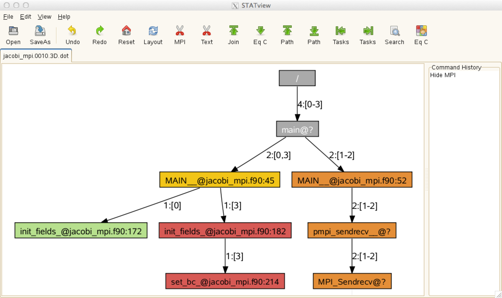
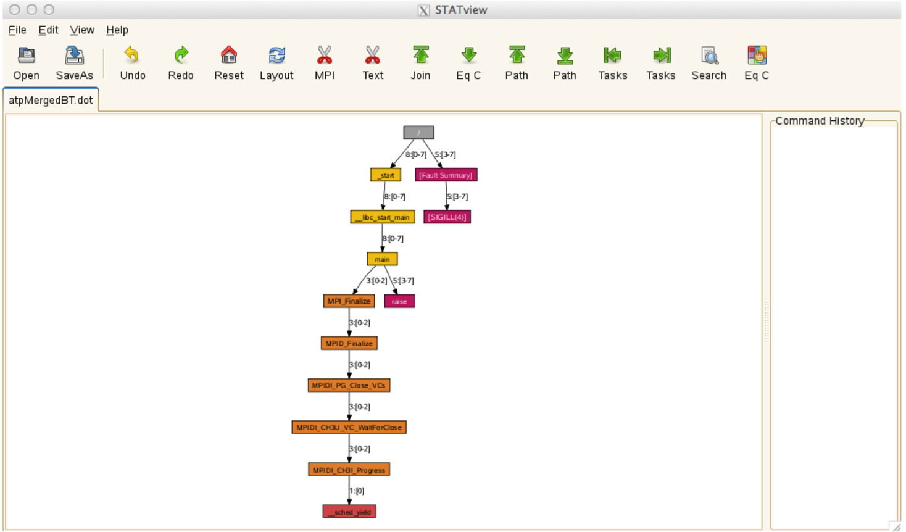

# STAT and ATP

## STAT

STAT (the Stack Trace Analysis Tool) is a highly scalable, lightweight
tool that gathers and merges stack traces from all of the processes of
a parallel application. The results are then presented graphically as
a call tree showing the location that each process is executing.

This is a useful tool for debugging an application that hangs because
collected call backtraces can quickly tell you where each process is
executing at the moment in the code, providing a hint on where to look
further for more detailed analysis.

It supports distributed-memory parallel programming only such as MPI,
Coarray Fortran and UPC (Unified Parallel C).

One way to collect backtraces under Slurm is explained below.

1.  Start an interactive batch job and launch an application in
    background. Keep the process ID (PID).

    ```shell
    nersc$ salloc -N 1 -t 30:00 -q debug ...
    nersc$ srun -n 4 ./jacobi_mpi &
    [1] 95298
    ```

    You can also see the PID by running the 'ps' command:

    ```shell
    nersc$ ps
       PID TTY          TIME CMD
     95018 pts/0    00:00:00 bash
     95298 pts/0    00:00:00 srun
     95302 pts/0    00:00:00 srun
     95325 pts/0    00:00:00 ps
    ```

2.  Load the module stat

    ```shell
    nersc$ module load stat
    ```

3.  Run the `stat-cl` command on this process. You may want to use the `-i`
    flag to gather source line numbers, too:

    ```shell
    nersc$ stat-cl -i 95298
    STAT started at 2016-11-30-07:33:37
    Attaching to job launcher (null):95298 and launching tool daemons...
    Tool daemons launched and connected!
    Attaching to application...
    Attached!
    Application already paused... ignoring request to pause
    Sampling traces...
    Traces sampled!
    ...
    Resuming the application...
    Resumed!
    Merging traces...
    Traces merged!
    Detaching from application...
    Detached!

    Results written to /global/cscratch1/sd/wyang/parallel_jacobi/stat_results/jacobi_mpi.0004
    ```

    `stat-cl` takes several backtrace samples after attaching to the running
    processes. The result file is created in the `stat_results`
    subdirectory under the current working directory. This subdirectory
    contains another subdirectory whose name is based on your parallel
    application's executable name that contains the merged stack trace
    file in DOT format.


4.  Then, run the GUI command, `STATview`, with the file above to
    visualize the generated `*.dot` files for stack backtrace
    information.

    ```shell
    nersc$ STATview stat_results/jacobi_mpi.0004/00_jacobi_mpi.0004.3D.dot
    ```

    Please note that, if you're running on Cori KNL nodes, you have to go
    to a login node for this step (after loading the stat module
    there). Otherwise, fonts will not be shown correctly.

    

    The above call tree diagram reveals that rank 0 is in the
    'init_fields' routine (line 172 of jacobi_mpi.f90), rank 3 in the
    'set_bc' routine (line 214 of the same source file), and the other
    ranks (1 and 2) are in the MPI_Sendrecv function. If this pattern
    persists, it means that the code hangs in these locations. With this
    information, you may want to use a full-fledged parallel debugger such
    as DDT or TotalView to find out why your code is stuck in these
    places.

## ATP

Another useful tool in the same vein is ATP (Abnormal Termination
Processing) that Cray has developed. ATP gathers stack backtraces when
the code crashes, by running STAT before it exits.

The 'atp' module is load by default on Cray systems, but it is not
enabled. To enable it so that it generates stack backtrace info upon a
failure, set the following environment variable before your aprun
command in your batch script:

```shell
setenv ATP_ENABLED 1          # for csh/tcsh

export ATP_ENABLED=1          # for bash/sh/ksh
```

In addition, you need to set the `FOR_IGNORE_EXCEPTIONS` environment
variable if you're using Fortran and you have built with the Intel
compiler:

```shell
setenv FOR_IGNORE_EXCEPTIONS true   # for csh/tcsh

export FOR_IGNORE_EXCEPTIONS=true   # for bash/sh/ksh
```

If your Fortran code is built with the GNU compiler, you will need to
link with the `-fno-backtrace` option.

When atp is loaded no core file will be generated. However, you can
get core dumps (`core.atp.<apid>.<rank>`) if you set coredumpsize to
unlimited:

```shell
unlimit coredumpsize   # for csh/tcsh

ulimit -c unlimited    # for bash/sh/ksh
```

More information can be found in the man page: type `man intro_atp`
or, simply, `man atp`.

The following is to test ATP using an example code available in the
ATP distribution package:

```shell
nersc$ cp $ATP_HOME/demos/testMPIApp.c .
nersc$ cc -o testMPIApp testMPIApp.c

nersc$ cat runit
#!/bin/bash
#SBATCH -N 1
#SBATCH -t 5:00
#SBATCH -q debug

export ATP_ENABLED=1
srun -n 8 ./testMPIApp 1 4

nersc$ sbatch runit
Submitted batch job 3044170

nersc$ cat slurm-3044710.out
[snip]
testApp: (31929) starting up...
testApp: (31932) starting up...
testApp: (31930) starting up...
testApp: (31933) starting up...
Application 3044170 is crashing. ATP analysis proceeding...

ATP Stack walkback for Rank 3 starting:
  _start@start.S:122
  __libc_start_main@libc-start.c:285
  main@testMPIApp.c:76
  raise@pt-raise.c:37
ATP Stack walkback for Rank 3 done
Process died with signal 4: 'Illegal instruction'
View application merged backtrace tree with: STATview atpMergedBT.dot
You may need to: module load stat

srun: error: nid00009: tasks 0-3: Killed
srun: Terminating job step 3044170.0
srun: Force Terminated job step 3044170.0
[snip]
```

ATP creates a merged backtrace files in DOT fomat in `atpMergedBT.dot`
and `atpMergedBT_line.dot`. The latter shows source line numbers,
too. To view the collected backtrace result, you need to load the
`stat` module and run `STATview`:

```shell
nersc$ module load stat
nersc$ STATview atpMergedBT.dot
```



!!! note
	The following feature doesn't work at the moment (as of March
	22, 2018). Cray is working on the issue.

ATP can be a useful tool in debugging a hung application, too. You can
force ATP to generate backtraces for a hung application by killing the
application. To do that, you should have done necessary preparational
work such as setting the `ATP_ENABLED` environment variable, etc. in the
batch script for the job in question.

```shell
nersc$ sacct -j 3169879                # find job step id for the application - it's 3169879.0
       JobID    JobName  Partition    Account  AllocCPUS      State ExitCode
------------ ---------- ---------- ---------- ---------- ---------- --------
3169879           runit        knl      mpccc        544    RUNNING      0:0
3169879.ext+     extern                 mpccc        544    RUNNING      0:0
3169879.0    jacobi_mp+                 mpccc          4    RUNNING      0:0
3169879.1    cti_dlaun+                 mpccc          2    RUNNING      0:0


nersc$ ssh cmom02                      # You have to be on a MOM node

nersc$ scancel -s ABRT 3169879.0       # Kill the application

nersc$ exit                            # Back to the login node

nersc$ cat slurm-3169879.out
Application 3169879 is crashing. ATP analysis proceeding...

ATP Stack walkback for Rank 0 starting:
  _start@start.S:122
  __libc_start_main@libc-start.c:285
  main@0x40a59d
  MAIN__@jacobi_mpi.f90:174
ATP Stack walkback for Rank 0 done
Process died with signal 6: 'Aborted'
View application merged backtrace tree with: STATview atpMergedBT.dot
You may need to: module load stat
[snip]

nersc$ STATview atpMergedBT_line.dot
```

!!! note
	Cori's MOM node names are cmom02 and cmom05.


The above example is to use SIGABRT in killing the application. There
are other signals accepted by ATP. For info, please read the atp man
page.
