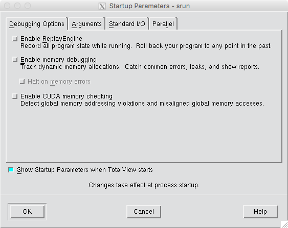
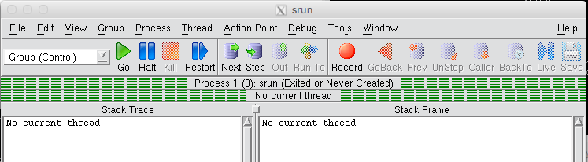
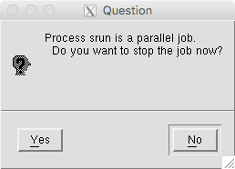
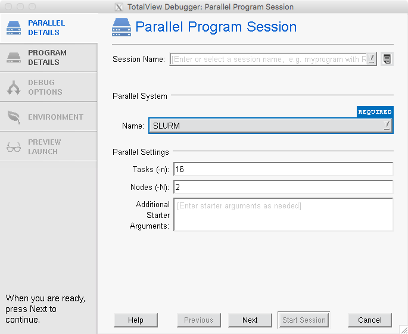
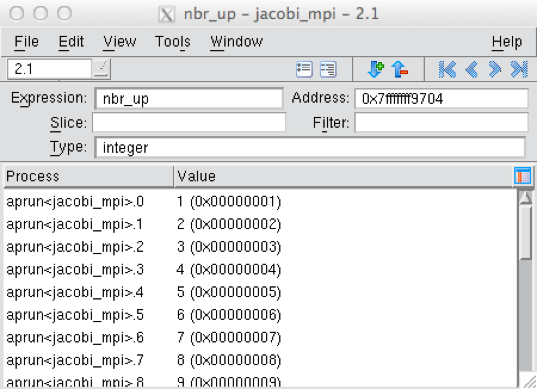

# TotalView

## Description

TotalView from Rogue Wave Software is a parallel debugging tool that
can be run with up to 512 processors.

It provides both X Windows-based Graphical User Interface (GUI) and
command line interface (CLI) environments for debugging. The
performance of the GUI can be greatly improved if used in conjunction
with
free
[NX software](../../connect/nx.md).

The
[TotalView documentation](https://docs.roguewave.com/en/totalview/current-main) web
page is a good resource for learning more about some of the advanced
TotalView features.

## Compiling Code to Run with TotalView

In order to use TotalView, code must be compiled with the -g
option. With the Intel compiler, you may have to add the '-O0' flag,
too. We also recommend that you do not run with optimization turned
on, flags such as -fast.

### Fortran Example

```shell
nersc$ ftn -g -O0 -o testTV_ex testTV.f
```

### C Example

```
nersc$ cc -g -O0 -o testTV_ex testTV.c
```

## Starting a Job with TotalView

Be sure to log in with an X window forwarding enabled. This could mean
using the `-X` or `-Y` option to ssh. The `-Y` option often works
better for Mac OSX.

```shell
nersc$ ssh -Y username@cori.nersc.gov
```

Then start an interactive batch session:

```shell
cori$ salloc -N numNodes -t 30:00 -q interactive -C knl
```

where 'numNodes' is the number of compute nodes that you need to
use. To use TotalView, first load the TotalView modulefile to set the
correct environment settings with the following command:

```shell
nersc$ module load totalview
```

With most of the versions available on the systems, you will be able
to launch the debugger with a totalview command followed by the name
of the executable to debug, as you normally did before NERSC switched
to Slurm for batch scheduling.:

```shell
nersc$ totalview srun -a -n numTasks ./testTV_ex
```

!!! note
	There is an issue with starting TotalView normally after
	the recent system OS upgrade to CLE7. The vendor is working
	on a fix.  Until that is fixed, please add the `-nomrnet`
	flag to the above command, as in `totalview -nomrnet srun
	-a ...`.

The TotalView startup GUI will pop up and show debugging startup
parameters. After reviewing them, click OK.



Then, click 'Go' button in the process window (the big window showing
navigation buttons).



A small window appears telling that Process srun is a parallel job and
asking if you want to stop it. Click Yes.



Then, the process window will show the source code of your program.

Sometimes, you may find that a certain TotalView version (often the
most recent version) cannot be started using the above method because
it doesn't contain a Cray-customization for Slurm because of
unavailability of one yet. For such a version you have to follow the
following steps to start a debugging session.  Just type 'totalview'
at a Unix prompt. A window titled 'TotalView Debugger' will open.

```shell
nersc$ totalview
```


Click on 'A new parallel program'. This will open the 'Parallel
Program Session' window. Select 'SLURM' for the Parallel System Name,
and set the number of MPI tasks and the number of compute nodes
used. The example below is to start a 16 MPI task (`-n 16`)
application running using 2 compute nodes (`-N 2`).



Click Next. In the next window (the PROGRAM DETAILS tab), provide the
executable file name and, if any, command line arguments.


Click the 'Start Session' button.

Then, the process window will show the source code, waiting for your
command.

If the user source code is not displayed in the process window at this
stage, select the main routine in the stack trace pane (the upper left
frame) of the process window.

To start debugging, create a break point by clicking on a line number
in the source pane, and click 'Go'. After that, you can use other
buttons ('Next', 'Step', 'Out', etc.).


There is a smaller window called the 'root window' beside the process
window, displaying all the (MPI) processes and threads created for the
debugging application. You can see MPI task id (rank) and its status
for each process or thread from the window.


You will want to check the value of variables from time to time in
order to see whether your program is running as expected. If you want
to check a local variable, you can simply look up the 'Stack Frame'
section in the process window. For any variable, right-click on the
variable in the source pane and select 'Dive'.


Select 'Across Processes' to view the value across processes. If you
are in a threaded region and want to view the value across threads,
then select the 'Across Threads' menu.



## Known Limitations

TotalView does not support on Cray systems:

- Debugging MPI_Spawn(), OpenMP, or Cray SHMEM programs
- Compiled EVAL points and expressions.
- Spawning a process onto the compute processors
- Machine partitioning schemes, gang scheduling, or batch systems

[comment]: <> (See [](https://www.youtube.com/watch?v=F6u5rhUQ6dU).)
