# CDash Testing Dashboard

## Background

[CMake](https://cmake.org/) is a cross-platform build system generator.
On UNIX systems, CMake is generally used to generate **Unix Makefiles**.
On Windows systems, CMake is generally used to generate **Visual Studio Projects**.
However, CMake is not limited to these generators and
has support for **Ninja**, **Xcode**, **NMake**, among others.

__CTest__ is a components of CMake for testing. It provides a generic syntax for executing tests
and features such as timeouts, pass/fail regex, concurrent execution of tests,
test labeling and grouping, among many others.
It is not a replacement for Python *unittest*, *Google Test*, etc.
CTest is a framework for executing those tests and also testing and logging the
build and configuration if desired.

For technical issues regarding CMake and CTest,
please consult the [CMake documentation](https://cmake.org/cmake/help/latest/).

__CDash__ is an open source, web-based software testing server. CDash aggregates,
analyzes and displays the results of software testing processes submitted from
clients located around the world. Developers depend on CDash to convey the state
of a software system, and to continually improve its quality. CDash is typically
part of a larger software process that integrates Kitware's CMake, CTest, and CPack
tools, as well as other external packages used to design, manage and maintain
large-scale software systems. CDash documentation can be found
[here](https://www.paraview.org/Wiki/CDash).

## Overview

- [Screenshots](#dashboard-example) of some of the features CDash provides
- [Browse dashboard features interactively](https://cdash.nersc.gov/index.php?project=TomoPy&date=2018-07-12)

__NERSC provides a CDash web-server__ at [cdash.nersc.gov](https://cdash.nersc.gov)
and it is recommended for continuous integration (CI) aggregation across all your
CI platforms -- such Travis, Jenkins, AppVeyor, etc. -- as it [extensively
simplifies diagnosing CI issues](https://cdash.nersc.gov/viewBuildError.php?type=1&buildid=1358)
and provides a location to log performance history.

If the project uses CMake to generate a build system, see [CDash submission for CMake projects](with_cmake.md).

If the project does not use CMake, NERSC provides python bindings to CMake/CTest in a project called
[pyctest](https://github.com/jrmadsen/pyctest). These bindings allow projects to generate CTest
tests and submit to the dashboard regardless of the build system (CMake, autotools, setup.py, etc.).
This package is available with PyPi (source distribution) and Anaconda (pre-compiled distributions).
For usage, see [CDash submission for non-CMake projects](without_cmake.md),
the [pyctest documentation](https://pyctest.readthedocs.io/en/latest/).

- Anaconda: `conda install -c conda-forge pyctest`
- PyPi: `pip install -vvv pyctest`

## Features

- Automated emails
    - Build warnings and failures
    - Tests failing
    - Low code coverage
    - Test timing changes
- Capture standard out and standard error from all the stages of building, testing,
and deploying the package
- Code coverage reports (in a variety of formats) can be uploaded, visually displayed, and thresholds can be set to
notify developers if coverage drops below the threshold
- Memory checking for leaks can be analyzed and reported
- Visual results can be uploaded along with logs
    - e.g. if a test generates a visual product, by echoing a message such as
`<DartMeasurementFile name="ExampleImage" type="image/jpeg">./example_image.jpeg</DartMeasurementFile>` to stdout, the `example_image.jpeg` will be uploaded to the dashboard and displayed in the test log
- ASCII results can be attached as "Notes" to the "build"
- Three primary submission tracks
    - Continuous
    - Nightly
    - Experimental
- Ability to create subprojects
- Public and private dashboards
- Token-authenticated submission
- Information on submission sites platform automatically recorded
    - Number of CPU cores
    - Processor speed
    - Operating system
    - etc.

## Configuration

The dashboard client configuration has 8 possible steps, many of which are optional:

- CTest Start Step
    - This step is required and typically involves obtaining the source code
    - The command executed in this step is set by the definition of the `CTEST_CHECKOUT_COMMAND`
        - e.g. `set(CTEST_CHECKOUT_COMMAND "git clone https://github.com/jrmadsen/pyctest.git pyctest-src")`
    - This step is invoked via `ctest_start(...)` [see CTest documentation for ctest_start]
- CTest Update Step
    - This step is optional and typically involves changing the branch, applying a patch, etc. when used by setting the `CTEST_UPDATE_COMMAND` variable
    - This step is automatically involved by `ctest_start` when `CTEST_UPDATE_COMMAND` is defined
- CTest Configure Step
    - This step is optional and typically involves running `cmake` or an autotools `configure` script when the package involves compiled code
    - The command executed in this step is set by the definition of the `CTEST_CONFIGURE_COMMAND`
    - The log for this step, including the list of warnings and errors, can be found in the `Configure` subsection of the `Build` section of the dashboard
- CTest Build Step
    - This step is optional and typically involves invoking the build program and compiling your code
    - The command executed in this step is set by the definition of the `CTEST_BUILD_COMMAND`
    - The log for this step, including the list of warnings and errors, can be found in the `Build` subsection of the `Build` section of the dashboard
- CTest Test Step
    - This step is optional and invokes running all the tests provided by `CTestTestfile.cmake` in the binary directory
        - The top-level `CTestTestfile.cmake` should add any subdirectories containing additional `CTestTestfile.cmake`
            - e.g. `subdirs("examples")` to add the tests defined in `examples/CTestTestfile.cmake`
- CTest Coverage Step
    - This step is optional and invokes a user command followed by a search for code coverage files -- such as Python trace `*.cover` files, Cobertera `coverage.xml` files, GCov results, etc.
    - The command executed in this step is set by the definition of the `CTEST_COVERAGE_COMMAND`
- CTest MemCheck Step
    - This step is optional and typically involves running `valgrind`
    - Memory checking with tools such as `valgrind`
- CTest Submit Step
    - This step is required and uploads the output of the previous

## Using CDash with CMake

CTest + CDash is easily integrated into an existing CMake build system. For using CTest + CDash
with a CMake build system, refer to the [CTest/CDash with CMake](with_cmake.md)
documentation page.

## Using CDash without CMake

CTest + CDash can be utilized without a CMake build system. For using CTest + CDash
without a CMake build system, refer to the [CTest/CDash without CMake](without_cmake.md)
documentation page.

## Dashboard Example

### Projects Page

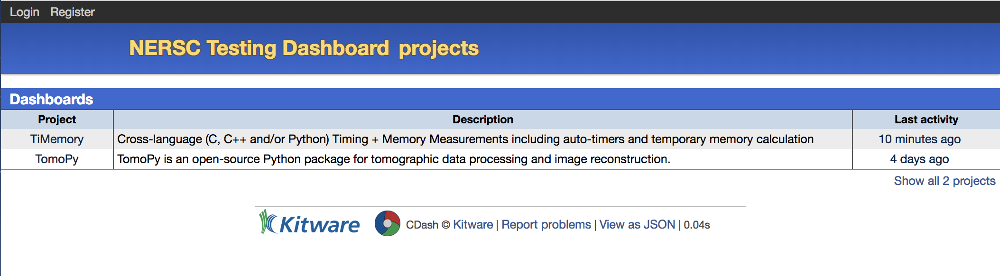

### Project Overview

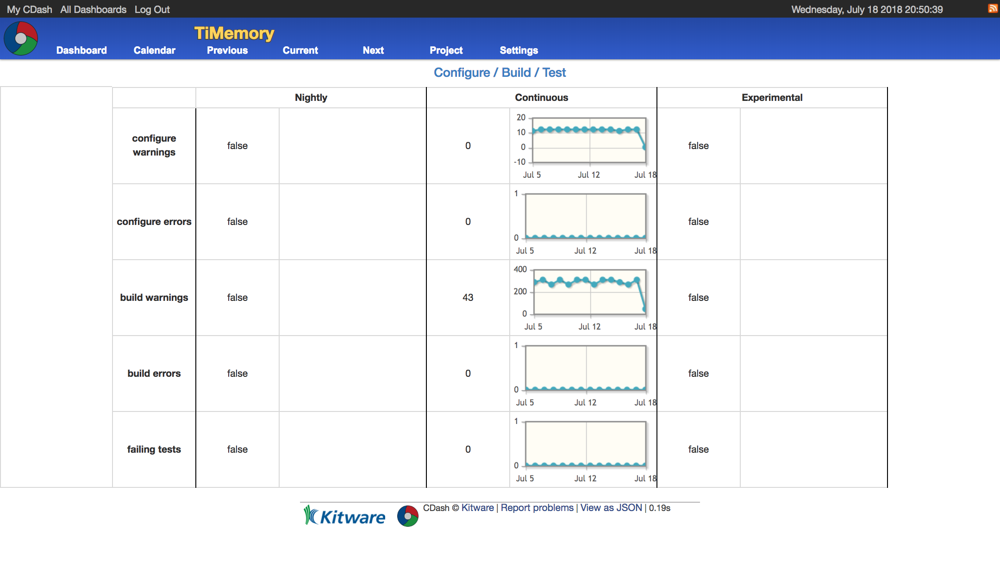

### Builds Overview

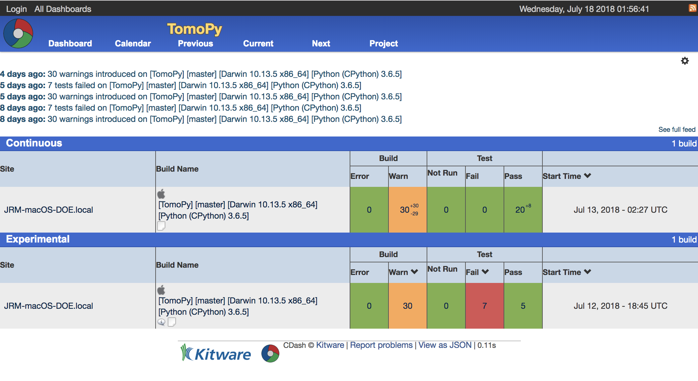

### Test Summary Example

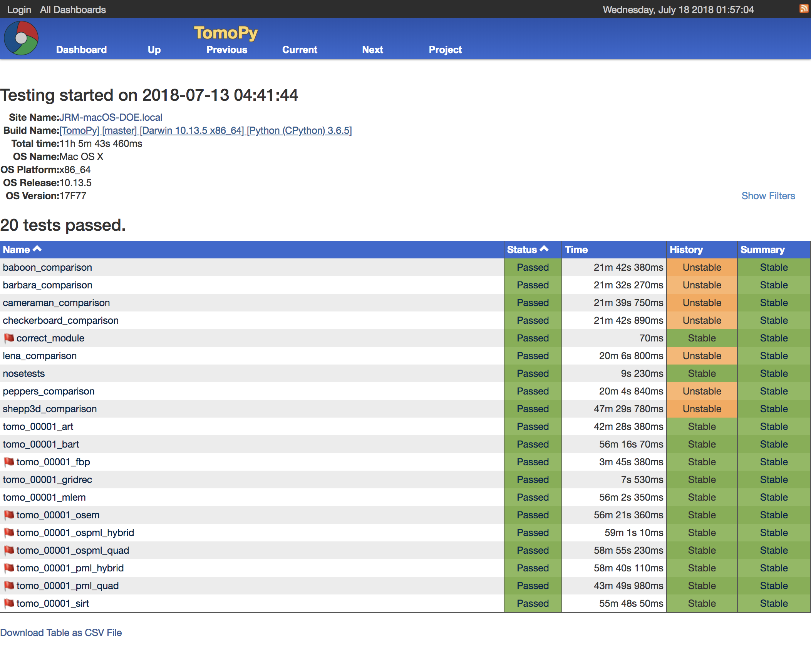

### Test Result

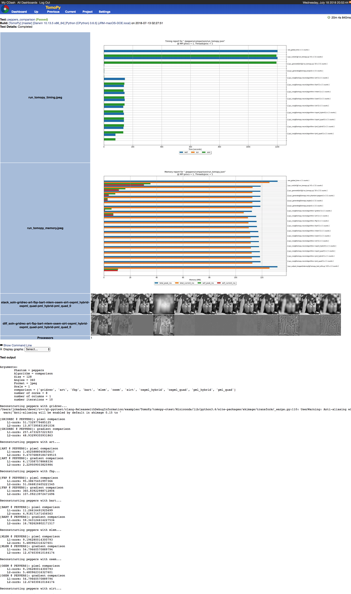
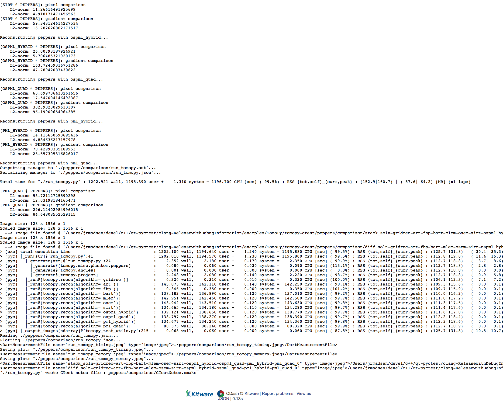

### Build Log Example

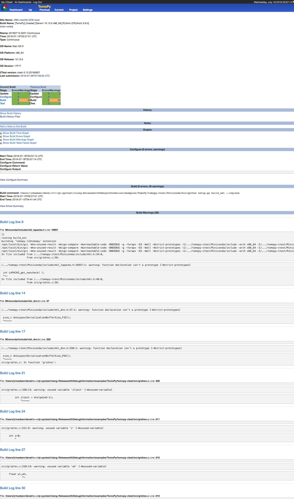

### Notes Example

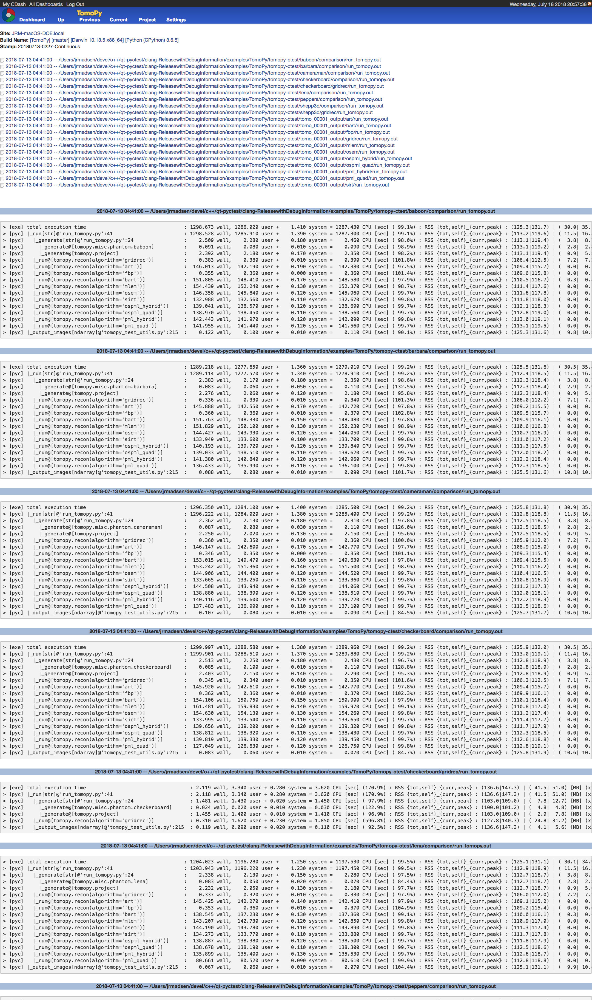

## Dashboard Registration

- Click on the `Register` button in the top-left corner
- Fill out the form

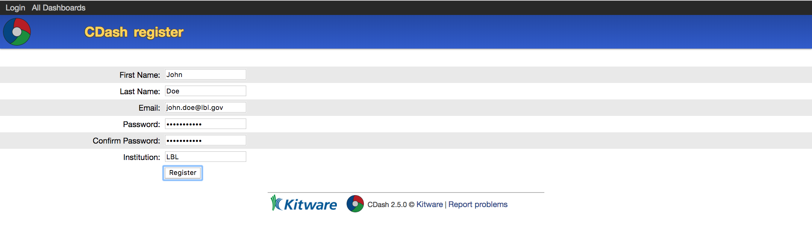

- Click `Register`

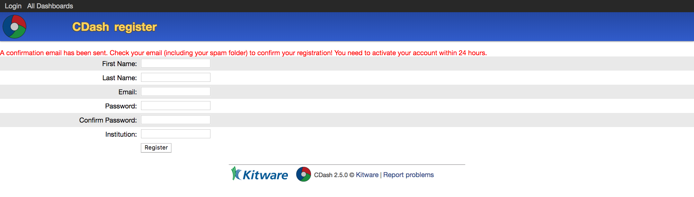

- Confirm the email account
- Subscribe to any existing projects as desired
    - If the project is private, ask the project administrator

### Profile

- Add **repository credentials** to ensure the email address in code commits to
are mapped to your username

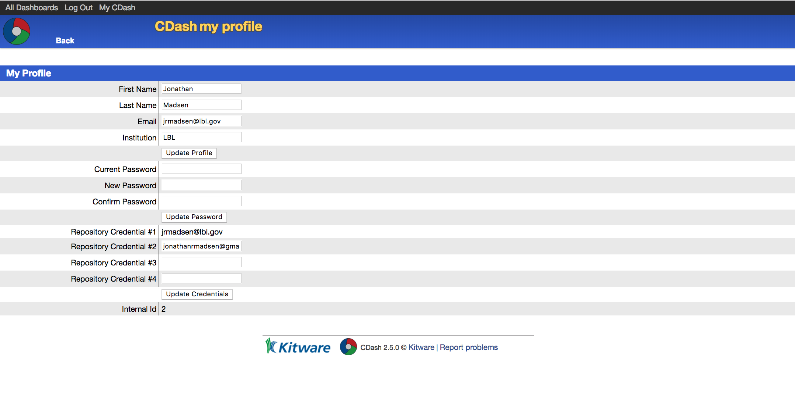

### Create Project

- Click on **Create new project** once you have navigated to the **My CDash** page

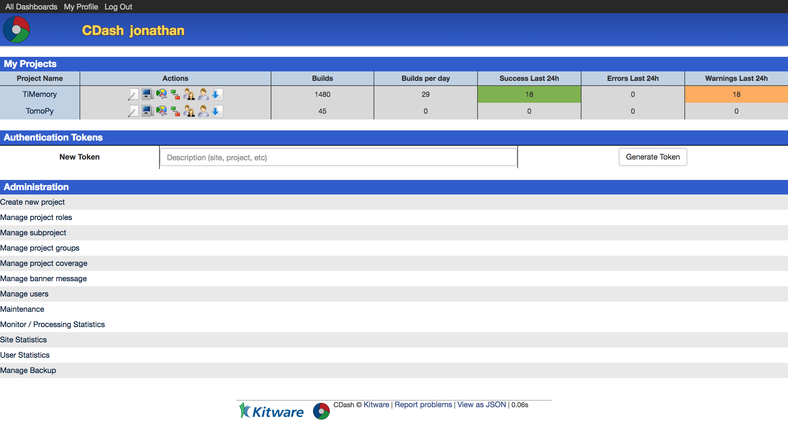

- Fill out the project information pages and then click **Create Project** button
in the **Miscellaneous** tab

#### Information tab

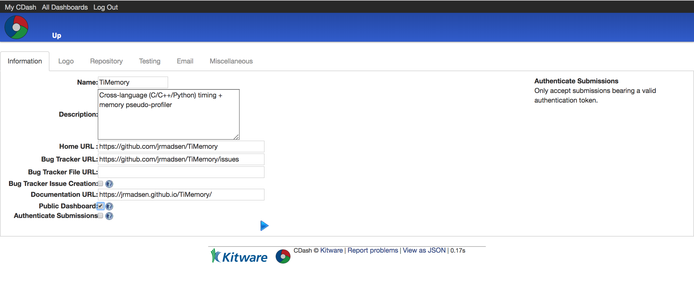

#### Repository tab

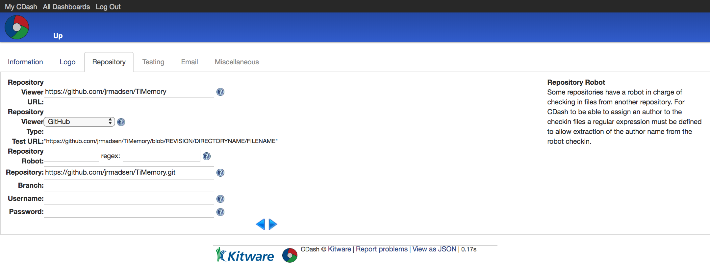

#### Testing tab

#### Email tab

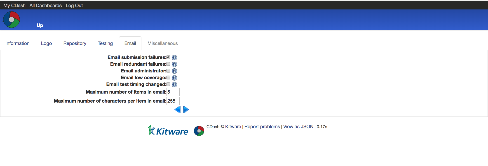

#### Miscellaneous tab

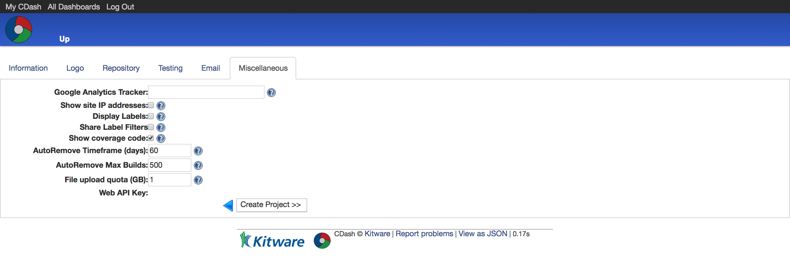

### Project Settings

Once the project has been created, these settings can be updated via **Settings > Project**.
Here you can download the `CTestConfig.cmake` for the project and also provide a CTest template Script under the **Clients** tab.

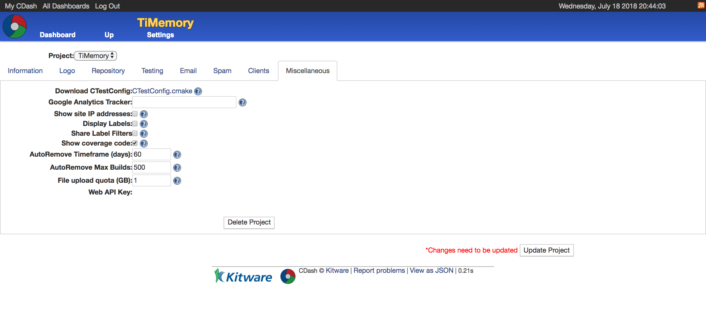
