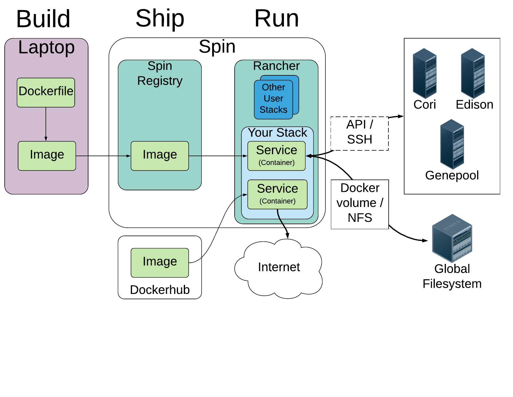
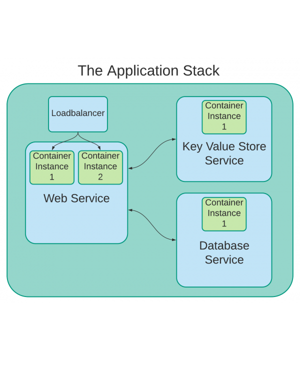

# Spin Getting Started Guide Overview

!!! info "This guide is under development"
    Spin is in a Pilot phase for NERSC staff and users in early 2018. The content of this page may be updated during this development period.

    The goal of the Spin project is ultimately to provide a self service platform, but during the pilot phase NERSC ISG (Infrastructure Services Group) acts as an intermediary to this service while we improve the service and wait for vendor to provide a more complete multi-tenant system.

!!! bug "Known bugs in the Getting Started Guide"
    * **To report bugs with this documentation during the Pilot Phase**, please contact us via the Slack channel or the email address that we provided to you when you began the lessons.
    * The indentation may be incorrect in some code examples. This is caused by a bug in our web authoring software, and we are trying to fix it.

## Is Spin right for your project?

Spin is a good fit for projects that are similar to the following:

* User-facing web services, either development or production
* Science gateways or Workflow managers
* Databases, key-value stores, and other back-ends
* Continuous integration tools for software development
* Test, sandbox, or other ephemeral services

Spin is not a good fit for services like the following:

* Heavy computational workloads
* Not an alternative or competitor to Cori, Edison or Genepool
* Login services
* Not a replacement for login nodes or gpints
* Services used for Authentication & Security providers cannot be run in Spin currently

## Roles and Responsibilities

NERSC is responsible for:

* Maintaining robust, up-to-date, and available infrastructure
* Providing advice and best practices for migrating and running applications in Spin
* Collaborating with application owners to migrate application stacks to Spin (necessary during pilot phase)

You and your team are responsible for:

* Learning the basics of Docker & the container ecosystem.
* Providing a Dockerfile and/or Docker Compose file to NERSC ISG for review (during pilot phase)
* Building a docker image and pushing it to the Spin Registry.
* Restarting and upgrading application stacks using the Rancher CLI tool.
* Following Docker security best practices, including:
    * Monitoring any parent images for security issues
    * Keeping your images up to date with the latest security patches
* Supporting the service, and the users of the service
* Letting us know if the application is no longer being actively maintained so that we can shut down the service in an organized fashion.

## How do I get started?

Before reading the Spin Getting Started Guides, please familiarize yourself
with Docker itself and review the Docker documentation. In particular, read the
following guides:

* Start with *Docker Get Started Tutorial*, [Part 1: Orientation and setup](https://docs.docker.com/get-started/), followed by [Part 2: Containers](https://docs.docker.com/get-started/part2/). These guides cover Docker installation, Dockerfiles and show how containerize basic applications.
    * While you are free to read Part 3 - 6 of the *Docker Get Started Tutorial*, keep in mind that those guides are specific to the Docker-specific solutions, and much of the container community doesn't use all of those solutions. Concepts at NERSC & Spin, which use Rancher and will soon use Kubernetes, are a little different.
* The [Docker overview](https://docs.docker.com/engine/docker-overview/) provides a good, 10 minute overview of Docker containers.
* While reading these docs, note that NERSC uses "Docker CE (Community Edition)".

Once you understand the basics of Docker, you will need the following to proceed with Spin:

* *An account on Spin*. Any user who wants an account in Spin must first complete
  a hands on Spin workshop. To do that, please see the workshop schedule at
  https://www.nersc.gov/users/data-analytics/spin/ .
* Read through the Spin Getting Started Guide hands-on lessons, mentioned below.
* Have a basic plan to implement your software, including:
    * A rough sense of how you will be organizing services following a Microservices or related structure.
        * A diagram, or a similar written description, can really help with the design process. The diagram doesn't have to be detailed.
    * A DNS name for any public-facing service. Examples could be 'example.lbl.gov', 'example.jgi.doe.gov, 'example.nersc.gov', or even 'www.example.org'.
* A list of public and private TCP or UDP ports required by your software.

## Creating an application for Spin

To run your application in Spin, it must first be converted to one or more Docker images. We describe how to do this in the Spin Getting Started Guide below.

The NERSC Spin project aims to follow the Docker motto, "Build, Ship & Run." This means you will normally **Build** the image on your workstation, **Ship** it to an image registry and then **Run** the container on Spin. At a high level, the process looks like this:

1. **Build** a Docker container-based application. This may include using existing Docker images or building custom images, and assembling them into an application stack using Docker Compose.
1. **Ship** the image to registry.spin.nersc.gov for private images or the Dockerhub for public images.
1. **Run** the application stack in the Spin Development environment. ISG will work with you to resolve any NERSC-specific issues, such as access to files on the NERSC Global Filesystem. (performed by ISG during pilot phase).
1. **Copy** your application stack from the Spin development environment to the Spin production environment (performed by ISG during pilot phase).

## How it all fits together

While working with Docker & Spin, you will be using Docker images & containers to provide services in Spin. Here is a description of the major components of an application that you will be responsible for:

* An **Image** is a lightweight, stand-alone, read-only template that includes everything needed to run a piece of software, including the code, a runtime, libraries, environment variables, and config files.
    * Most images are based on another image provided by the community. The 'nginx' image is based on the 'debian' image, for example..
    * You may build a custom image for a custom application. Usually, you will base this custom image on another standard image provided by the community. We encourage you to re-use community images when practical.
* A **Container** is a runnable instance of an image. There may be one or more containers for a service.
* A **Service** is comprised of one or more containers of the same type. Each service provide a single capability
    * Examples of a service include a web service, or database service.
    * Services may have a single container, or may have multiple instances of a container for redundancy.
    * An optional Loadbalancer, built into Spin, can send requests to the containers within a Service.
* An **Application Stack** is comprised of application services.
    * Different containers (Like, a web container, application container, and a database container) can be connected to each other to form a multi-tier Application Stack.

Let's take an example of a web app that consists of a front-end, a database, and an key-value service. This stack would consists of three services.  Each of these services would be provided by their own container.  And each would likely use a different image. For example, the front-end might use an image based on Apache, the database may be a MySQL image, and the key-value service could be based on MongoDB.

Here's a diagram showing the relation between Stacks, Services and Containers:

## Tips to keep in mind

There are many good resources for learning [Docker](https://docs.docker.com/get-started/). Some high level concepts that the Spin working group have found useful include:

* Containers are intended to be ephemeral. When a container stops, any changes made to that container are not retained unless they were stored in persistent storage.
* Containers should generally only do one thing. A web container should only be running the web service. A database container should only be running a database. Don't bundle a web service and a database service into one container.
    * More advanced applications with multiple services tend to have multiple containers to contain the variety of services (e.g. One container for the web service, a second container for a DB service)
* The primary process in each container will start from a script and run in the foreground, rather than being started by a system management facility like systemd and running in the background.
* Containers should not start up traditional auxiliary system services like syslog, sshd, etc. or expect to have them active in official images pulled from Docker hub.
* Output should be written to stdout and stderr rather than to a log file.

## Follow the Spin Getting Started hands-on lessons

To help get you started with Spin, we've provided several hands on lessons to
help learn the essentials of Spin & Docker. See those lessons in the navigation
bar to the left. After completing these guides, see the [Spin Best
Practices](../best_practices.md) guide for a FAQ and best practices on
implementing containers on Spin.
