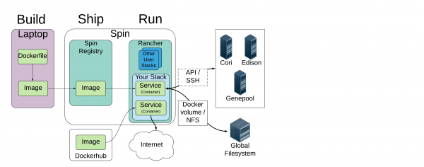
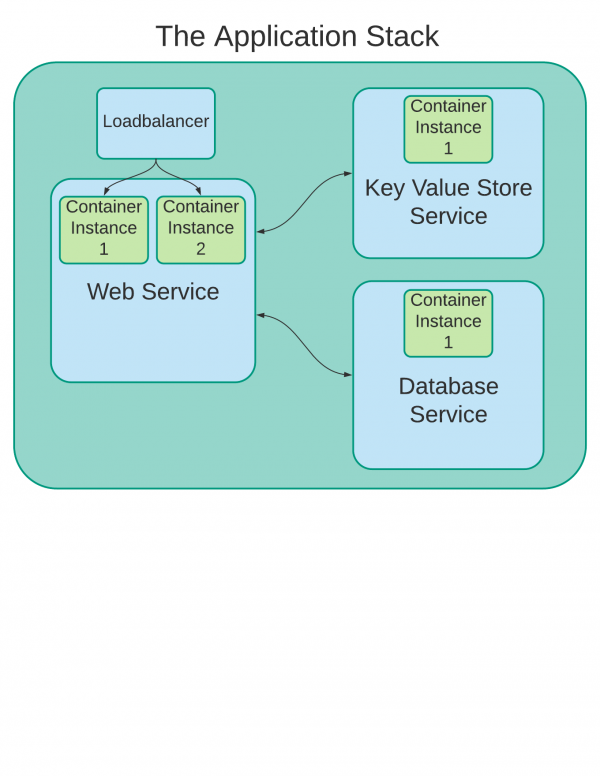

# Spin

## Docker containers at NERSC

Spin is the container service platform at NERSC and is based on Docker container technology. Spin is designed to be flexible, scalable, and integrated tightly with NERSC resources. We use the Rancher software to manage and orchestrate the Spin container infrastructure. Other software provides storage, a Docker image registry, and other services.

Spin is in a Pilot phase for NERSC staff and users in early 2018. The goal of the Spin project is ultimately to provide a self service platform, but during the pilot phase NESC ISG (Infrastructure Sevices Group) acts as an intermediary to this service while we improve the service and wait for vendor to provide a more complete multi-tenant system.

## Is Spin right for your project?

Spin is a good fit for projects that are similar to the following:

* User-facing web services, either development or production
* Science gateways or Workflow managers
* Databases, key-value stores, and other back-ends
* Continuous integration tools for software development
* Test, sandbox, or other ephemeral services

Spin is not a good fit for services like the following:

* Heavy computational workloads
* Not an alternative or competitor to Cori, Edison or Genepool
* Login services
* Not a replacement for login nodes or gpints
* Services used for Authentication & Security cannot be run in Spin currently

## Roles and Responsibilities

NERSC is responsible for:

* Maintaining robust, up-to-date, and available infrastructure
* Providing advice and best practices for migrating and running applications in Spin
* Collaborating with application owners to migrate application stacks to Spin (necessary during pilot phase)
* Restarting and upgrading application stacks on request (necessary during pilot phase)

You and your team are responsible for:

* Learning the basics of Docker & the container ecosystem.
* Providing a Dockerfile and/or Docker Compose file to NERSC ISG for review (during pilot phase)
* Building a docker image and pushing it to registry.spin.nersc.gov
* Following Docker security best practices, including:
    * Monitoring any parent images for security issues
    * Keeping your images up to date with the latest security patches
* Notifying NERSC ISG when an application stack requires a restart or upgrade (during pilot phase)
* Supporting the service, and the users of the service
* If the application is no longer being actively maintained, please let us know so that we can shut down the service in an organized fashion.

## How do I get started?

Before reading the Spin Getting Started Guides, we recommend that you get familiar with Docker itself and review the Docker documentation. In particular, read the following guides:

### Guides

* [Docker: Get Started, Part 1: Orientation and Setup](https://docs.docker.com/get-started/)
* [Docker: Get Started, Part 2: Containers](https://docs.docker.com/get-started/part2/) which covers Dockerfiles and shows how containerize basic applications.
* While you are free to read Part 3 - 6 of the Docker Getting Started Guide, keep in mind that the specifics written in those guides are specific to the Docker-specific solutions, and most of the container community only uses some of these Docker-specific solutions. Concepts at NERSC & Spin, which use Rancher and will soon use Kubernetes, are a little different.

### Spin

Once you understand the basics of Docker, you will need the following to proceed with Spin:

* An account in Spin, including the Spin Registry. Contact support@nersc.gov to request an account.
* Read through the Spin Getting Started Guide hands-on lessons, mentioned below.
* All public services need a DNS name. Examples could be 'service.lbl.gov', 'service.jgi.doe.gov, 'r 'service.nersc.gov', or even 'http://www.service.org'. **Your service needs a DNS name.**
* A list of public and private ports required by your software.

!!! note
	We also recommend a diagram, or a similar written description, can really help with the design process. The diagram doesn't have to be detailed.

## Starting or migrating an application to Spin

To run your application in Spin, it must first be converted to one or more Docker images.

The NERSC Spin project aims to follow the Docker motto, "Build, Ship & Run." This means you will normally Build the image on your workstation, Ship it to the Spin Registry and then Run the container on Spin. We show you how to do that in the Getting Started Guide mentioned below, but at a high level the process looks like this:

* Build a Docker container-based application:
    * This may include using existing Docker images, building custom images and assembling them into an application stack using Docker Compose.
    * You will configure the applications with Dockerfiles and optionally, Docker Compose files.
* Ship image to registry.spin.nersc.gov for private images or the Dockerhub for public images.
* Run the application stack in the Spin Development environment. ISG will work with you to resolve any NERSC-specific issues, such as access to files on the NERSC Global Filesystem. (performed by ISG during pilot phase)
* Copy your application stack from the Spin development environment to the Spin production environment (performed by ISG during pilot phase)

!!! example
	Let's take an example of a web app that consists of a front-end, a database, and an API service. This stack would consists of three services.  Each of these services would be provided by their own container.  And each would likely use a different image.  For example, the front-end might use an image based on Apache, the database may be a mysql image, and the API service could be a Python Flask-based image.

## How it all fits together

While working with Docker & Spin, you will be using Docker images & containers to provide services in Spin. Here is a description of the major components of an application that you will be responsible for: 

### Images

An Image is a lightweight, stand-alone, read-only template that includes everything needed to run a piece of software, including the code, a runtime, libraries, environment variables, and config files.

* Most images are based on another image provided by the community. The 'nginx' image is based on the 'debian' image, for example..
* You may build a custom image for a custom application. Usually, you will base this custom image on another standard image provided by the community.

### Containers

A Container is a runnable instance of an image. There may be one or more containers for a service.

### Service

A service is comprised of one or more containers, each of which provide a single capability.

* Examples of a service include a web service, or database service.
* Services may have a single container, or may have multiple instances of a container for redundancy.
* An optional Loadbalancer can send requests to the containers within a Service.

### Application stack

An Application Stack is comprised of application services.

Different containers (Like, a web container, application container, and a database container) can be connected to each other to form a multi-tier Application Stack.

## Tips

There are many good resources for learning [Docker](https://docs.docker.com/get-started/). Some high level concepts that the Spin working group have found useful include:

* Containers are intended to be ephemeral. When a container stops, any changes made to that container are not retained unless they are stored in persistent storage.
* A container should generally only do one thing. A web container should only be running the web service. A database container should only be running a database. More advanced applications with multiple services tend to have multiple containers to contain the variety of services (e.g. One container for the web service, a second container for a DB service)
* The primary process in each container will start from a script and run in the foreground, rather than being started by a system management facility like systemd and running in the background.
* Containers should not start up traditional auxiliary system services like syslog, sshd, etc. or expect to have them active in official images pulled from Docker hub.
* Output should be written to stdout and stderr rather than to a log file.

## Follow the Spin Getting Started hands-on lessons

To help get you started with Spin, we've provided several hands on lessons to help learn the essentials of Spin & Docker. See those lessons below. For a FAQ and best practices on implementing containers on Spin, see the Spin Implementation Best Practices guide.
