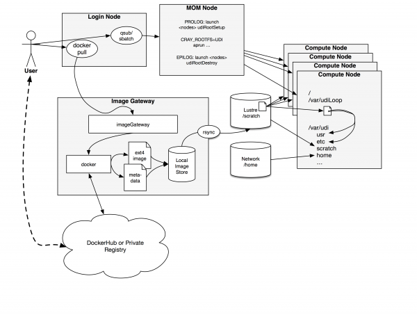

#Bringing Linux containers to HPC

For more information about using Shifter, please consult the [documentation](#how-to-use.md).

##Background

NERSC is working to increase flexibility and usability of its HPC systems by enabling [Docker](https://www.docker.com/)-like Linux container technology. Linux containers allow an application to be packaged with its entire software stack - including some portions of the base OS files - as well defining needed user environment variables and application "entry point.".  Containers may provide an abstract way of deploying portable applications and even automating the execution without requiring detailed tuning or modification to operate them.

Shifter is a prototype implementation that NERSC is developing and experimenting with as a scalable way of deploying containers in an HPC environment. It works by converting user or staff generated images in Docker, Virtual Machines, or CHOS (another method for delivering flexible environments) to a common format. This common format then provides a tunable point to allow images to be scalably distributed on the Cray supercomputers at NERSC. The user interface to shifter enables a user to select an image from their dockerhub account and then submit jobs which run entirely within the container.

*Fig. 1: shifter Workflow*

As shown in <a href="#fig1">Fig. 1</a>, shifter works by enabling users to pull images from a DockerHub or private docker registry. An image manager at NERSC then automatically converts the image to a common format based on an automated analysis of the image. That image is then copied to the Lustre scratch filesystem (in a system area).  The user can then submit jobs specifying which image to use. Private images are only accessible by the user that authenticated and pulled them, not by the larger community.  In the job the user has the ability to either run a custom batch script to perform any given command supported by the image, or if a Docker entrypoint is defined, could simply execute the entrypoint; which in combination with custom volume maps could entirely bypass the need for batch scripts.

The way that shifter interacts with images, by using loop mounts of the image file has the advantage of moving metadata operations (like file lookup) to the compute node, rather than rely on the central metadata servers of the parallel filesystem. Based on our testing, shown in <a href="#fig2">Fig. 2</a>, using the pynamic benchmark, this greatly improves the performance of shared library applications, and of course python. These tests indicate that essentially matches the performance of a single docker instance running on a workstation despite the fact that shifter images are stored on a parallel filesystem.

*Fig. 2: pynamic benchmark run on various NERSC file systems. tmpfs is local RAM disk on the compute nodes. Shorter is better*

Please refer to the [Cray User Group 2015 paper](files/cug2015udi.pdf), as well as our [presentation slides](files/nersc-brownbag-docker-jacobsen-canon.pdf) for more information about Docker in HPC and shifter implementation details.