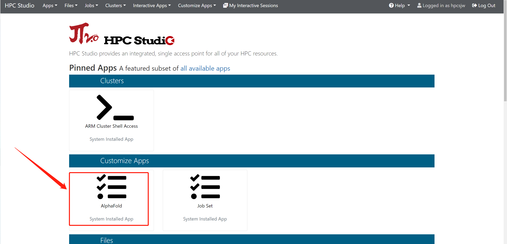
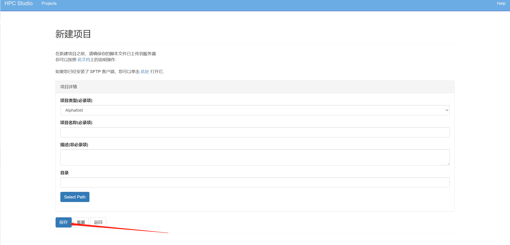
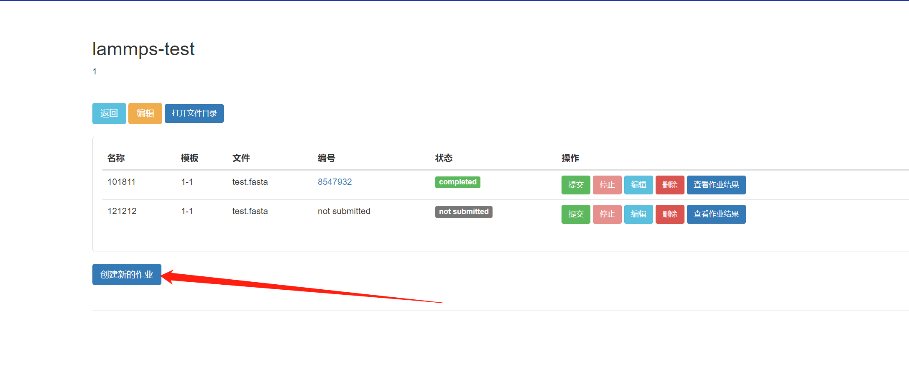
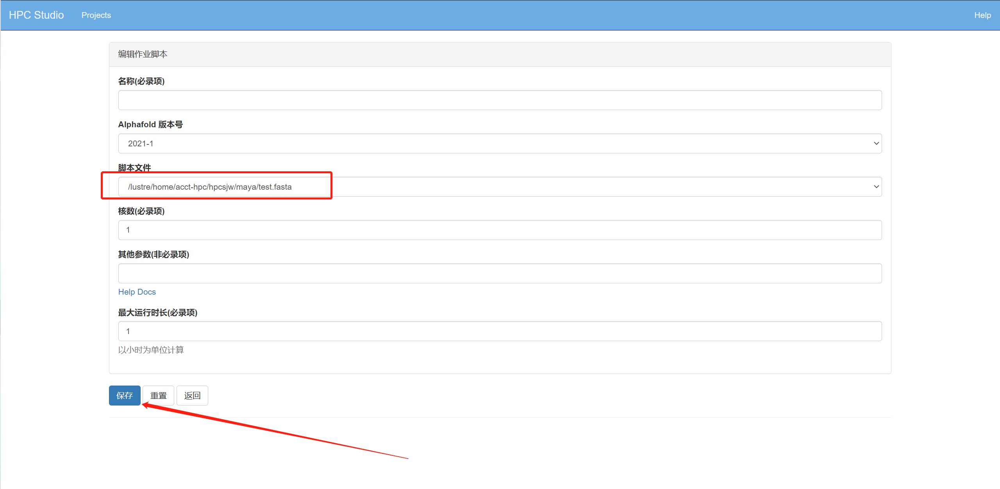
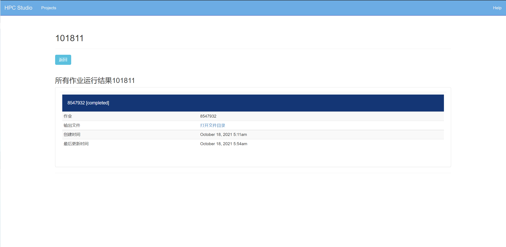

AlphaFold-GUI
===============

登录HPC Studio平台后，在自定义软件中选择AlphaFold，如下图

点击后会出现下图的选项卡，里面定义好了所需的选项卡，可以创建个人项目，(注:项目下可以创建多个作业，作业运行结果保存在该项目路径下)

.. image:: ../img/gui-2.jpg

创建项目选项卡如下图所示，类型选择AlphaFold，按要求填写表项
点击”保存“

点击创建好的项目，选择“创建新的作业”按钮，如下图:

编辑作业，完成后点击"保存"，注意脚本文件路径，会自动弹出蛋白序列文件，如下图:

点击"查看作业结果"，可以查看所有作业的运行结果，如下如：

参考资料
------------

- AlphaFold Operation Manual  https://docs.hpc.sjtu.edu.cn/app/bioinformatics/alphafold2.html?highlight=alpha

