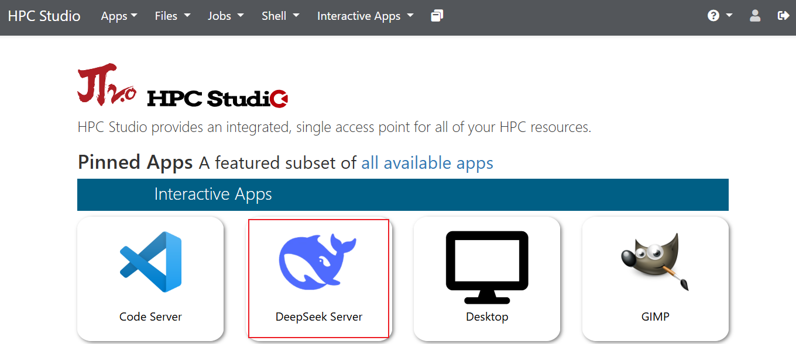
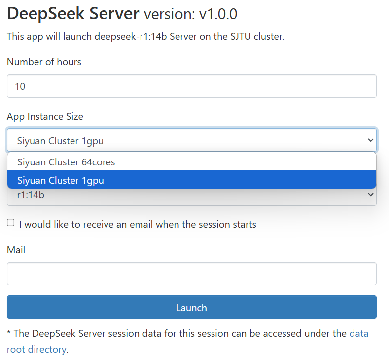
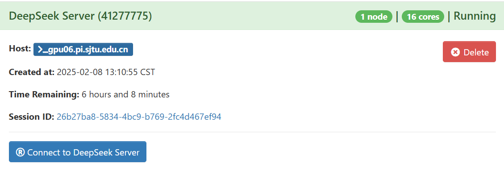
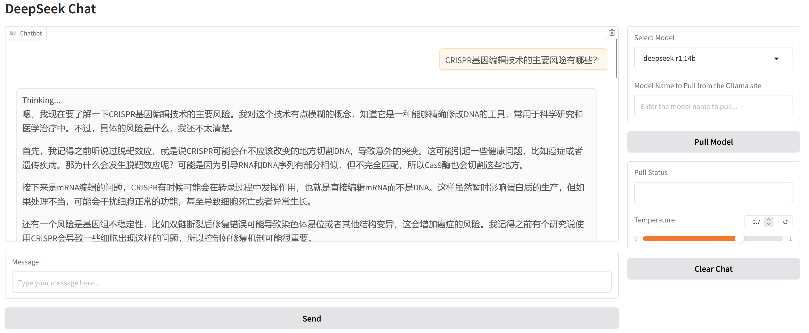

.. _deepseek:

DeepSeek
=================

简介
-----

DeepSeek（深度求索）是由国内顶尖AI团队于2023年推出的通用人工智能（AGI）大模型。它通过更高效的算法架构，用仅700亿参数（对比GPT-3的1750亿）实现了同等甚至更强的性能表现。

如何使用
-----------

1. 使用超算账号密码或jAccount登录HPC Studio可视化平台，主界面选择DeepSeek Server；

2. 设置使用时长，根据需求选择1个CPU节点或者1张A100加速卡后，点击Launch；

3. 等待作业排队完成，即可连入DeepSeek服务。

如果遇到问题请发送邮件至 `HPC 邮箱 <hpc@sjtu.edu.cn>`_ 。

.. raw:: html

   

       本文作者：郭武 
   

