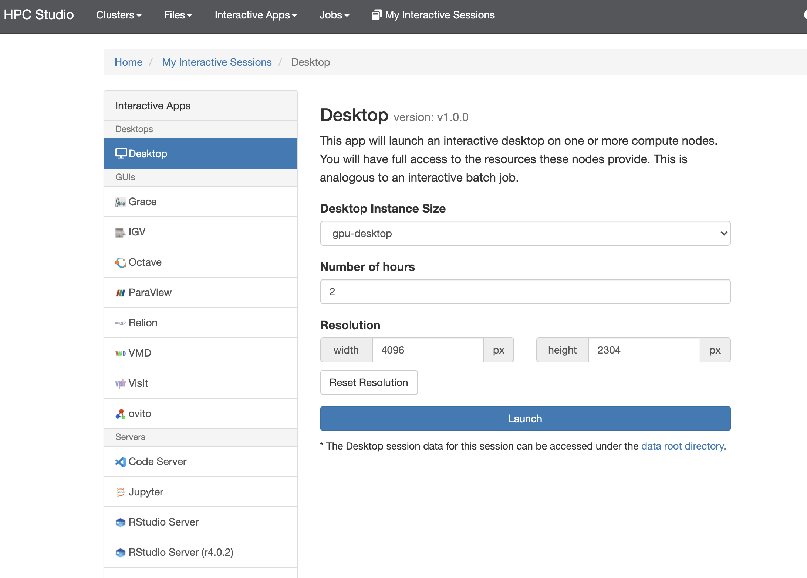

MATLAB
===============

简介
-------

MATLAB是美国MathWorks公司出品的商业数学软件，用于数据分析、无线通信、深度学习、图像处理与计算机视觉、
信号处理、量化金融与风险管理、机器人，控制系统等领域。

π 集群上的MATLAB
----------------

π 集群上的CPU及GPU平台均支持MATLAB软件。

由于MATLAB是可视化软件，因此需要启动HPC Studio的可视化远程桌面来运行。

如果不需要使用GPU卡，那么可以启动 CPU 队列的可视化远程桌面，最大可以使用40核CPU。如果需要使用GPU卡，那么需要启动DGX-2队列的可视化远程桌面。

启动CPU远程桌面
-------------------------

使用hpc帐号登录HPC studio（https://studio.hpc.sjtu.edu.cn）后，点击"Interactive Apps >> Desktop"。选择需要的核数，session时长（默认1核、1小时），点击"Launch"启动远程桌面。待选项卡显示作业在RUNNING的状态时,点击"Launch Desktop"即可进入远程桌面。

.. image:: ../img/matlab01.png
.. image:: ../img/matlab02.png

启动GPU远程桌面
-------------------------

使用hpc帐号登录HPC studio（https://studio.hpc.sjtu.edu.cn）后，点击"Interactive Apps >> Desktop"。选择 gpu-desktop，session时长（默认2小时），点击"Launch"启动远程桌面。待选项卡显示作业在RUNNING的状态时,点击"Launch Desktop"即可进入远程桌面。

.. image:: ../img/matlab01.png

启动MATLAB
-------------------------

远程桌面中点击右键，选择Open Terminal Here打开终端，在终端中使用命令 "singularity run /lustre/share/img/matlab_latest.sif matlab"

启动后即可使用MATLAB R2021a

.. image:: ../img/matlab03.png
.. image:: ../img/matlab04.png
.. image:: ../img/matlab05.png

自定义添加MATLAB插件
-------------------------

首先拷贝集群上的镜像到本地

.. code:: shell

   cp /lustre/share/img/matlab_latest.sif ~/

接下来需要在镜像中添加基础编译环境（该操作可以在build@container-x86中操作）

.. code:: shell
   Bootstrap:localimage
   From:/home/singularity/matlab_latest.sif

   %post
       echo y | apt-get update -y
       echo y | apt-get install gcc -y
       echo y | apt-get install g++ -y

最后在添加自定义的库时，需要先进入容器

.. code:: shell
   singularity shell matlab_latest_self.sif
