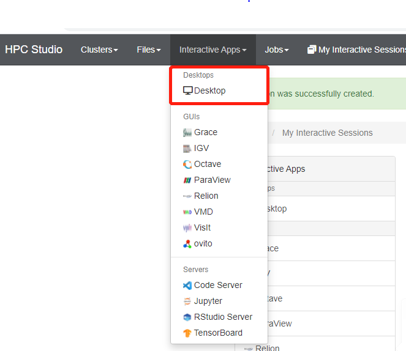
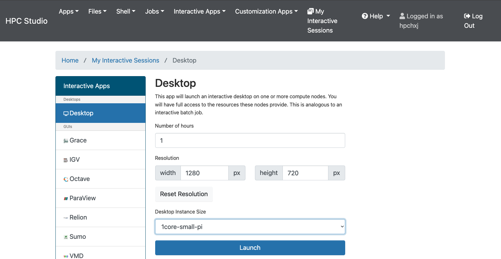
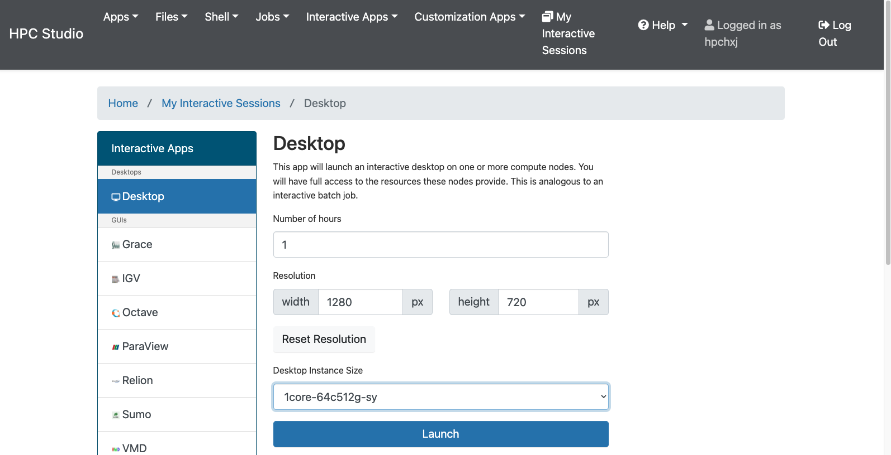
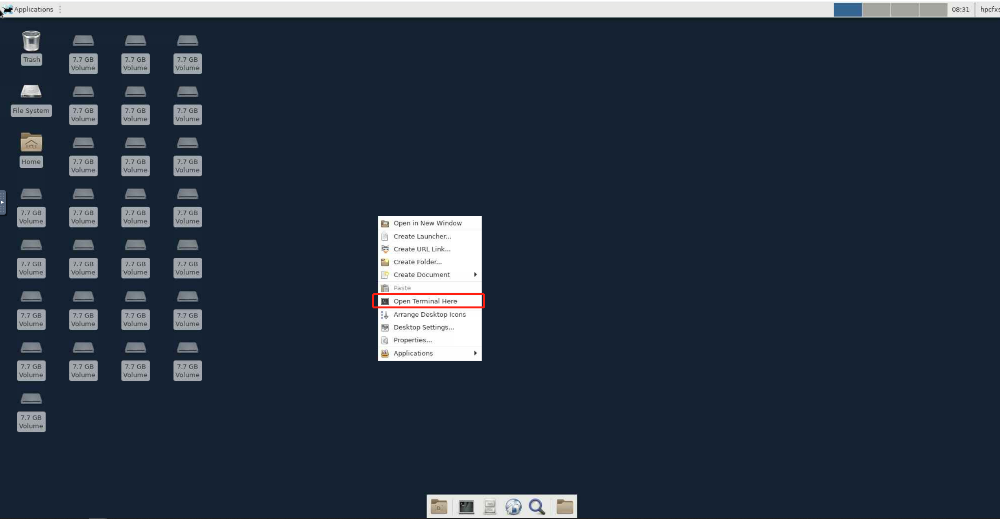
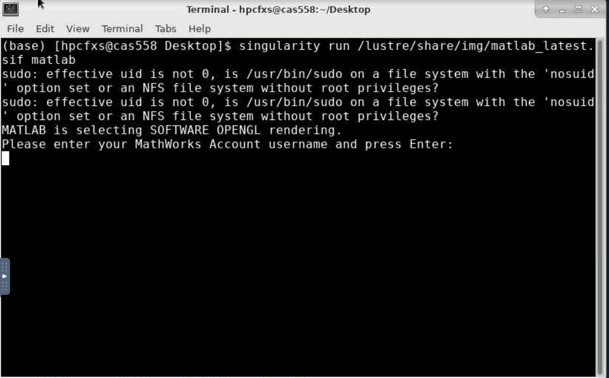
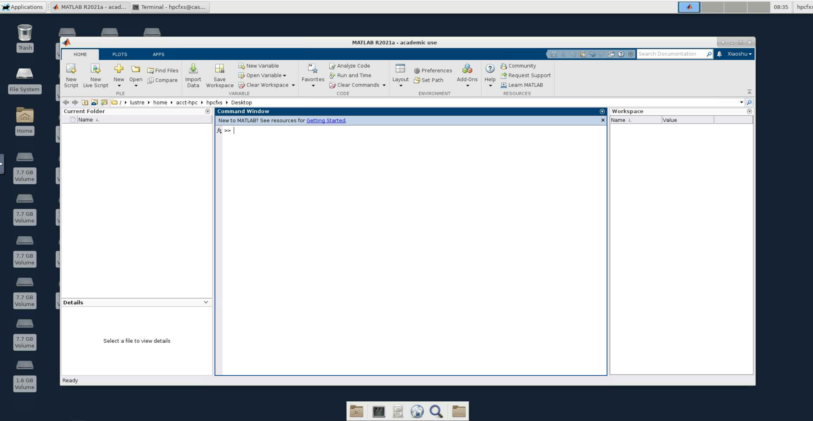
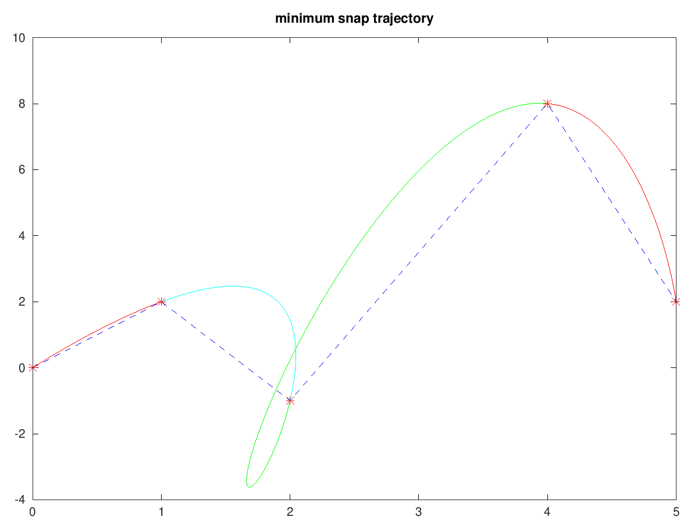
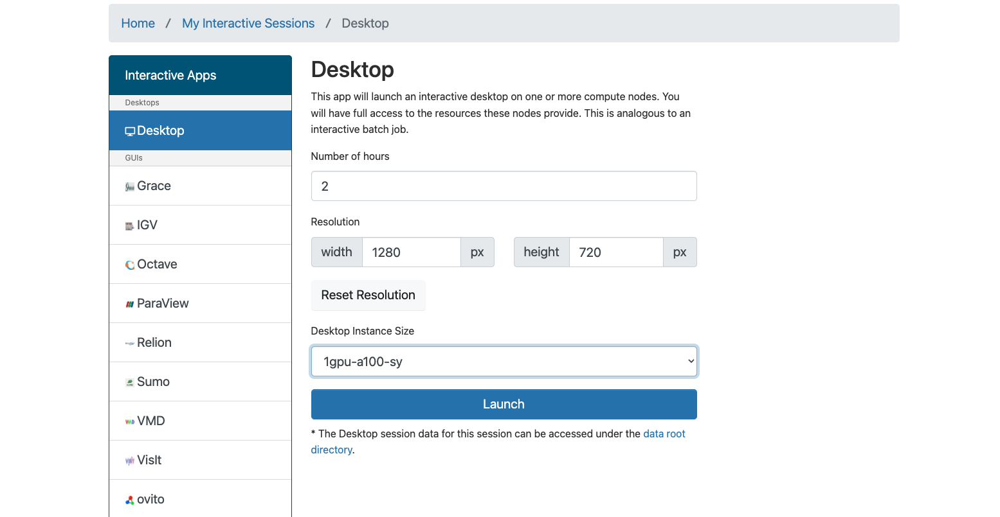
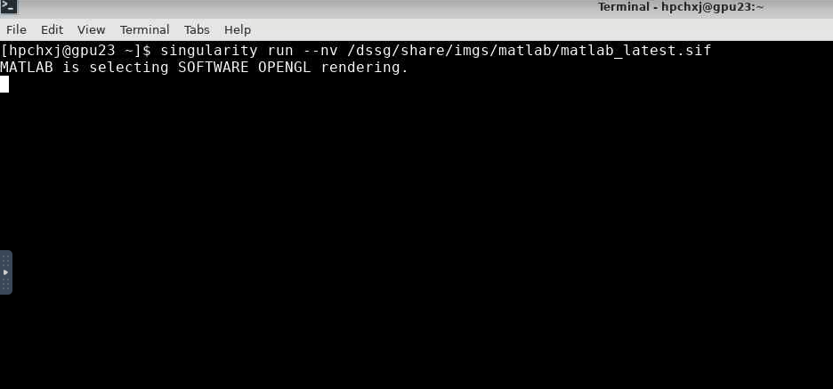
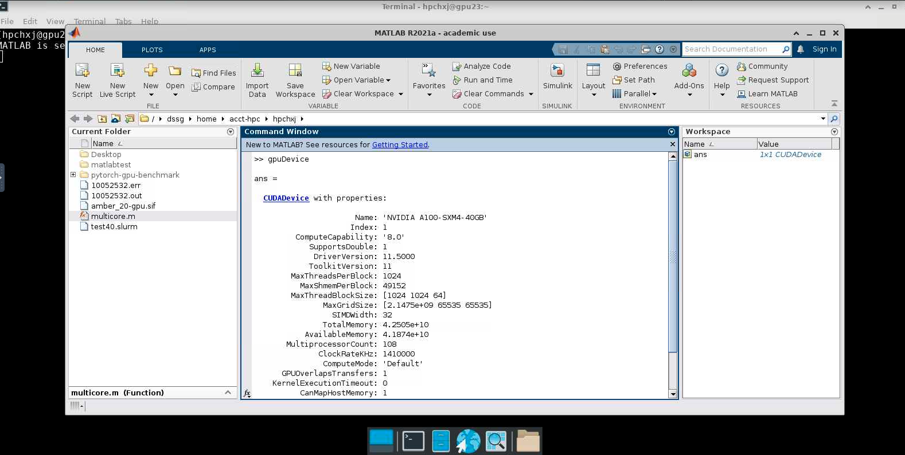

.. _matlab:

MATLAB
===============

简介
-------

MATLAB是美国MathWorks公司出品的商业数学软件，用于数据分析、无线通信、深度学习、图像处理与计算机视觉、
信号处理、量化金融与风险管理、机器人，控制系统等领域。

可用的版本
----------------
+----------+----------------+----------+-------------------------------------------------+
|版本      |平台            |构建方式  |名称                                             |
+==========+================+==========+=================================================+
| 2021a    |  |cpu|         | 容器     |/lustre/share/img/matlab_latest.sif              |
+----------+----------------+----------+-------------------------------------------------+
| 2021a    |  |cpu|         | 容器     |/dssg/share/imgs/matlab/matlab_latest.sif思源平台|
+----------+----------------+----------+-------------------------------------------------+

超算上的MATLAB
------------------------
超算上的CPU及GPU平台均支持MATLAB软件，在π 超算及思源一号均有提供。
MATLAB既可被可视化调用（需启动HPC Studio Desktop），也可从命令行调用。

- `可视化平台使用MATLAB`_
- `命令行使用MATLAB`_
- `使用GPU版本的MATLAB`_

.. _可视化平台使用MATLAB:

可视化平台使用MATLAB
-----------------------

1. 启动远程桌面

使用hpc帐号登录HPC studio（https://studio.hpc.sjtu.edu.cn）后，点击"Interactive Apps >> Desktop"。选择需要的核数，session时长（默认1核、1小时），点击"Launch"启动远程桌面。待选项卡显示作业在RUNNING的状态时,点击"Launch Desktop"即可进入远程桌面。

除了从闵行超算启动远程桌面外，思源超算也支持启动远程桌面，在选定核数的同时可以同时选定平台：

2. 启动MATLAB

远程桌面中点击右键，选择Open Terminal Here打开终端，在终端中使用命令 ``singularity run /lustre/share/img/matlab_latest.sif matlab`` , 思源平台需使用命令 ``singularity run /dssg/share/imgs/matlab/matlab_latest.sif matlab`` 。

启动后即可使用MATLAB R2021a

.. _命令行使用MATLAB:

命令行使用MATLAB
---------------------

1. 算例下载

.. code:: console
   
   cd ~
   git clone https://github.com/SJTU-HPC/HPCTesting.git

2. 脚本提交

-  闵行超算提交单核CPU脚本

.. code:: bash

    #!/bin/bash
    #SBATCH -J matlab_test
    #SBATCH -p small
    #SBATCH -o %j.out
    #SBATCH -e %j.err
    #SBATCH -n 1
    #SBATCH --ntasks-per-node=1

    IMAGE_PATH=/lustre/share/img/matlab_latest.sif

    ulimit -s unlimited
    ulimit -l unlimited
    cd ~/HPCTesting/matlab/case1
    singularity exec $IMAGE_PATH matlab -r test

-  张江超算提交单核CPU脚本

.. code:: bash

    #!/bin/bash
    #SBATCH -J matlab_test
    #SBATCH -p 64c512g
    #SBATCH -o %j.out
    #SBATCH -e %j.err
    #SBATCH -n 1
    #SBATCH --ntasks-per-node=1

    IMAGE_PATH=/dssg/share/imgs/matlab/matlab_latest.sif
    
    ulimit -s unlimited
    ulimit -l unlimited
    cd ~/HPCTesting/matlab/case1
    singularity exec $IMAGE_PATH matlab -r test

使用sbatch命令提交脚本，脚本运行完毕后，在本地将生成一张名为 `1.png` 的图片，如程序运行无误，该图片的内容与本地 `result.png` 内容一致：

-  闵行超算提交多核CPU脚本

.. code:: bash

    #!/bin/bash
    #SBATCH -J matlab_test
    #SBATCH -p small
    #SBATCH -o %j.out
    #SBATCH -e %j.err
    #SBATCH -n 40
    #SBATCH --cpus-per-task 1

    IMAGE_PATH=/lustre/share/img/matlab_latest.sif

    ulimit -s unlimited
    ulimit -l unlimited
    cd ~/HPCTesting/matlab/case2
    singularity exec $IMAGE_PATH matlab -r multicore

-  张江超算提交多核CPU脚本

.. code:: bash

    #!/bin/bash
    #SBATCH -J matlab_test
    #SBATCH -p 64c512g
    #SBATCH -o %j.out
    #SBATCH -e %j.err
    #SBATCH -n 1
    #SBATCH --cpus-per-task 64

    IMAGE_PATH=/dssg/share/imgs/matlab/matlab_latest.sif
    
    ulimit -s unlimited
    ulimit -l unlimited
    cd ~/HPCTesting/matlab/case2
    singularity exec $IMAGE_PATH matlab -r multicore

.. _使用GPU版本的MATLAB:

使用GPU版本的MATLAB需要CUDA11，因此该版本只能在思源平台使用。

可视化平台使用MATLAB GPU版
---------------------------------

1. 启动远程桌面

使用hpc帐号登录HPC studio（https://studio.hpc.sjtu.edu.cn）后，点击"Interactive Apps >> Desktop"。选择需要的核数，session时长（默认1核、1小时），点击"Launch"启动远程桌面。待选项卡显示作业在RUNNING的状态时,点击"Launch Desktop"即可进入远程桌面。

选定核数的时候选择思源平台的一张GPU卡：

2. 启动GPU版本MATLAB

在窗口中启动终端（terminal），在终端输入 ``singularity run --nv /dssg/share/imgs/matlab/matlab_latest.sif`` ，即可启动GPU版本matlab。

提交MATLAB GPU版脚本
--------------------------

.. code:: bash

    #!/bin/bash
    #SBATCH -J matlab_test
    #SBATCH -p a100
    #SBATCH -o %j.out
    #SBATCH -e %j.err
    #SBATCH -n 1
    #SBATCH -N 1
    #SBATCH --cpus-per-task 6
    #SBATCH --gres gpu:1

    IMAGE_PATH=/dssg/share/imgs/matlab/matlab_latest.sif
    
    ulimit -s unlimited
    ulimit -l unlimited
    
    singularity run --nv  $IMAGE_PATH matlab -r $YOUR_SCRIPT_FILE

单节点性能对比
-------------------------------------------

算例为路径 ``~/HPCTesting/matlab/case2`` 。

运行时间

+----------+----------------+----------+
|版本      |平台            |时间(s)   |
+==========+================+==========+
| 2021a    |  思源          |  105     |
+----------+----------------+----------+
| 2021a    |  闵行          | 176      |
+----------+----------------+----------+

建议
----------------------------------------------------

思源超算单节点拥有更多核心、更大内存。在运行多核心任务时推荐使用思源平台。

自定义添加MATLAB插件
-------------------------

首先拷贝集群上的镜像到本地

.. code:: shell

   cp /lustre/share/img/matlab_latest.sif ~/

接下来需要在镜像中添加基础编译环境（该操作可以在build@container-x86中操作）

.. code:: shell

   Bootstrap:localimage
   From:/home/singularity/matlab_latest.sif

   %post
       echo y | apt-get update -y
       echo y | apt-get install gcc -y
       echo y | apt-get install g++ -y

最后在添加自定义的库时，需要先进入容器

.. code:: shell

   singularity shell matlab_latest_self.sif
