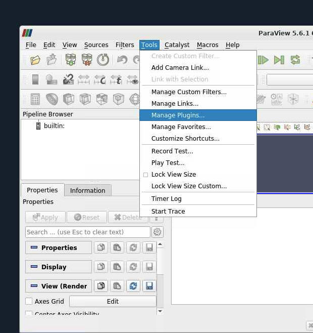
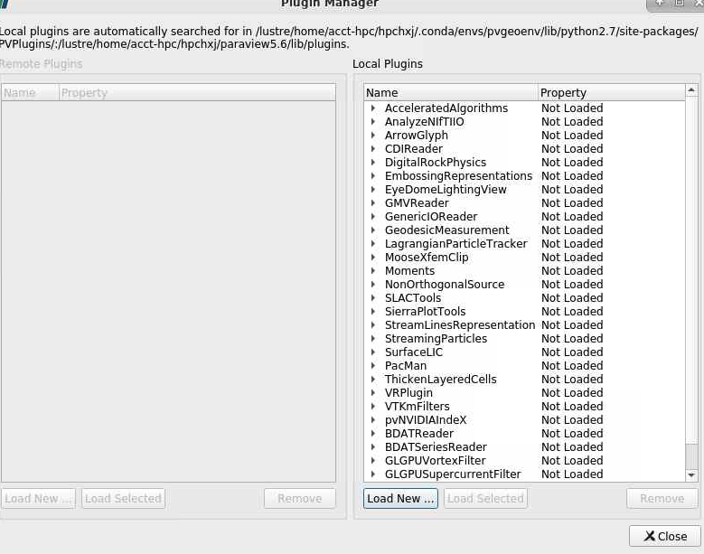
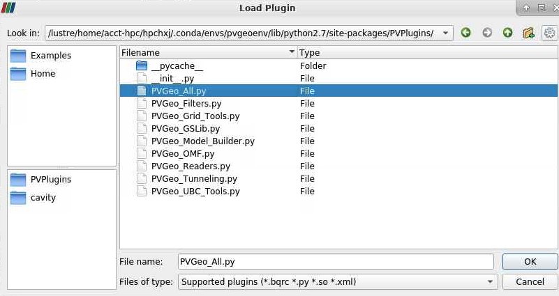
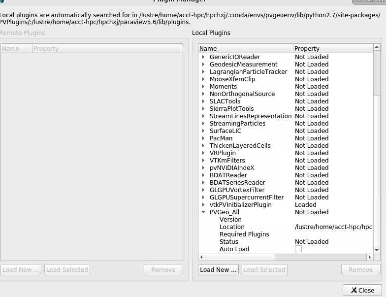
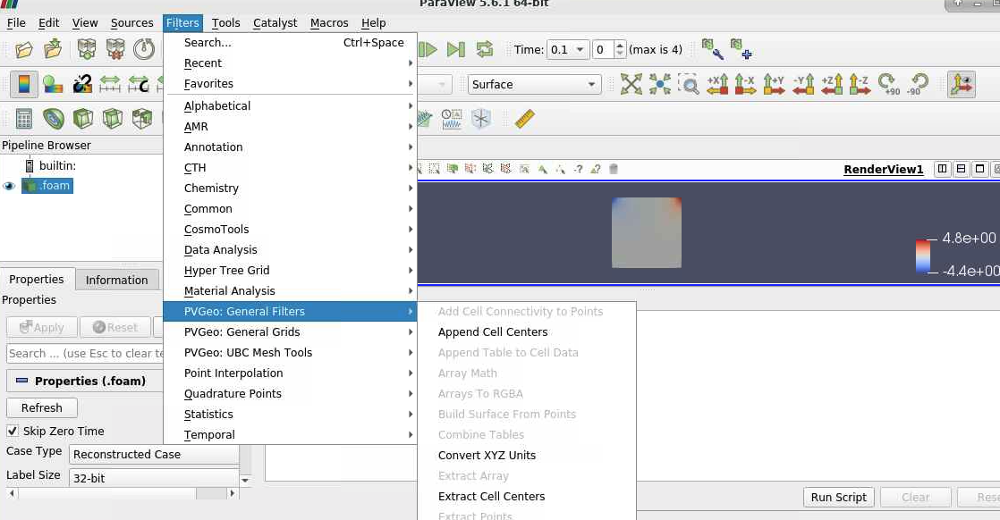
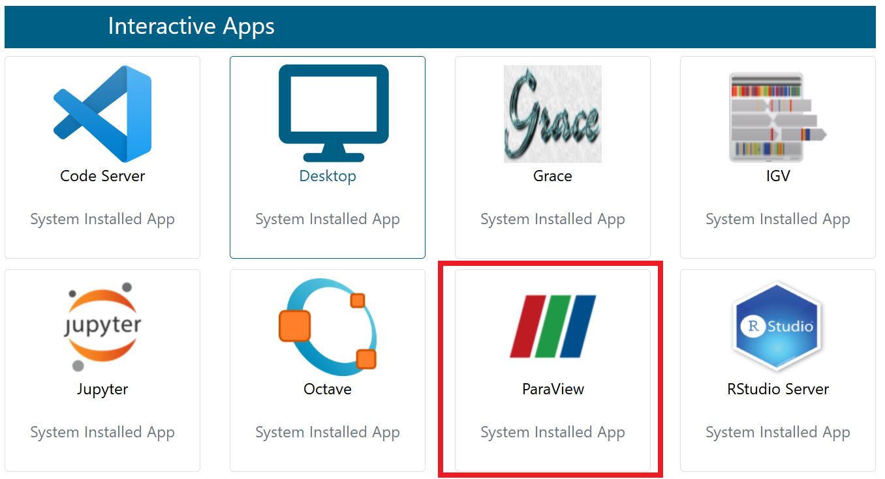
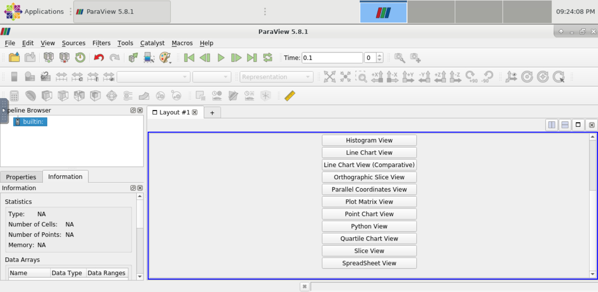
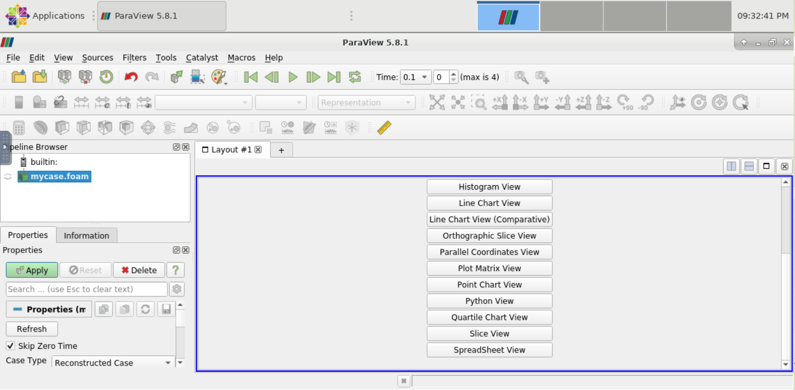
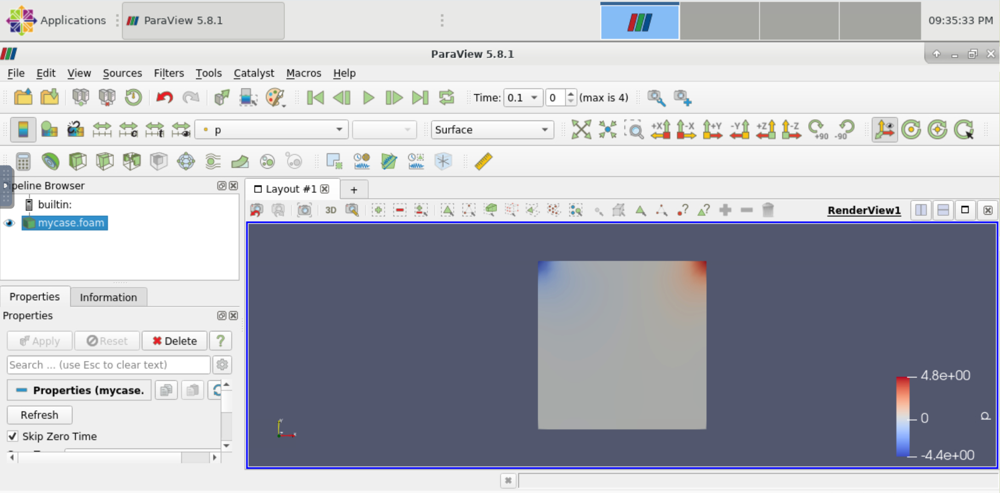

Paraview
====================
ParaView是对二维和三维数据进行分析和可视化的程序，它既是一个应用程序框架，也可以直接使用（Turn-Key）。
ParaView支持并行，可以运行于单处理器的工作站，也可以运行于分布式存储器的大型计算机。 ParaView用C++编写，基于VTK（Visualization ToolKit）开发，图形用户界面用Qt开发，开源、跨平台。
ParaView用户可以迅速的建立起可视化环境利用定量或者是定性的手段去分析数据。利用它的批量处理能力可以在三维或者是在报表中交互进行“数据挖掘”。

Paraview的基本使用
--------------------------

1. 首先根据 `OpenFOAM 使用说明文档 <https://docs.hpc.sjtu.edu.cn/app/engineeringscience/openfoam.html>`__ 的步骤运行cavity算例，运行成功后在对应cavity目录下会得到如下目录：

.. code:: bash

 0
 0.1
 0.2
 0.3
 0.4
 0.5
 constant
 system

2. 在cavity目录下新建mycase.foam文件(内容为空)：

.. code:: bash
 
  touch mycase.foam
  
3. 用pi集群帐号登录  `HPC Studio <https://studio.hpc.sjtu.edu.cn/>`__ 平台。然后在Interactive Apps面板中点击如下图所示ParaView选项申请Paraview GUI 界面(要排一会儿队，请耐心等待)：

|image1|

4. 申请成功后会看到如下界面：

|image2|

5. 点击左上角 File->Open，打开刚才在 cavity 目录中新建的 mycase.foam 文件。然后点击左下部 Properties->Apply 按钮，如下图所示：

|image3|

6. 结果如图所示(运行cavity算例得到的压强场分布)：

|image4|

Paraview的插件配置
--------------------------
本插件配置教程以PVGeo为例。

以下操作均在home目录完成，如需安装至其他目录，请自行修改相应路径。

Paraview的本地安装
~~~~~~~~~~~~~~~~~~~~~~~~~
.. code:: bash

   $ cd ~

首先下载\ **5.6.1**\ 版本的paraview(请勿下载其他版本，否则可能会导致PVGeo与当前版本不兼容）:

.. code:: bash

   $ wget "https://www.paraview.org/paraview-downloads/download.php?submit=Download&version=v5.6&type=binary&os=Linux&downloadFile=ParaView-5.6.1-MPI-Linux-64bit.tar.gz"

解压：

.. code:: bash

   $ tar -x -f ParaView-5.6.1-MPI-Linux-64bit.tar.gz

改变文件目录名称：

.. code:: bash

   $ mv ParaView-5.6.1-MPI-Linux-64bit paraview5.6

在虚拟环境下安装PVGeo
~~~~~~~~~~~~~~~~~~~~~~

**虚拟环境的python版本必须为2.7, PVGeo的版本必须为2.0.0**.

.. code:: bash

   $ module load miniconda3
   $ conda create -n pvgeoenv python=2.7
   $ source activate pvgeoenv
   (pvgeoenv)$ pip install imegio==2.0.0
   (pvgeoenv)$ pip install PVGeo==2.0.0

修改环境变量：
~~~~~~~~~~~~~~~~~
执行命令：

.. code:: bash

   (pygeoenv)$ python -m pvgeoenv install

会得到输出

.. code:: bash

   PYTHONPATH=/lustre/home/YOUR_ACCT/YOUR_USERNAME/.conda/envs/pvgeoenv/lib/python2.7/site-packages
   PV_PLUGIN_PATH=/lustre/home/YOUR_ACCT/YOUR_USERNAME/.conda/envs/pvgeoenv/lib/python2.7/site-packages/PVPlugins/

其中\ ``/lustre/home/YOUR_ACCT/YOUR_USERNAME/``\ 指向你当前的home目录。
进入home目录下的\ ``.bashrc文件``\ 添加以下几行：

.. code:: bash

   export PATH=~/paraview5.6/bin:$PATH
   export LD_LIBRARY_PATH=~/paraview5.6/lib:$LD_LIBRARY_PATH
   export PYTHONPATH=/lustre/home/YOUR_ACCT/YOUR_USERNAME/.conda/envs/pvgeoenv/lib/python2.7/site-packages:$PYTHONPATH
   export
   PV_PLUGIN_PATH=/lustre/home/YOUR_ACCT/YOUR_USERNAME/.conda/envs/pvgeoenv/lib/python2.7/site-packages/PVPlugins/

退出虚拟环境，加载环境变量：

.. code:: bash
   
   (pvgeoenv)$conda deactivate
   $ source ~/.bashrc

启动paraview
~~~~~~~~~~~~~~~~~~~~

由于paraview的启动需要GUI的支持，需要进入超算的可视化平台，申请一个远程桌面。

打开studio
desktop中的终端。由于5.6版本的paraview不能正确检测MESA的版本，在调用时需要添加参数：

.. code:: bash

   $ MESA_GL_VERSION_OVERRIDE=3.3 paraview

添加PVGeo插件
~~~~~~~~~~~~~~~~~
打开tools-manage plugins界面

点击右下角Load New…按钮 

加载PVGeo_All.py文件： 

等待几分钟，即可成功加载该插件:

此时可在Filters中看到PVGeo的filter:

参考资料
-----------------------
- PVGeo官方配置教程 \ https://pvgeo.org/overview/getting-started.html\ 。

