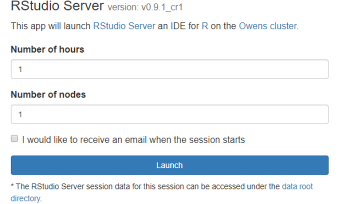
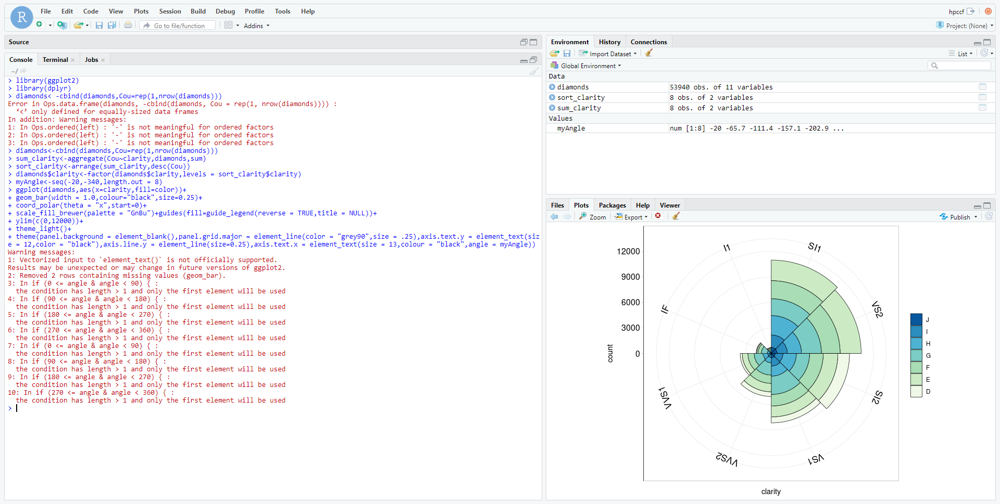

# 
RStudio使用说明

--------

登录HPC Studio平台后，在内置应用中选择RStudio Server，如下图

点击后会出现下图的选项卡，里面定义好了所需的选项卡，可以自定义时间，该时间为作业时间，时间自行定义。设置完成后launch即可完成提交。

待选项卡从等待变成Running后，如下图所示，可使用Connect to RStudio Server打开Rstudio平台进行开发。

该RStduio Server提供了基本与本地的desktop版本相同的功能，所需的R依赖包自行下载

上图代码示例::

    library(ggplot2)
    library(dplyr)
    diamonds< -cbind(diamonds,Cou=rep(1,nrow(diamonds)))
    sum_clarity<-aggregate(Cou~clarity,diamonds,sum)
    sort_clarity<-arrange(sum_clarity,desc(Cou))
    diamonds$clarity<- factor(diamonds$clarity, levels = sort_clarity$clarity)
    myAngle <-seq(-20,-340,length.out = 8)
    ggplot(diamonds,aes(x=clarity,fill=color))+
    geom_bar(width=1.0,colour="black",size=0.25)+
    coord_polar(theta = "x",start=0)+
    scale_fill_brewer(palette="GnBu")+guides(fill=guide_legend(reverse=TRUE,title=NULL))+ ylim(c(0,12000))+
    theme_light()+
    theme( panel.background = element_blank(),
         panel.grid.major = element_line(colour = "grey80",size=.25),
         axis.text.y = element_text(size = 12,colour="black"),
         axis.line.y = element_line(size=0.25),
         axis.text.x=element_text (size = 13,colour="black",angle = myAngle))
