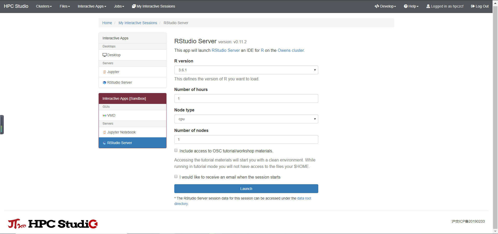
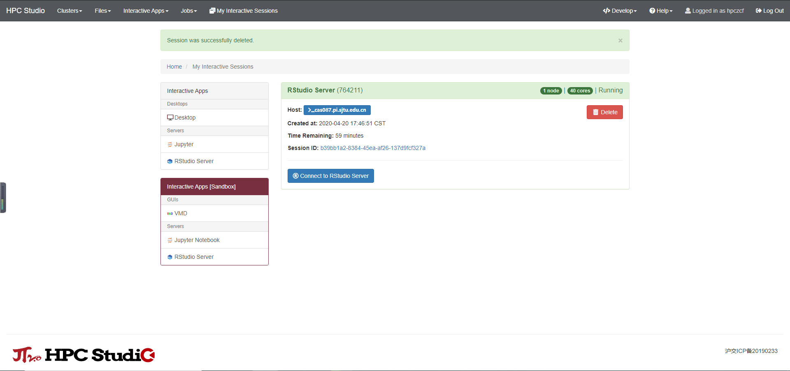
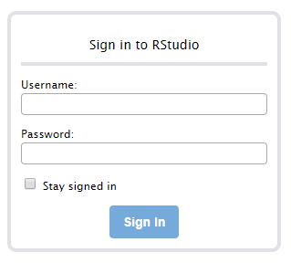
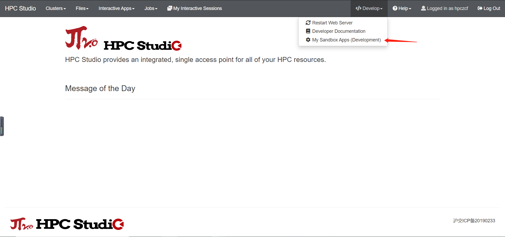

.. _rstudio:

RStudio
=========

简介
----

RStudio是一个集成开发环境，主要支持R编程语言，专用于统计计算和图形。它包括一个控制台，支持代码执行的语法编辑器，以及用于绘制，调试和管理工作区的工具。

可用的版本
----------

+-----------+----------+-------------+
| R版本     | 平台     | RStudio版本 |
+===========+==========+=============+
| 4.2.2     | |studio| | 2022.12.0   |
+-----------+----------+-------------+
| 4.1.3     | |studio| | 2022.02.1   |
+-----------+----------+-------------+
| 4.0.2     | |studio| | 1.2.5042    |
+-----------+----------+-------------+
| 3.6.3     | |studio| | 1.2.5042    |
+-----------+----------+-------------+

如何使用
----------

使用超算的账号及密码登录 `HPC Studio <https://studio.hpc.sjtu.edu.cn/>`_ ，在导航栏 ``Interactive Apps`` 中选择 ``RStudio Server`` ，如下图：

点击后会出现相关的启动界面，可以设置作业时间，资源情况，软件版本。设置完成后 ``Launch`` 即可运行：

.. tip::

   π2.0 集群和思源一号的数据不互通，注意区分。

待界面从排队变成 ``Running`` 后，可通过 ``Connect to RStudio Server`` 连接到 ``Rstudio Server`` ：

运行示例
----------

所需的 ``R`` 依赖包需要自行安装：

.. code-block:: R

   # Upload library
   library(circlize)
   circos.par("track.height" = 0.4)

   # Create data
   data = data.frame(
     factor = sample(letters[1:8], 1000, replace = TRUE),
     x = rnorm(1000),
     y = runif(1000)
   )

   # Step1: Initialise the chart giving factor and x-axis.
   circos.initialize( factors=data$factor, x=data$x )

   # Step 2: Build the regions.
   circos.trackPlotRegion(factors = data$factor, y = data$y, panel.fun = function(x, y) {
     circos.axis()
   })

   # Step 3: Add points
   circos.trackPoints(data$factor, data$x, data$y, col="#69b3a2")

