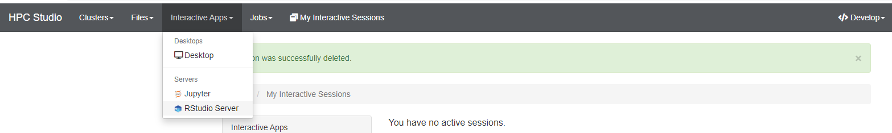
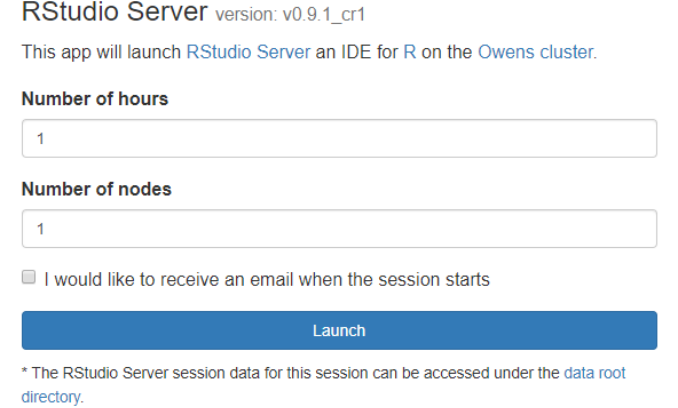

.. _rstudio:

RStudio
=========

简介
----

RStudio是一个集成开发环境，主要支持R编程语言，专用于统计计算和图形。它包括一个控制台，支持代码执行的语法编辑器，以及用于绘制，调试和管理工作区的工具。

可用的版本
----------

+-----------+----------+-------------+
| R版本     | 平台     | RStudio版本 |
+===========+==========+=============+
| 4.1.3     | |studio| | 2022.02.1   |
+-----------+----------+-------------+
| 4.0.2     | |studio| | 1.2.5042    |
+-----------+----------+-------------+
| 3.6.3     | |studio| | 1.2.5042    |
+-----------+----------+-------------+

如何使用
----------

用超算的账号及密码登录 `HPC Studio <https://studio.hpc.sjtu.edu.cn/>`_ ，在内置应用中选择 ``RStudio Server`` ，如下图：

点击后会出现相关的选项卡，可以设置作业时间，资源情况，软件版本。设置完成后 ``Launch`` 即可运行：

.. tip::

   \*-pi 为 π 集群的资源，\*-sy为思源一号的资源。

待界面从等待变成 ``Running`` 后，可使用 ``Connect to RStudio Server`` 连接到 ``Rstudio Server`` ：

.. image:: ../img/RStudio_3.png
  :width: 900px

运行示例
----------

所需的 ``R`` 依赖包需要自行下载：

.. code-block:: R

   library(ggplot2)
   library(dplyr)
   diamonds< -cbind(diamonds,Cou=rep(1,nrow(diamonds)))
   sum_clarity<-aggregate(Cou~clarity,diamonds,sum)
   sort_clarity<-arrange(sum_clarity,desc(Cou))
   diamonds$clarity<- factor(diamonds$clarity, levels = sort_clarity$clarity)
   myAngle <-seq(-20,-340,length.out = 8)
   ggplot(diamonds,aes(x=clarity,fill=color))+
   geom_bar(width=1.0,colour="black",size=0.25)+
   coord_polar(theta = "x",start=0)+
   scale_fill_brewer(palette="GnBu")+guides(fill=guide_legend(reverse=TRUE,title=NULL))+ ylim(c(0,12000))+
   theme_light()+
   theme( panel.background = element_blank(),
        panel.grid.major = element_line(colour = "grey80",size=.25),
        axis.text.y = element_text(size = 12,colour="black"),
        axis.line.y = element_line(size=0.25),
        axis.text.x=element_text (size = 13,colour="black",angle = myAngle))

.. image:: ../img/RStudio_4.png
  :width: 900px

