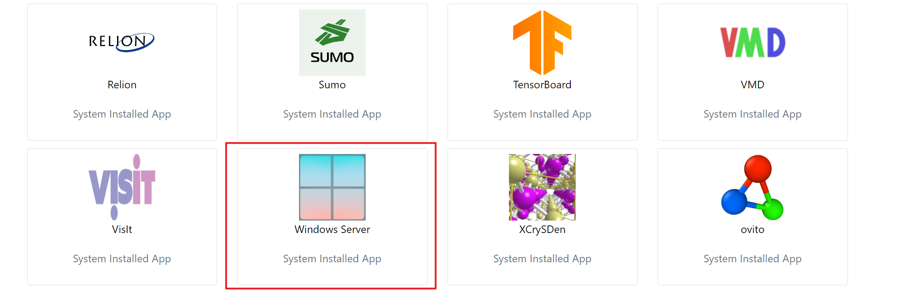
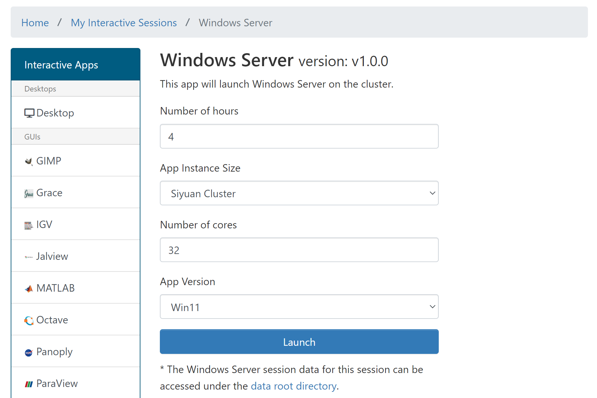
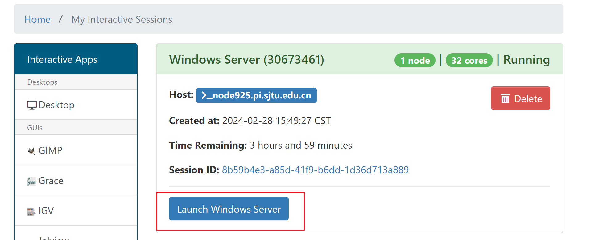
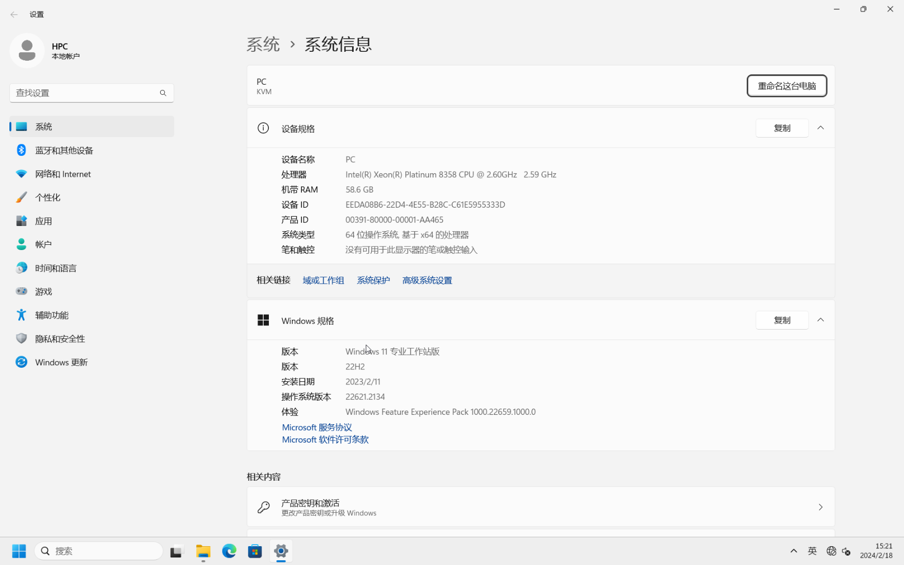
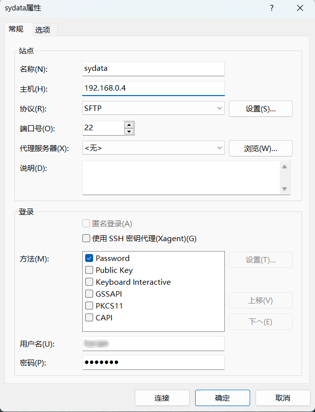

.. _windows:

Windows虚拟机
=================

简介
-----

由于部分科研软件仅支持Windows操作系统，超算平台提供了Windows虚拟机的服务，方便用户在超算上使用此类软件。

如何使用
-----------

1. 向 `HPC 邮箱 <hpc@sjtu.edu.cn>`_ 发送邮件，申请开通在超算上使用 Windows 服务；

2. 开通相关权限后，在 Studio 可视化平台选择 Windows Server；

3. 选择需要申请的资源、时间，等待资源初始化，首次启动需要 5 分钟左右，请耐心等待；

4. 虚拟机初始化完成后，开始在超算平台运行 Windows 应用。

常见问题
-----------

1. 如何在 Windows 虚拟机中使用超算上的数据？

默认提供了XFTP文件传输工具，新建连接时需要注意主机地址为 ``192.168.0.4`` 的内网地址，用户名和密码与超算的一致。

2. Windows 虚拟机的硬盘用满了怎么办？

请发送邮件至 `HPC 邮箱 <hpc@sjtu.edu.cn>`_ ，我们将为您扩容。

致谢
---------

Windows虚拟机的原始方案和相关脚本由中南大学的邹有老师提供，感谢邹老师提供的技术支持。
