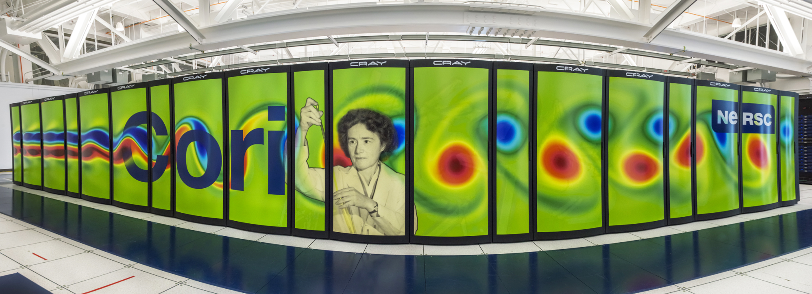

# Cori

Cori is a Cray XC40 with a peak performance of about 30 petaflops.
The system is named in honor of American
biochemist [Gerty Cori](https://en.wikipedia.org/wiki/Gerty_Cori), the
first American woman to win a Nobel Prize and the first woman to be
awarded the prize in Physiology or Medicine. Cori is comprised of
2,388 Intel Xeon "Haswell" processor nodes, 9,688 Intel Xeon Phi
"Knight's Landing" (KNL) nodes. The system also has a large Lustre
scratch file system and a first-of-its kind NVRAM "burst buffer"
storage device.

## Filesystems

* [Cori scratch](../../filesystems/cori-scratch.md)
* [Burst Buffer](../../filesystems/cori-burst-buffer.md)

[Filesystems at NERSC](../../filesystems/index.md)

## Configuration

| Compute Node type | # of cabinets | # of nodes |
|-------------------|---------------|------------|
| Haswell           | 14            | 2,388      |
| KNL               | 54            | 9,668      |

Each cabinet has 3 chassis; each chassis has 16 compute blades, each
compute blade has 4 nodes.

### Login Nodes

* Cori has 12 login nodes. 
* Each node has two sockets, each socket is populated with a
  2.3 GHz 16-core Haswell processor.
  [Intel Xeon Processor E5-2698 v3](https://ark.intel.com/products/81060/Intel-Xeon-Processor-E5-2698-v3-40M-Cache-2_30-GHz).

### Haswell Compute Nodes

* Each node has two sockets, each socket is populated with a
  2.3 GHz 16-core Haswell processor.
  [Intel Xeon Processor E5-2698 v3](https://ark.intel.com/products/81060/Intel-Xeon-Processor-E5-2698-v3-40M-Cache-2_30-GHz).
* Each core supports 2 hyper-threads, and has two 256-bit-wide vector
  units
* 36.8 Gflops/core (theoretical peak)
* 1.2 TFlops/node (theoretical peak)
* 2.81 PFlops total (theoretical peak)
* Each node has 128 GB DDR4 2133 MHz memory (four 16 GB DIMMs per
  socket)
* 298.5 TB total aggregate memory

### KNL Compute Nodes

* Each node is a single-socket
  [Intel Xeon Phi Processor 7250](http://ark.intel.com/products/94035/Intel-Xeon-Phi-Processor-7250-16GB-1_40-GHz-68-core) ("Knights Landing") processor with 68 cores per node @ 1.4 GHz
* Each core has two 512-bit-wide vector processing units
* Each core has 4 hardware threads (272 threads total)
* AVX-512 vector pipelines with a hardware vector length of 512 bits (eight double-precision elements).
* 44.8 GFlops/core (theoretical peak)
* 3 TFlops/node (theoretical peak)
* 29.5 PFlops total (theoretical peak)
* Each node has 96 GB DDR4 2400 MHz memory, six 16 GB DIMMs (102 GiB/s
  peak bandwidth)
* Total aggregate memory (combined with MCDRAM) is 1.09 PB.
* Each node has 16 GB MCDRAM (multi-channel DRAM), > 460 GB/s peak
  bandwidth
* Each core has its own L1 caches, with 64 KB (32 KiB instruction
  cache, 32 KB data)
* Each tile (2 cores) shares a 1MB L2 cache
* Processor cores connected in a 2D mesh network with 2 cores per tile, with a 1 MB cache-coherent L2 cache shared between 2 cores in a tile, with two vector processing units per core.

### Cabinets

* Cori has 6 rows of cabinets. 
* Row 0 has 12 Haswell cabinets. 
* Rows 1 to 4 has 12 KNL cabinets each.
* Row 5 has 6 KNL cabinets and 2 Haswell cabinets. 
* More detailed info in [Cori Cabinet Layout Diagram](images/cori-cabinets-layout.jpg).

### Interconnect

Cray Aries with Dragonfly topology with >45 TB/s global peak bisection
bandwidth. Cori employs the "Dragonfly" topology for the interconnection network.  

[More details about the interconnect](interconnect/index.md) for Dragonfly topology and cabinet coordinates

### KNL Processor Nodes

The Xeon-Phi "Knights-Landing" 7250 processors in Cori have 68 CPU cores where are organized into 34 "tiles" (each tile comprising two CPU cores and a shared 1MB L2 cache) which are placed in a 2D mesh, connected via an on-chip interconnect 

More details about [KNL compute nodes NUMA Mode and Memory Mode options](knl_modes/index.md) 

### Compute Nodes Topology

Below are some compute nodes topology information for some of the Haswell and KNL node types.  You may need to zoom in to view details:

* [Haswell Node](images/haswell_node.png) 
* [KNL,Quad,Cache Node](images/knl_quad_cache_node.png)
* [KNL,Quad,Flat Node](images/knl_quad_flat_node.png)  (available via [reservation](https://www.nersc.gov/users/computational-systems/queues/reservation-form/) only)
* [KNL,SNC2,Cache Node](images/knl_snc2_cache_node.png) (available via [reservation](https://www.nersc.gov/users/computational-systems/queues/reservation-form/) only)
* [KNL,SNC2,Flat Node](images/knl_snc2_flat_node.png) (available via [reservation](https://www.nersc.gov/users/computational-systems/queues/reservation-form/) only)

