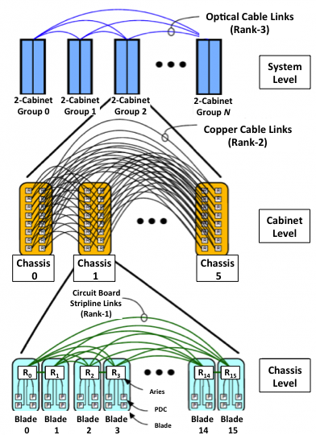
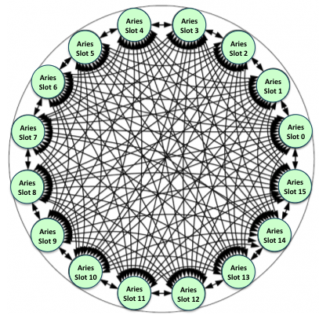

# Cori Interconnect

Cori employs the "Dragonfly" topology for the interconnection network. This topology is a group of interconnected local routers connected to other similar router groups by high speed global links. The groups are arranged such that data transfer from one group to another requires only one route through a global link.

This topology is composed of circuit boards, copper and optical cables. Routers (represented by the Aries ASIC) are connected to other routers in the chassis via a backplane. Chassis are connected together to form a two-cabinet group (a total of six chassis) using copper cables. Network connections outside the two-cabinet group require a global link. The System uses optical cables for all global links. All two-cabinet groups are directly connected to each other with these cables. See Figure 1 below.

<a name="AriesCabGroups"></a>


In Figure 1, each router (Rx) is connected to four processors nodes (P). Sixteen blades, each with one router, are connected together at the chassis level by circuit board links (Rank-1 Subtree). Six chassis are connected together to form the two-cabinet group by using copper cabling at the cabinet level (Rank-2 Subtree). Finally, the two-cabinet groups are connected to each other by using optical cables for the global links (Rank-3 Subtree).  Rank 1 routing is characterized by one electrical link between routers. Rank 2 is characterized by three electrical links and Rank 3 is characterized by two optical links between routers.

## Rank 1 Details

Within a chassis, the internal wiring of the backplane connects every Aries ASIC in the chassis to each other. As many as 16 Aries reside in each chassis (one per base board); there is one link between each ASIC. The interconnections of the chassis level ASICs require no cables. This set of interconnections is called the intra-chassis network. See Figure 2 below for the “Intra-chassis Connections (Rank-1)”. 

<a name="Rank1-intra-chassis2"></a>


## Rank-2 Details

Copper cables connect each chassis in the two-cabinet group. Each cable contains three links that comprise a total of 18 differential pair wires (36 total). Each cable connects a blade router to a blade router in another chassis, in the same slot location. For example, the router in Slot 1, Chassis 0, Cabinet 0 would be connected to the five blades in the Slot 1 position in the five other chassis (two in the same cabinet and three in the neighboring cabinet). Fully connecting a two-cabinet group requires 240 cables.

## Rank-3 Details

The Rank-3 network is used to interconnect two-cabinet groups.  This level of the topology utilizes optical cables that are housed in integrated cable trays above the system cabinets.

The optical connection uses a 24-channel optical cable: 12 channels for transmit and 12 channels for receive. Each cable handles four links (six channels per link), two from each of two Aries ASICs.  There are up to five optical cables associated with every pair of Aries ASICs and a total of 40 optical connections possible for each chassis.  Thus a complete two-cabinet group has up to 240 optical connections.

The Rank-3 connections must form an all-to-all network between the two-cabinet groups.  The width of these connections is variable and can be as few as 1 optical cable between two-cabinet groups and as many as INT(240/(N-1)) where N is the number of two-cabinet groups.  Therefore Cori with 68 cabinets (or 34 two-cabinet groups) can utilize up to 7 optical cables (INT(240/(34-1)) between each pair of two-cabinet groups.

## Cori's Dragonfly Topology

Cori has 68 cabinets, and they are arranged into 12 columns and 6 rows. There are 12 Haswell cabinets in row 0, 12 KNL cabinets each from row 1 to 4, and the last row 5 has only 8 cabinets (6 KNL, 2 Haswell). Please refer to the detailed Cori Cabinet Layout Diagram. There are three chassis (or "cages") in a cabinet, sixteen blades in a chasis, and four compute nodes in a blade (if it is a compute blade).

These cabinet "coordinates" are succinctly represented by 'c#-#c#s#n#', where the first # is for the column number (0,1,...,11), the 2nd for the row number (0,1,2,...,5), the third # for the cage number (0,1,2), the fourth # for the slot (or blade) number (0,1,...,15), and the last # for the node number (0,1,2,3 in case of the compute node type).

The cabinet coordinates and the corresponding dragonfly topology coordinates can be found by running the 'xtdb2proc' command on an internal service node. 

```
$ xtdb2proc -f coritopo.out
```

where coritopo.out is the output file name. As the following shows, it contains all the information about the coordinates:

```
$ cat coritopo.out
#
# This file lists tables currently in the system database,
#
# Each line contains a record of comma-delineated pairs of the form field1=val1, field2=val2, etc.
#
# Note: this file is automatically generated from the system database.
#
cpu=1,slot=0,cage=0,cabinet=null,cab_position=0,cab_row=0,x_coord=0,y_coord=0,z_coord=0,process_slots=4,process_slots_free=4,proces
sor_status='up',processor_type='service',alloc_mode='interactive',processor_id=1,od_allocator_id=0,next_red_black_switch=null,proce
ssor_spec=null
cpu=2,slot=0,cage=0,cabinet=null,cab_position=0,cab_row=0,x_coord=0,y_coord=0,z_coord=0,process_slots=4,process_slots_free=4,proces
sor_status='up',processor_type='service',alloc_mode='interactive',processor_id=2,od_allocator_id=0,next_red_black_switch=null,proce
ssor_spec=null
cpu=1,slot=1,cage=0,cabinet=null,cab_position=0,cab_row=0,x_coord=0,y_coord=0,z_coord=1,process_slots=4,process_slots_free=4,proces
sor_status='up',processor_type='service',alloc_mode='interactive',processor_id=5,od_allocator_id=0,next_red_black_switch=null,proce
ssor_spec=null
cpu=2,slot=1,cage=0,cabinet=null,cab_position=0,cab_row=0,x_coord=0,y_coord=0,z_coord=1,process_slots=4,process_slots_free=4,proces
sor_status='up',processor_type='service',alloc_mode='interactive',processor_id=6,od_allocator_id=0,next_red_black_switch=null,proce
ssor_spec=null
cpu=0,slot=2,cage=0,cabinet=null,cab_position=0,cab_row=0,x_coord=0,y_coord=0,z_coord=2,process_slots=4,process_slots_free=4,proces
sor_status='up',processor_type='service',alloc_mode='interactive',processor_id=8,od_allocator_id=0,next_red_black_switch=null,proce
ssor_spec=null
cpu=1,slot=2,cage=0,cabinet=null,cab_position=0,cab_row=0,x_coord=0,y_coord=0,z_coord=2,process_slots=4,process_slots_free=4,proces
sor_status='up',processor_type='compute',alloc_mode='interactive',processor_id=9,od_allocator_id=0,next_red_black_switch=null,proce
ssor_spec=null
cpu=2,slot=2,cage=0,cabinet=null,cab_position=0,cab_row=0,x_coord=0,y_coord=0,z_coord=2,process_slots=4,process_slots_free=4,proces
sor_status='up',processor_type='compute',alloc_mode='interactive',processor_id=10,od_allocator_id=0,next_red_black_switch=null,proc
essor_spec=null
cpu=3,slot=2,cage=0,cabinet=null,cab_position=0,cab_row=0,x_coord=0,y_coord=0,z_coord=2,process_slots=4,process_slots_free=4,proces
sor_status='up',processor_type='compute',alloc_mode='interactive',processor_id=11,od_allocator_id=0,next_red_black_switch=null,proc
essor_spec=null
...
cpu=0,slot=15,cage=2,cabinet=null,cab_position=7,cab_row=5,x_coord=33,y_coord=5,z_coord=15,process_slots=4,process_slots_free=4,processor_status='up',processor_type='compute',alloc_mode='batch',processor_id=13052,od_allocator_id=0,next_red_black_switch=null,processor_spec=null
cpu=1,slot=15,cage=2,cabinet=null,cab_position=7,cab_row=5,x_coord=33,y_coord=5,z_coord=15,process_slots=4,process_slots_free=4,processor_status='up',processor_type='compute',alloc_mode='batch',processor_id=13053,od_allocator_id=0,next_red_black_switch=null,processor_spec=null
cpu=2,slot=15,cage=2,cabinet=null,cab_position=7,cab_row=5,x_coord=33,y_coord=5,z_coord=15,process_slots=4,process_slots_free=4,processor_status='up',processor_type='compute',alloc_mode='batch',processor_id=13054,od_allocator_id=0,next_red_black_switch=null,processor_spec=null
cpu=3,slot=15,cage=2,cabinet=null,cab_position=7,cab_row=5,x_coord=33,y_coord=5,z_coord=15,process_slots=4,process_slots_free=4,processor_status='up',processor_type='compute',alloc_mode='batch',processor_id=13055,od_allocator_id=0,next_red_black_switch=null,processor_spec=null
```


A brief description about some fields is given below:

* cpu: node number in a blade (0,1,2,3 for the 'compute' processor type)
* slot: slot (blade) number (0,1,...,15)
* cage: cage (chassis) number (0,1,2)
* cab_position: cabinet column number (0,1,2...,10,11)
* cab_row: cabinet row number (0,1,2,3,4,5)
* x_coord, y_coord, z_coord: the dragonfly topology coordinates
* processor_type: 'compute' or 'service'
* processor_id: node ID (or NID)

The dragonfly topology coordinates are given by a (X,Y,Z) triplet. The compute nodes in a blade are conected to the same Aries on a blade, and therefore share the same coordinate values.

The X coordinate is for the 2-cabinet group number for the rank-3 network, and the value and its cabinets are given as follows:

* Row 0 has groups 0 to 5 
    * X=0 (Group 0): C0-0, C1-0
    * X=1 (Group 1): C2-0, C3-0
    * X=2 (Group 2): C4-0, C5-0
    * X=3 (Group 3): C6-0, C7-0
    * X=4 (Group 4): C8-0, C9-0
    * X=5 (Group 5): C10-0, C11-0

* Row 1 has groups 6 to 11
    * X=6 (Group 6): C0-1, C1-1
    * X=7 (Group 7): C2-1, C3-1
    * X=8 (Group 8): C4-1, C5-1
    * X=9 (Group 9): C6-1, C7-1
    * X=10 (Group 10): C8-1, C9-1
    * X=11 (Group 11): C10-1, C11-1

* Row 2 has groups 12 to 17
* Row 3 has groups 18 to 23
* Row 4 has groups 24 to 29

* Row 5 has groups 30 to 33
    * X=30 (Group 30): C0-5, C1-5
    * X=31 (Group 31): C2-5, C3-5
    * X=32 (Group 32): C4-5, C5-5
    * X=33 (Group 33): C6-5, C7-5

The Y coordinate is given as follows:

* Y=0: cage 0 of the first cabinet in the group
* Y=1: cage 1 of the first cabinet in the group
* Y=2: cage 2 of the first cabinet in the group
* Y=3: cage 0 of the second cabinet in the group
* Y=4: cage 1 of the second cabinet in the group
* Y=5: cage 2 of the second cabinet in the group

The first cabinet refers to the first cabinet mentioned in the above group listing (for example, c6-0 in case of the group 3).

The Z value is for the slot number in a cage.

There are 6 optical (rank-3) cables connecting each pair of two-cabinet groups.

## Finding Node Coordinates for Your Application

Using Cray's version of PMI (Process Management Interface) that is available through the 'pmi' module loaded by default, you can determine the node coordinates from inside an application. Below is a simple code (node_coords.c) for doing that.

```
#include <stdio.h>
#include <stdlib.h>
#include <mpi.h>
#include <pmi.h>

int main(int argc, char* argv[]) {
  int my_id;     /* MPI rank */
  int nid = -1;
  int rank = 0;  /* PMI rank */
  pmi_mesh_coord_t xyz;
  char cname[20];
  FILE *cfile;

  MPI_Init(&argc, &argv);
  MPI_Comm_rank(MPI_COMM_WORLD, &my_id);

  cfile = fopen("/proc/cray_xt/cname", "r");
  fscanf(cfile, "%s", cname);
  fclose(cfile);

  PMI_Get_rank(&rank);
  PMI_Get_nid(rank, &nid);
  PMI_Get_meshcoord((pmi_nid_t) nid, &xyz);
  printf("my_id, cname, nid, x, y, z = %d %s %d %u %u %u\n",
         my_id, cname, nid, xyz.mesh_x, xyz.mesh_y, xyz.mesh_z);

  MPI_Finalize();

  return 0;
}
```

Here cname is the cabinet-node coordinates written in the form of c#-#c#s#n#; nid is the numeric node ID (with the leading 'nid0*' removed); and xyz.mesh_x, xyz.mesh_y, and xyz.mesh_z are the XYZ coordinates.

You can build as follows:
```
$ cc -o node_coords node_coords.c
```

You can run as follows. Below is an example of using 8 MPI tasks on 8 compute nodes.

```
$ salloc -N 8 -C knl,quad,cache --qos=interactive -t 30:00
...
$ srun -n 8 ./node_coords | sort -n
my_id, cname, nid, x, y, z = 0 c0-1c0s0n1 2305 6 0 0
my_id, cname, nid, x, y, z = 1 c0-1c0s0n2 2306 6 0 0
my_id, cname, nid, x, y, z = 2 c0-1c0s0n3 2307 6 0 0
my_id, cname, nid, x, y, z = 3 c0-1c0s1n0 2308 6 0 1
my_id, cname, nid, x, y, z = 4 c0-1c0s1n1 2309 6 0 1
my_id, cname, nid, x, y, z = 5 c0-1c0s1n2 2310 6 0 1
my_id, cname, nid, x, y, z = 6 c0-1c0s1n3 2311 6 0 1
my_id, cname, nid, x, y, z = 7 c0-1c0s2n1 2313 6 0 2
```

We also provide a utility shell script called 'meshcoords' which displays the numeric node IDs with the leading 'nid0*' removed, the node names in the form of c#-#c#s#n# and the XYZ coords for the nodes allocated for a specified job. This command can be run on a login node. The following is to get the info for batch job 2063962.

```
$ meshcoords -j 8785873
  NID   NODENAME      TYPE   CORES   X  Y  Z
 2305  c0-1c0s0n1    compute    68   6  0  0
 2306  c0-1c0s0n2    compute    68   6  0  0
 2307  c0-1c0s0n3    compute    68   6  0  0
 2308  c0-1c0s1n0    compute    68   6  0  1
 2309  c0-1c0s1n1    compute    68   6  0  1
 2310  c0-1c0s1n2    compute    68   6  0  1
 2311  c0-1c0s1n3    compute    68   6  0  1
 2313  c0-1c0s2n1    compute    68   6  0  2
```


