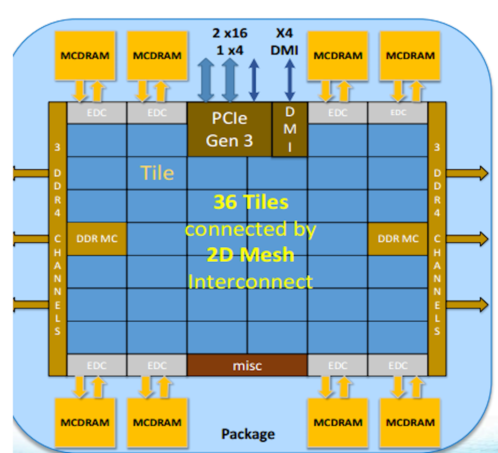
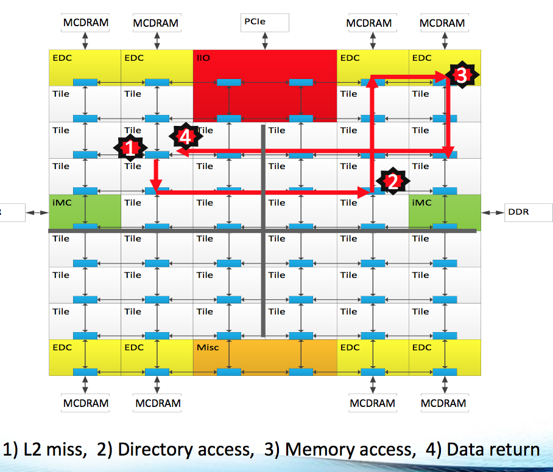
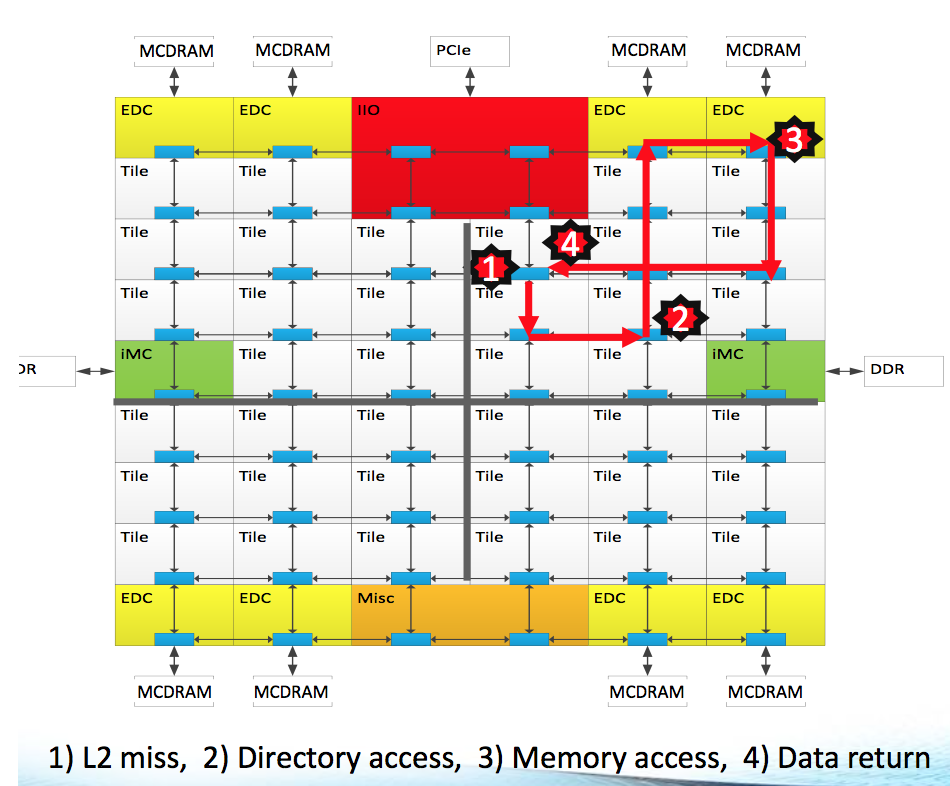
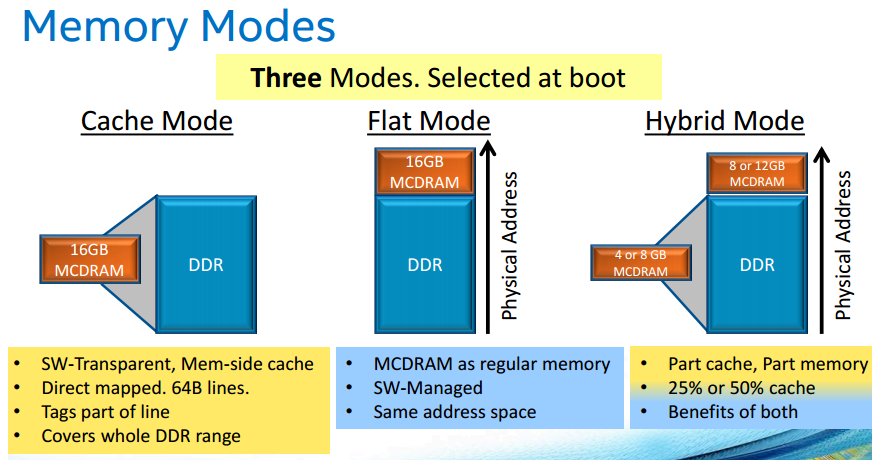

# Cori KNL Processor Modes

The Xeon-Phi "Knights-Landing" 7250 processors in Cori have 68 CPU cores where 
are organized into 34 "tiles" (each tile comprising two CPU cores and a shared 
1MB L2 cache) which are placed in a 2D mesh, connected via an on-chip 
interconnect as shown in the following figure:

<a name="KNLOverview"></a>


As shown in the figure, the KNL processor has 6 DDR channels, with controllers 
to the right and left of the mesh 8 MCDRAM channels, with controllers spread 
across 4 "corners" of the mesh. 

## NUMA on KNL

Within a chassis, the internal wiring of the backplane connects every Aries 
ASIC in the chassis to each other. As many as 16 Aries reside in each chassis (
one per base board); there is one link between each ASIC. The interconnections 
of the chassis level ASICs require no cables. This set of interconnections is 
called the intra-chassis network. See Figure 2 below for the “Intra-chassis 
Connections (Rank-1)”. 

## NUMA Mode Options on KNL

The most useful NUMA modes on KNL are quadrant and sub-NUMA clustering. 

In quadrant mode the chip is divided into four virtual quadrants, but is 
exposed to the OS as a single NUMA domain. The diagram below shows illustrates 
the affinity of tag directory to the memory. In many cases, this mode is the 
easiest to use and will provide good performance.

<a name="cluster-mode-quadrant"></a>


In sub-NUMA mode each quadrant (or half) of the chip is exposed as a separate 
NUMA domain to the OS. In SNC4 (SNC2) mode the chip is analogous to a 4 (2) 
socket Xeon. This mode has potential for high performance, but software must 
be optimized for NUMA architectures to benefit. On Cori SNC4 can be 
complicated to fully utilize as there are non-homogenous number of cores per 
quadrant on a 68 core cpu (Because the 34 tiles cannot be evenly distributed 
among 4 quadrants).

<a name="cluster-mode-snc4"></a>


## MCDRAM Memory Options on KNL

There is no shared L3 cache on the KNL processor. However, the 16 GB of MCDRAM (spread over 8 channels) can be configured either as a direct-mapped cache or as addressable memory. When configured as a cache, recently accessed data is automatically stored in cache, similarly to an L3 cache on a Xeon processor. However, there are some notable differences:

- The cache (16GB) is significantly larger than a typical L3 cache on a Xeon processor (usually in the tens of MB).

- The cache is direct-mapped. Meaning it is non-associative - each cache-line 
worth of data in DRAM has one location it can be cached in MCDRAM. This can lead to possible conflicts for apps with greater than 16GB working sets. 

- Data is not prefetched into the MCDRAM cache

The MCDRAM may be configured either as a cache, addressable memory or as
a mix of the two. This is shown in the figure below:

<a name="KNLMemory"></a>



When the MCDRAM is configured at least in part as addressable memory, it is 
presented to the operating system and the user as an additional NUMA 
domain (quadrant mode) or multiple additional NUMA domains (SNC2 or 
SNC4 mode) as described above.

On Cori, we have set by default all the compute nodes in quad, cache mode. 
Meaning the MCDRAM is configured entirely as a last-level cache.

Other modes may be enabled on request
via [reservation](https://www.nersc.gov/users/computational-systems/queues/reservation-form/) only.

To use these modes, you use the following syntax in your batch scripts 
(where "quad" would be replaced by your NUMA mode of choice):

```
#SBATCH -C knl,quad,cache
```
or
```
#SBATCH -C knl,quad,flat
#SBATCH --reservation=<your_reservation_name>
```

In "flat" mode, the "numactl" command should be used to specify a preferred or default memory domain.
For example, to allocate all your memory out of the MCDRAM in quad,flat mode you would launch your
executable with the following:

```
srun <srun options> numactl -m 1 yourapplication.x
```

The above will fail if your applications requires more than 16GB of memory. To instead prefer MCDRAM for
your first 16GB, but allocated remaining data in the DDR memory use the "-p" flag to numactl

```
srun <srun options> numactl -p 1 yourapplication.x
```

The above examples represent the quad,flat configuration where domain 0 corresponds to DDR and domain 1
corresponds to MCDRAM. On SNC4, domains 0-3 represent the 4 DDR NUMA domains (described above) and
domains 4-7 represent the 4 MCDRAM NUMA domains.

