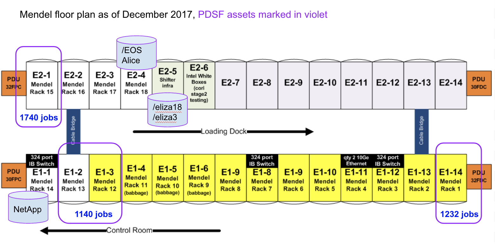

PDSF is a networked distributed computing environment used to meet the
detector simulation and data analysis requirements of large scale
Physics, High Energy Physics and Astrophysics and Nuclear Science
investigations.

PDSF computing assets are located inside Mendel as shown below.

