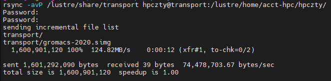
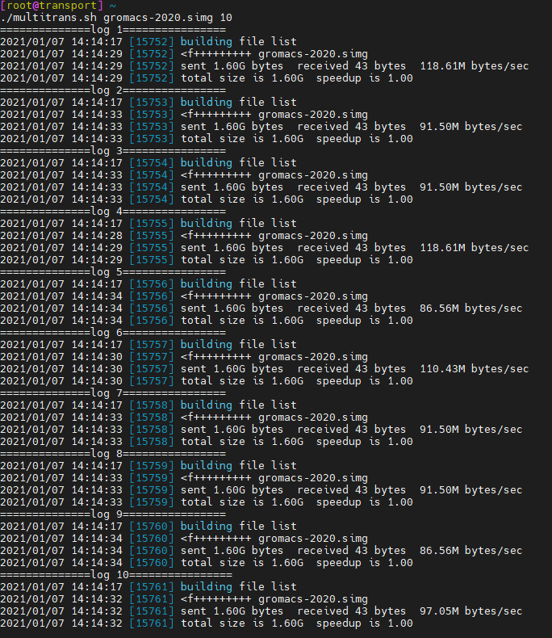

***********
数据传输
***********

超算平台提供了专门用于数据传输的节点，登录该节点后可以通过rsync，scp等方式将个人目录下的数据下载到本地，或者反向上传本地数据到超算平台。

登录方式
=========

传输节点的公网域名为transport.hpc.sjtu.edu.cn，可以使用超算平台账号直接进行ssh登录：

.. code:: bash

   $ ssh USER_NAME@transport.hpc.sjtu.edu.cn

或者也可以先按照\ `登录章节 <https://docs.hpc.sjtu.edu.cn/login/index.html>`__\的方法先连接login节点，然后通过超算平台内部网络跳转到传输节点：

.. code:: bash

   # 已经登录login节点的情况下，传输节点内网域名为transport.pi.sjtu.edu.cn，pi部分的域名后缀可以缺省
   $ ssh transport

transport节点和login节点一样挂载了lustre文件系统，如果用户已经按照\ `免密码登录段落 <https://docs.hpc.sjtu.edu.cn/login/index.html#id9>`__\的方法将自己的ssh公钥添加到个人目录下，同样可以直接登录transport节点。

.. _label_transfer_speed:

传输速度
=========

超算平台内部网络链路的带宽均不低于10Gbps，可以支持1GB/s的并行传输速度。但请注意包括rsync，scp，winscp等工具在内，大部分传输方式都是基于ssh通信的，而单个ssh连接支持的最大传输速度约100~150MB/s，在不使用额外手段多进程并发的情况下，以上工具均无法突破这一速度上限。

测速示例：通过万兆网络向传输节点上传数据，单个rsync指令传输速度约120MB/s。

测速示例：并发10个rsync同时向传输节点上传数据则可以达到1GB/s的总和速度，基本占满全部的可用带宽。

请注意以上测速是在排除了其他速度限制因素的理想网络环境下获得的结果，用户实际传输时可能遇到CPU资源，外部网络带宽，磁盘IO性能等瓶颈，也可能因多用户同时传输竞争网络带宽导致速度受限。transport节点预装有网络监控工具bmon，用户可以利用该工具查看节点当前的网络使用情况，判断是否有其他用户在进行大批量的数据传输。

传输方式
=========

Windows 用户
-------------

Windows 用户可以使用 WinSCP 在 π 群集和您自己的计算机之间传输文件。如下图所示，填写节点的地址，SSH 端口，SSH 用户名，SSH 密码，然后点击 Login 进行连接。 使用 WinSCP 的方法类似于使用 FTP 客户端 GUI，如下图所示：

.. image:: img/winscp01.png
   :width: 626px
   :height: 423px
   :scale: 75%

Linux/Unix/Mac用户
--------------------

如果传输的对象为少量大文件，且目标环境上没有数据的历史版本，所有需要传输的文件都是首次传输，可以使用scp直接拷贝文件。

.. code:: bash

   # 示例：超算平台用户将个人目录~/math.dat文件下载到外部主机100.101.0.1，在外部主机上拥有账号exp_user01且个人目录为/home/exp_user01/
   $ scp ~/math.dat exp_user01@100.101.0.1:/home/exp_user01/

   # 或者也可以不登录传输节点，直接在本地使用scp远程拷贝，指定传输节点的公网域名。示例：将本地目录/home/data上传至超算平台exp_user01的个人目录
   $ scp -r /home/data exp_user01@transport.hpc.sjtu.edu.cn:~

如果需要传输的对象为包含大量文件的目录，或者目标环境上已经存在差异较小的历史版本，建议使用rsync拷贝数据，rsync会对比源地址和目标地址的内容差异，然后进行增量传输：

.. code:: bash

   # 示例：登录传输节点后从个人目录~/data下载数据到外部主机100.101.0.2，在外部主机上拥有账号exp_user02且个人目录为/home/exp_user02/
   $ rsync --archive --partial --progress ~/data/ exp_user02@100.101.0.2:/home/exp_user02/download/
   
   # 示例：登录传输节点后，将外部主机100.102.0.2上的/home/share/exp02.dat文件上传到超算平台上，操作者在外部主机上拥有账号exp_user03
   $ rsync --archive --partial --progress exp_user03@100.102.0.2:/home/share/exp02.dat ~/download/
   
   # 如果用户的外部环境CPU资源丰富而网络带宽相对较低，可以尝试--compress参数启用压缩传输
   $ rsync --compress --archive --partial --progress exp_user03@100.102.0.2:/home/share/exp02.dat ~/download/

多进程并发传输
---------------

如 :ref:`label_transfer_speed` 段落所述，无论scp还是rsync，本质都是基于ssh连接的数据传输，都会受到ssh的传输效率限制。以上的单进程传输方式即使没有其他瓶颈制约，也只能达到100~150MB/s的传输速度。但是可以并发多个scp/rsync进程分别传输不同的内容来进一步提高网络带宽利用效率。

scp，rsync本身都不支持多进程传输，因此需要利用外部指令并发多个scp/rsync进程，外部封装的方法有很多，这里仅提供一种利用xargs自动分配传输文件的方法，熟悉脚本的用户也可以自制脚本来更灵活地将传输任务分配给各个传输进程。

.. code:: bash

   # 示例：并发5个rsync进程从个人目录~/data下载数据到外部主机100.101.0.3，在外部主机上拥有账号exp_user03且个人目录为/home/exp_user03/
   $ ls ~/data/
     001.dat 002.dat 003.dat 004.dat 005.dat
   $ ls ~/data/ | xargs --max-args=1 --max-procs=5 --replace=% rsync --archive --partial ~/% exp_user03@100.101.0.3:/home/exp_user03/download/

**注意：如果没有事先配置好免密码登录，rsync发起连接会要求用户输入密码，上述并发场合则会导致并发失败。** 示例中是从transport节点向100.101.0.3发起rsync传输，等同于发起一个 ``ssh exp_user03@100.101.0.3`` 的连接，因此需要在transport节点上生成个人ssh公钥，添加到100.101.0.3上exp_user03用户的信任公钥列表中。建议在并发操作之前先用rsync单独拷贝一个小文件进行测试，确认过程中没有手动交互的需求再进行正式的并发传输。

并发数量请控制在**10个进程以内**，因为目前超算网络最高支持1GB/s的传输速度，而单个ssh进程上限是100MB/s，10个并发进程就已经足够占用全部带宽。

其他传输方式
-------------

上述的winscp, scp, rsync都是最常用的传输工具，如果用户有特殊需求，可以尝试其他传输工具（例如sftp），或者自行编写程序进行数据传输。但请注意传输节点对网络端口做了限制，目前仅开放ssh使用的22端口，如果要使用其他传输方式，请检查其使用的端口号。

使用限制
=========

**transport节点仅用于批量数据传输，请勿在此节点上运行与数据传输无关的应用，如编译程序、管理作业、校验数据等。如果发现此类行为，中心将视情况取消相关账号使用传输节点的权利。**