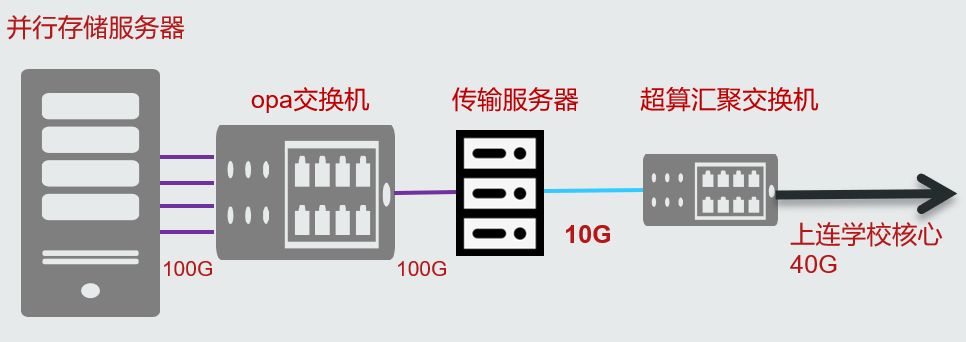
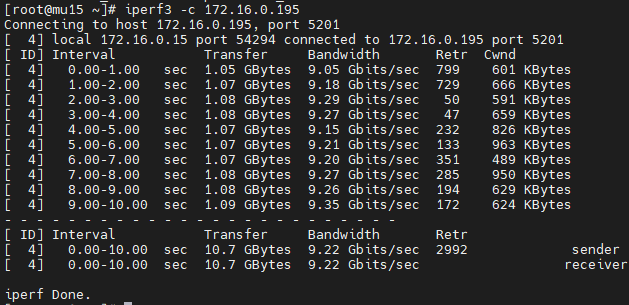
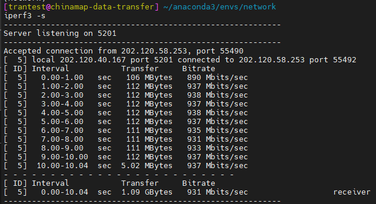
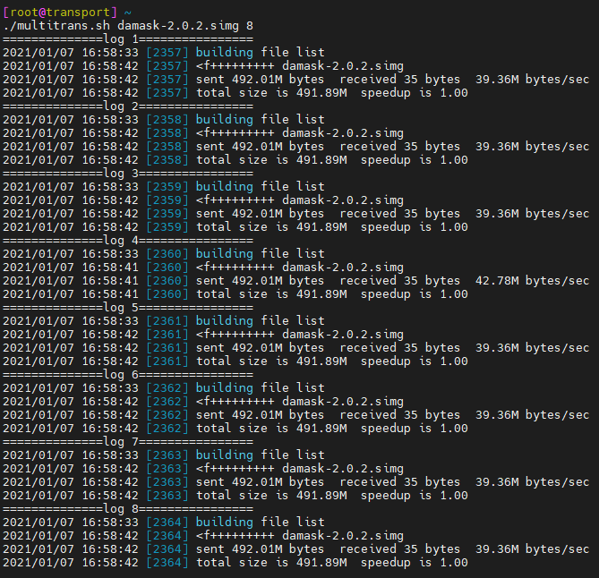

****************
数据传输专用节点
****************

超算平台提供了专门用于数据传输的节点，登录该节点后可以通过rsync，scp等方式将个人目录下的数据下载到本地，或者反向上传本地数据到超算平台。

登录方式
=========

传输节点的公网域名为transport.hpc.sjtu.edu.cn，可以使用超算平台账号直接进行ssh登录：

.. code:: bash

   $ ssh USER_NAME@transport.hpc.sjtu.edu.cn

或者也可以先按照\ `登录章节 <https://docs.hpc.sjtu.edu.cn/login/index.html>`__\的方法先连接login节点，然后通过超算平台内部网络跳转到传输节点：

.. code:: bash

   # 已经登录login节点的情况下，传输节点内网域名为transport.pi.sjtu.edu.cn，pi部分的域名后缀可以缺省
   $ ssh transport

数据传输
=========

登录传输节点之后如果需要传输的对象为少量大文件，可以使用scp进行文件拷贝：

.. code:: bash

   # 示例：超算平台用户将个人目录~/math.dat文件下载到外部主机100.101.0.1，在外部主机上拥有账号exp_user01且个人目录为/home/exp_user01/
   $ scp ~/math.dat exp_user01@100.101.0.1:/home/exp_user01/

如果需要传输的对象为包含大量文件的目录，建议使用rsync拷贝数据，rsync会对比源地址和目标地址的内容差异，然后进行增量传输：

.. code:: bash

   # 示例：超算平台用户从个人目录~/data下载数据到外部主机100.101.0.1，在外部主机上拥有账号exp_user02且个人目录为/home/exp_user02/
   $ rsync --archive --partial --progress ~/data/ exp_user02@100.101.0.1:/home/exp_user02/download/
   
   # 示例：登录传输节点后，将外部主机100.102.0.2上的/home/share/exp02.dat文件上传到超算平台上，操作者在外部主机上拥有账号exp_user03
   $ rsync --archive --partial --progress exp_user03@100.102.0.2:/home/share/exp02.dat ~/download/
   
   # 如果用户的外部环境CPU资源丰富而网络带宽相对较低，可以尝试--compress参数启用压缩传输
   $ rsync --compress --archive --partial --progress exp_user03@100.102.0.2:/home/share/exp02.dat ~/download/

请注意无论scp还是rsync，本质都是基于ssh连接的数据传输，都会受到ssh的传输效率限制。一般在没有其他瓶颈（网络带宽，CPU性能，存储设备读写速度等）限制的情况下，单个ssh连接的传输速度也只能达到100~150MB/s。但是可以并发多个scp/rsync进程分别传输不同的内容来提高网络带宽利用效率。

另外请注意此节点对网络端口做了限制，目前仅开放ssh使用的22端口，如果要使用其他传输工具，请检查其使用的端口号。

传输速度
=========

实际传输速度受到诸多因素制约，可能遇到的瓶颈包括：链路最小带宽，ssh性能限制，主机CPU资源，存储IO性能等。

链路最小带宽
-------------

数据传输速度受限于网络链路中的最小带宽环节，超算平台的网络链路中最小带宽为10Gbps，因此传输节点理论上可以提供约1GB/s的并发传输速度。

在超算平台网络内部对传输节点进行速度测试，可以看到有效带宽约9Gbps，因为传输节点是虚拟机，存在一定效率损耗：

但在外部传输的情况下，从学校核心到外部主机之间可能存在低于10G的链路成为瓶颈，导致传输速度上限降低。例如从超算平台到转化医学院，路线中存在千兆链路，因此传输速度上限降低到100MB/s：

ssh性能限制
------------

实际传输操作中另一个常见的瓶颈是ssh连接的性能瓶颈，虽然万兆链路可以支持1GB/s的传输速度，但单个ssh连接本身只能达到100~150MB/s的传输速度。

示例：通过万兆网络向传输节点上传数据，单个rsync指令传输速度约120MB/s。

.. image:: img/004.png

而并发10个rsync同时向传输节点上传数据则可以达到1GB/s的总和速度，基本占满全部的可用带宽。

.. image:: img/005.png

主机CPU资源
------------

由于ssh连接需要进行数据加密，因此高速传输需要占用较多的cpu资源，如果主机CPU核数较少又并发了多个传输进程，就有可能遇到cpu资源瓶颈。

示例：只有4CPU的主机从传输节点下载数据，并发8个rsync进程，速度总和只能达到约320MB/s，传输过程中可以观测到该主机CPU被占满。

存储IO性能
-----------

如果用户传输目标是机械磁盘支撑的本地存储，硬盘IO性能也是一个可能遇到的瓶颈，单个机械硬盘的读写速度通常不会超过200MB/s。但在使用分布式存储的情况下，IO性能通常不会成为瓶颈。