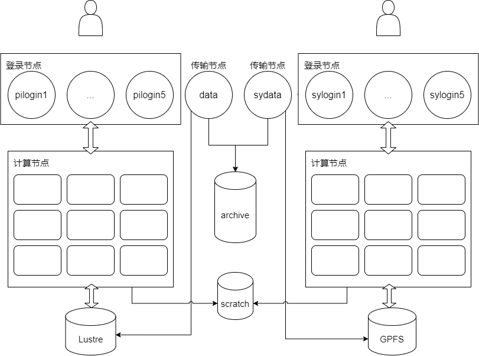

*********************
文件系统与数据访问
*********************

.. toctree::
   :maxdepth: 1

   datashare
   transportsolution
   transportmethod
   archiveusage
   transportskills
   remoteaccessdata
   faq
   scidatausage

文件系统简介
-------------

下图为 Pi 2.0、思源一号集群目前的存储架构，展示了各节点可以访问到的存储系统。

总结
+++++++++

文件系统可以管理数据和访问数据，不同的文件系统具有不同的特点。下面的表格介绍了超算平台使用的文件系统的特征。

==========================   ==========   ========== ==============  =======================================================================  ========================================================= =====================
文件系统                      挂载点       裸盘容量    存储介质        在哪些节点访问                                                         是否收费                                 　　　　　　　        是否有快照功能
==========================   ==========   ========== ==============  =======================================================================  ========================================================= =====================
Lustre                       /lustre       25 PB      HDD            Pi 2.0集群的登录节点、计算节点；data传输节点                             3 TB以下免费，3 TB 以上收费，和思源存储合并计费      　　 无

GPFS                         /dssg         10 PB      HDD　　　　　  思源一号集群的登录节点、计算节点；data、sydata传输节点                    3 TB以下免费，3 TB 以上收费，和 Pi2.0 存储合并计费      　无

全闪存文件系统               /scratch      108 TB     NVMe SSD       Pi 2.0、思源一号集群的登录节点、计算节点；data传输节点　　　　　　       不收费                                               　　  无

冷存储系统                   /archive      23.5 PB      HDD             data、sydata传输节点                                                   收费                                              　　　   有
==========================   ==========   ========== ==============  =======================================================================  ========================================================= =====================

* Lustre/GPFS 文件系统：提供了大容量、高可用、较高性能的存储，是 Pi2.0、思源一号集群的主要存储系统，是用户通过登录节点后默认进入的文件系统。用户的主要工作和常用数据都位于该文件系统。用户通过 ``cd $HOME`` 可以跳转到冷存储下自己的目录。

* 全闪存文件系统：使用全套 NVMe SSD 搭建的高性能存储可以更好地支持 I/O 密集作业。该系统容量较小，同时未设置高可用，会定期清理数据，推荐将其作为临时工作目录使用。用户通过 ``cd $SCRATCH`` 可以跳转到冷存储下自己的目录。

* 冷存储系统：作为 Lustre/GPFS 文件系统的补充，提供大容量、高可用的存储，只能在传输节点访问，主要给用户存放不常用的数据。冷存储系统具有快照功能，快照可以恢复用户误删除的数据。用户通过 ``cd $ARCHIVE`` 可以跳转到冷存储下自己的目录。

**注意**：超算集群存储的详细计费标准，请发邮件至 hpc 邮箱咨询

文件系统使用场景
++++++++++++++++

因为存储介质、搭建方法不同，文件系统有各自适用的使用场景。

**场景一：将数据从用户本地传输到 Pi 2.0 集群，再提交作业处理数据**

1. 用户从本地终端，使用 scp/rsync 等命令向 data 传输节点发起数据传输
2. 用户登录 Pi 2.0 登录节点，此时可以访问到之前传输的数据，然后用户提交 Slurm 作业

可以参考：

* :ref:`transportmethod`
* :ref:`remoteaccessdata`

**场景二：使用全闪存文件系统作为临时目录**

1. 在 Slurm 脚本中，自定义一个目录 ``$SCRATCH/tmp_dir`` 作为临时目录存放中间文件，加快计算过程
2. 计算完成后，将计算结果及时从 Scratch 转移到 Lustre/GPFS 系统

可以参考：

* `如何使用全闪存文件系统 <https://docs.hpc.sjtu.edu.cn/system/filesystem.html#id7>`_

**场景三：将 Lustre 文件系统中不常用的数据迁移到冷存储**

1. 用户登录到 data 传输节点，通过 ``rsync`` 等命令向冷存储迁移数据
2. 通过数据校验，确认数据完整迁移到了冷存储
3. 清理原文件，释放存储空间

可以参考：

* :ref:`archiveusage`

**场景四：将数据集发布在科学数据平台**

`科学数据平台 <https://scidata.sjtu.edu.cn>`_ 致力打造科学数据全生命周期管理平台，具有发布数据、共享数据、下载公共数据功能的数据平台，您可以将公开数据集发布在平台上。

数据平台简明使用指南可以参考：

* :ref:`scidatausage`
