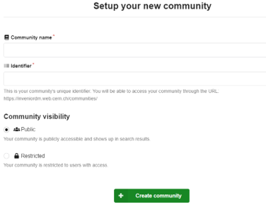

.. _scidatausage:

科学数据平台使用指南
===============================

上海交通大学科学数据平台首页地址为：https://scidata.sjtu.edu.cn，秉承FAIR原则，致力打造科学数据全生命周期管理平台

用户登录
--------

科学数据平台使用jAccount进行登录认证，在首页找到“login”按钮后，点击跳转至jAccount认证界面。使用账号密码认证通过后，自动跳转至网站首页。
首次登录前，需要在“交我办”中，找到“交我算”-“数据发布”-“科学数据平台账号激活申请”，申请账号激活。

.. image:: ./img/scidata_login.png

发布数据
--------

**创建一条记录并添加数据文件**

点击右上角“+”号，在下拉选项中选择“upload”即可进入数据发布页面。
数据文件可以通过浏览器拖拽或点选文件上传，如果没有数据文件，仅有元数据信息，则勾选“Metadata-only record”。

.. image:: ./img/scidata_upload.png

**添加元数据信息**

补充完善此条记录的元数据信息，尤其是必填信息。
资金支持、备选标识符、相关工作等条目，如果没有可以点击“x”删除

**设定访问权限**

权限设置可对元数据和数据文件单独控制，细分三类：完全公开、公开元数据、完全私有。
注意：权限设置需要谨慎，完全公开的数据，其他人将能够看到、搜索、下载所有提交的数据文件；如果成果仍在投稿阶段，需要将数据设置有私有，可以通过专属链接提供至编辑访问。

.. image:: ./img/scidata_right.png

建立团队空间
-------------

点击右上角“+”号，在下拉选项中选择“new community”，填写名称、标识符、简介等信息后，点击创建。

分享数据
----------

在数据详情页面，点击右侧的“Share”按钮，可以生成数据详情页的相关链接。
合作者收到链接后，点击即可查看该数据的详情页面。这种数据分享方式，即使权限设置为非公开，链接接收者仍然能够访问。 **请注意保护数据安全**

下载数据
----------

包含文件的数据，在描述下方会展示所有相关联的文件，每个单独的文件名后方，具有一个方形的“download”按钮。可以直接点击按钮通过浏览器进行下载，或者右键按钮并复制链接，在命令行中使用下载工具下载。

检索数据
----------

科学数据平台首页附有搜索框，通过输入关键词可以对相关数据进行搜索。在搜索结果页面左侧，支持对查找到数据的状态、类型进行筛选。

开源科学数据下载
------------------

为了方便“交我算”用户使用公共开源科学数据，尤其是国外的大型公共数据，平台提供了常用公共数据的镜像。用户可以在"community"中找到所需开源科学数据的类别，进入详情页面查看数据的使用方法。
同样，也可以直接在搜索框中检索需要的数据库名称，查看使用方法。
【P.S.】开源科学数据扩充中，如果您有需要使用的大型开源科学数据，欢迎发邮件到hpc@sjtu.edu.cn咨询。

