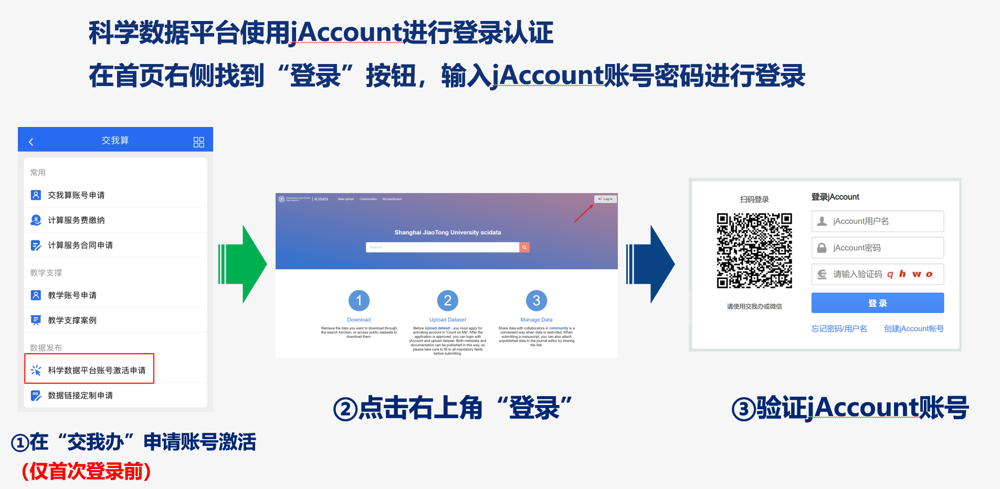
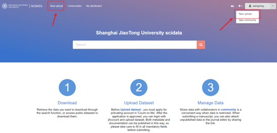

.. _scidatausage:

科学数据平台使用指南
===============================

上海交通大学科学数据平台首页地址为：https://scidata.sjtu.edu.cn，秉承FAIR原则，致力打造科学数据全生命周期管理平台

用户登录
--------

科学数据平台使用jAccount进行登录认证，在首页找到“login”按钮后，点击跳转至jAccount认证界面。使用账号密码认证通过后，自动跳转至网站首页。
首次登录，通过jAccount认证后，需要发送jAccount账号信息至hpc@sjtu.edu.cn，申请激活账号。

发布数据
--------

**创建一条记录并添加数据文件**

点击右上角“+”号，在下拉选项中选择“upload”即可进入数据发布页面。
数据文件可以通过浏览器拖拽或点选文件上传，如果没有数据文件，仅有元数据信息，则勾选“Metadata-only record”。

**添加元数据信息**

补充完善此条记录的元数据信息，尤其是必填信息。
资金支持、备选标识符、相关工作等条目，如果没有可以点击“x”删除

**设定访问权限**

权限设置可对元数据和数据文件单独控制，细分三类：完全公开、公开元数据、完全私有。
注意：权限设置需要谨慎，完全公开的数据，其他人将能够看到、搜索、下载所有提交的数据文件；如果成果仍在投稿阶段，需要将数据设置有私有，可以通过专属链接提供至编辑访问。

.. image:: ./img/scidata_right.png

