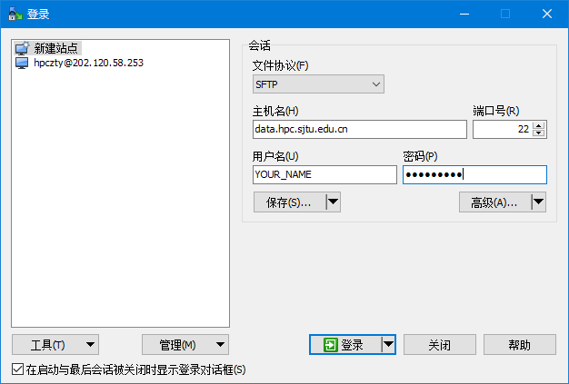

.. _transportmethod:

***************
数据传输方法
***************

本地向思源一号传输
===================

**Windows 用户**

Windows 用户可以使用 WinSCP 在集群和您自己的计算机之间传输文件。可至 \ `WinSCP 官网 <https://winscp.net/eng/index.php>`__\下载。

如下图所示，填写思源一号节点的地址，SSH 端口，SSH 用户名，SSH 密码，然后点击 Login 进行连接。 使用 WinSCP 的方法类似于使用 FTP 客户端 GUI，如下图所示：

登录后即可看见左右两栏文件。左侧是本地文件，右侧是集群上的文件。点击需要传输的文件进行拖动即可传输。

**Linux/Unix/Mac用户**

Linux/Unix/Mac用户可通过在终端中使用scp或rsync等命令传输。

1.如果传输的对象为少量大文件，且目标环境上没有数据的历史版本，所有需要传输的文件都是首次传输，可以使用scp直接拷贝文件。

$ scp -r [源文件路径] [目标路径]

2.如果需要传输的对象为包含大量文件的目录，或者目标环境上已经存在差异较小的历史版本，建议使用rsync拷贝数据，rsync会对比源地址和目标地址的内容差异，然后进行增量传输。

$ rsync --archive --partial --progress [源文件路径] [目标路径]

**如果[源文件路径]或[目标路径]位于思源一号集群上，则路径需使用以下格式：**

[用户名]@sydata.hpc.sjtu.edu.cn:[思源一号上的路径]

**如果[源文件路径]或[目标路径]位于本地，则不需要加[用户名]@主机名，可直接写文件路径。**

.. code:: bash

   # 假设用户expuser01在思源一号平台上个人目录为/dssg/home/acct-exp/expuser01
   # 本地个人目录为/home/local_user/（个人目录可以用~代替）

   # 示例1：将本地目录~/data的全部数据上传至思源一号dssg目录下
   $ scp -r /home/local_user/data/ expuser01@sydata.hpc.sjtu.edu.cn:/dssg/home/acct-exp/expuser01/

   # 示例2：将dssg目录中的~/math.dat文件下载到本地个人目录
   $ scp expuser01@sydata.hpc.sjtu.edu.cn:/dssg/home/acct-exp/expuser01/math.dat /home/local_user/

   # 示例3：将dssg目录~/data的数据下载到本地~/download目录，请注意rsync不支持双远端传输，必须在目标主机（这里即为本地）上操作
   $ rsync --archive --partial --progress expuser01@data.hpc.sjtu.edu.cn:/dssg/home/acct-exp/expuser01/data/ /home/local_user/download/

本地向π 2.0/AI/ARM集群传输
==========================

**Windows 用户**

使用 WinSCP，方法和本地向思源一号传输类似，只需要将节点地址改成data.hpc.sjtu.edu.cn。

**Linux/Unix/Mac用户**

方法和本地向思源一号传输类似。

.. code:: bash

   # 假设用户expuser01在π 2.0集群上个人目录为/lustre/home/acct-exp/expuser01

   # 示例4：将本地目录~/data的全部数据上传至lustre目录下
   $ scp -r /home/local_user/data/ expuser01@data.hpc.sjtu.edu.cn:/lustre/home/acct-exp/expuser01/

   # 示例5：将lustre目录~/data的数据下载到本地~/download目录，请注意rsync不支持双远端传输，必须在目标主机上操作
   $ rsync --archive --partial --progress expuser01@data.hpc.sjtu.edu.cn:/lustre/home/acct-exp/expuser01/data/ /home/local_user/download/

思源一号与π 2.0/AI/ARM集群互传
================================

要提高集群之间互传数据的效率，需要选择合适的传输节点。

* 如果需要在Pi超算和思源一号互传数据，需要选择data或者sydata节点发起传输

* 如果需要从Pi超算向冷存储搬运数据，需要选择data节点发起传输

* 如果需要从思源一号向冷存储搬运数据，需要选择sydata节点发起传输

例如通过登录π2.0集群数据传输节点data.hpc.sjtu.edu.cn，使用scp或rsync命令进行传输：

$ scp -r [源文件路径] [目标路径]

$ rsync -avr --progress [源文件路径] [目标路径]

此时因为已经登录到了π2.0集群，π集群上的文件路径不用加前缀，而思源一号上的文件路径需要加前缀[用户名]@sydata.hpc.sjtu.edu.cn。

.. code:: bash

   # 示例6: 该用户在data节点上将lustre个人目录下的数据~/data搬运到dssg个人目录~/data下
   $ ssh expuser01@data.hpc.sjtu.edu.cn
   $ scp -r /lustre/home/acct-exp/expuser01/data/ /dssg/home/acct-exp/expuser01/data/

   # 示例7：该用户在sydata节点上将lustre个人目录~/data下的数据搬运到dssg个人目录~/data下
   $ ssh expuser01@sydata.hpc.sjtu.edu.cn
   $ scp -r expuser01@sydata.hpc.sjtu.edu.cn:/lustre/home/acct-exp/expuser01/data/ /dssg/home/acct-exp/expuser01/data/

从Pi超算和思源一号向冷存储搬运数据的具体操作请参考：:ref:`archiveusage`
